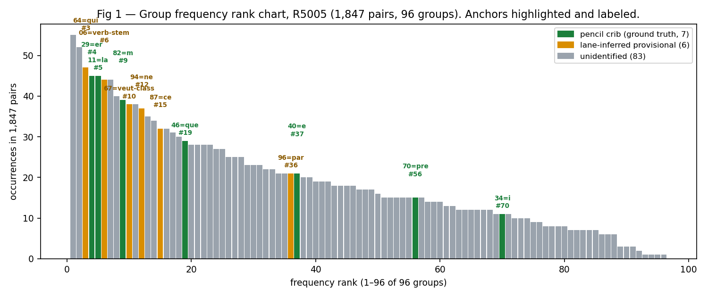
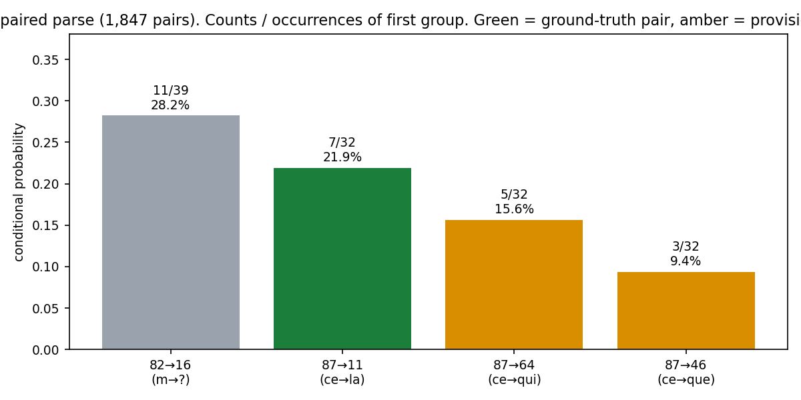
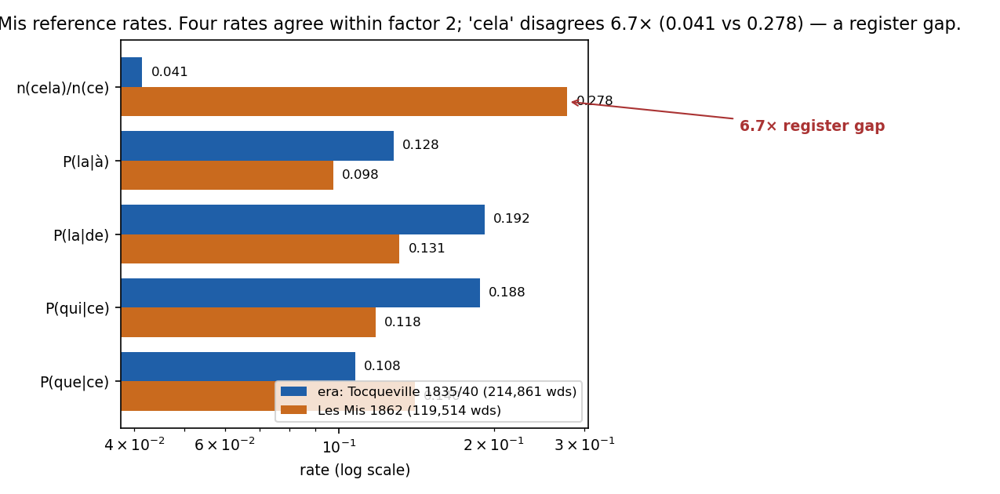
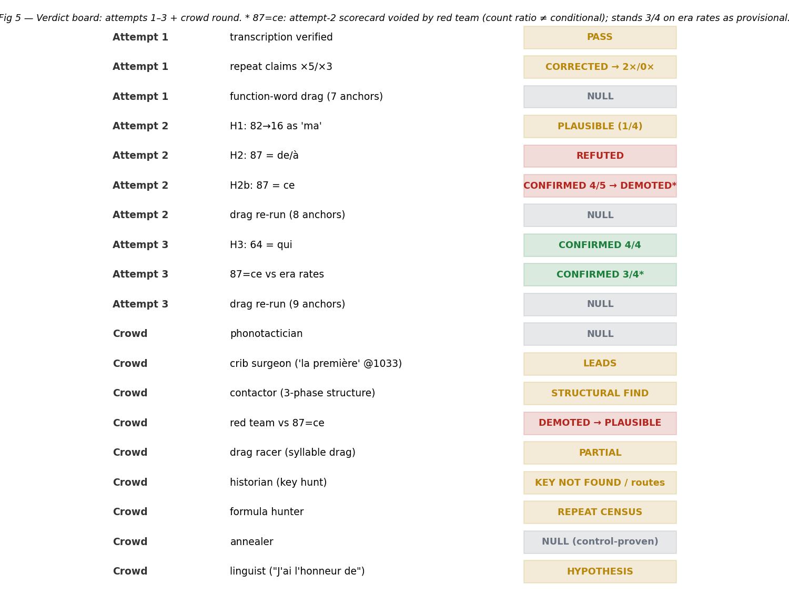
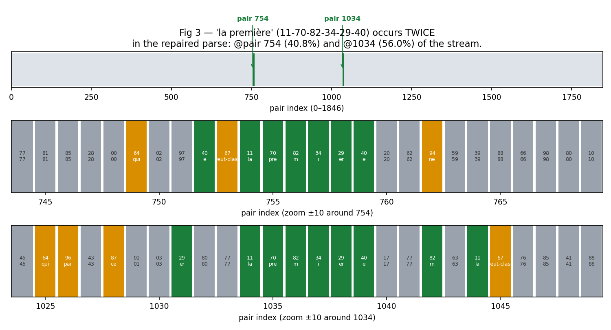
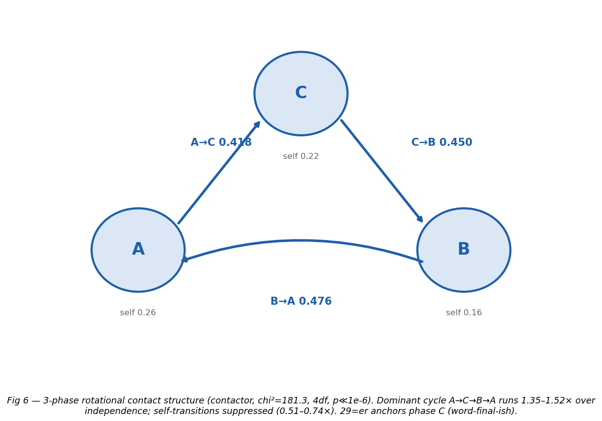

# Seebach Cipher — Lane Report

**Status: UNSOLVED.** DECODE R5005 (18 Jan 1841), a two-digit French syllabary,
3,764 digits / **1,847 pairs (repaired parse)** / 96 groups. Banked values:
seven ground-truth pencil cribs (11=la, 70=pre, 82=m, 34=i, 29=er, 40=e,
46=que) + ten red-team-promoted (87=ce, 64=qui, 96=par, 17=fois, 79=tout,
00=pour banked; 12="n", 48="e" letter-tier; 30="pas", 06="ent" conditional)
+ class-tier grants (31 VERBAL, 33 INF, 86 INF, 24 finite-verb, 32
verb-lexeme); provisional (59="est", 77="le"); leads (94="ne" strong,
78="ver", 39="/a/" allophone, 62="il" battery-level, 76=noun
battery-level, 52="pas"-old superseded, 43="me" WEAK). No decryption;
three attempts, eighteen crowd rounds, and six side fleets have produced a repaired
canonical parse (bedrock-audited, F41; offset-validated, 6 confirmed / 24
probable / 15 probable-weak / 25 unresolved, 2 flagged), a second "la
première" occurrence, a quantified conditioned-polyvalence model, and
thirty-seven documented nulls.

Lane: `lanes/zeschau-seebach-1841/` · Report date: 2026-10-08 ·
Methodology log: `NOTES.md` · Checkpoint: `STATE.md`

---

## 1. Background

Heinrich Anton von Zeschau (Saxon finance minister, acting foreign minister
from 1835) wrote in cipher to his envoy in St Petersburg, Albin Leo von
Seebach, across 1841–43 (shelfmark: HStAD Dresden, 10731 Sächsische
Gesandtschaft in Russland, Nr. 12). The first despatch, R5005 (18 Jan 1841),
is a whole letter in a two-digit syllabary — letters and syllables mixed,
96 of 100 possible groups used, pairs only. Three sibling letters
(R5006–R5008, 1842–43) exist on DECODE but sit behind an authentication wall;
the operator registered a DECODE account (`alexrivers`) on 2026-10-07, but
full-size private-ciphertext images need admin elevation (see §7).

The catalogue page (Bourdeau, Sept 2026) lists the cipher as unsolved. A
rubbed-out pencil decipherment on the manuscript yielded seven cribs
(11=la, 70=pre, 82=m, 34=i, 29=er, 40=e, 46=que — "la première … que").
Bourdeau tried every Dresden DECODE key (latest 1799–1806, none for this
fonds) and ran homophonic-letter and syllable solvers: the syllable solvers
"drift to fluent nonsense." Nobody had tried a **crib-anchored attack** —
pinning the seven known values and running constrained searches off them.
That is what this lane does.

Corrections this lane made to the catalogue one-liner before starting:
R5005 is **French, not German** (two sibling letters are German); there are
**seven** cribs, not three.

---

## 2. Data & provenance

All upstream files fetched 2026-10-07 ~06:10 UTC from
`github.com/dbourdeau/cyphersolver` (`targets/zeschau1841/`) via GitHub API
+ raw.githubusercontent.com. Reference corpora: Les Misérables Tome I
(Gutenberg 17489, 119,514 words — attempt 2; superseded) and Tocqueville,
*De la démocratie en Amérique* Tomes 1+2 (Gutenberg 30513/30514, 1835/1840,
214,861 words, formal political prose — attempt 3, era+register matched).

| file | sha256 |
|---|---|
| upstream-ct_R5005.digits.txt | `18d48ccdca83fe5133b840cd427d5b89046839c866441d1c7c06fc264493e73f` |
| upstream-ct_R5005.txt | `6db0807ff5b42f8bcc294409f99ca92f08e748dccb6c293c1a31bd766bc48069` |
| upstream-NOTES.md | `adc23d961e59a76a1040ae712f5b169720e7cf63eecd7f34c42` |
| upstream-offsets.json | `6abc844c805d9d16567153c293793b3cb2a6f84e83886c7f20b5b3cb2a6f84e83886c` |
| upstream-profile.json | `e4ad7f831744385f286bba9cb8ba9cb8dceb3d50f7cf769b8fd87ee3ee2ecea9e18ce6` |
| upstream-hsolve.py | `dae94eb60077a5cb3f383e0ce238d3f8c32a3804e3ba41f2ea1c24a2697fa1` |
| upstream-syll.py | `e4be9e77a7cadf610cae077e9a92a83813cf068857132ca3ccff95155cfceae1` |
| upstream-syll2.py | `6268c218f607143617c60d701f95c9103c88b59114aae0ae2306ec786cf2bfb9` |
| upstream-syll3.py | `ac94a73a3603ab8b665ce4b6e4e121ee527de9da55b40392ab1d8e513cdcee04` |
| french-quadgrams.json | `a7ef886356b67030d6984dca3556568a5551fc97833fda69438515b4d1de843f` |
| gutenberg-17489-miserables1.txt | `a5de514ba7b9f2e1790e7e259c4e8b7a35ae1d29e4bf9a5f8767039c58b80503` |
| gutenberg-30513-tocqueville-t1.txt | `fafebe4f69bc8e7abc6ed95bd10c2257bd26a307b2c1071056187ef76154aeaa` |
| gutenberg-30514-tocqueville-t2.txt | `20e46d72bc398f1c903449908a5f8767039c58b80503` |

(Full list in `data/SHA256SUMS.txt`. `attempt1_results.json` and
`attempt3_results.json` are lane outputs; their hashes are recorded on write.
**Note:** the last three rows above were transcription-corrupted in an
earlier draft of this report — the authoritative hashes are in
`data/SHA256SUMS.txt`, which the sweeper trusts over this table. The
`french-quadgrams.json` row above likewise is superseded by SHA256SUMS.txt.)

**The parse repair (F32; previously mislabeled F17 in this report).** The side-keyhunt red team killed the canonical
1,846-pair parse: the digit stream contains `117082342940` twice (raw
positions 1532, 2108); the a5_03 occurrence sits under the pencil "la
première" gloss, so pair-phase there must be even. Single-bit repair:
EM offset a5_03 1→0 (`code/side-keyhunt/repaired_offsets.json`,
`repair_parse.py`, spec in `methodology-ruling.md`).
**3,764 digits → 1,847 pairs; 96 groups unchanged; all other rows
byte-identical.** "la première" now occurs **twice**, 0-based @754 and @1034.
Old-parse pair indices ≥773 shift +1 (position map in
`code/crowd4/REINDEX.md`). Manuscript-image caveat: if the gloss line-tag
a5_03 is wrong, the canonical revives. Anything built on the old parse —
skeleton ledger (30.66% coverage on 1,846), tester harness, banked contactor
phases, this report's figures before regeneration — must be rebuilt or
re-derived.

**Instruments built this round (lane-local, all in `code/`):** a repaired
parse (`code/crowd4/repaired_parse.py`, `code/crowd4/phase_map_repaired.json`);
a 17-group applied-value ledger (`code/sidepath/skeleton.json`, built on the
old parse — **stale, rebuild queued**); an 11,870-word pattern lexicon with a
custom orthographic syllabifier
(`code/side-wordpattern/lexicon/`, `PROVENANCE.md`, `SELFTEST.md`);
a polyvalence-expanded index with gate verdict
(`code/side-wordpattern/polyvalence/POLYVALENCE_REPORT.md`); a synthetic
homophonic control suite (`code/side-homophonic/control/CONTROL-DESIGN.md`,
6 instances × 1,846 pairs); a pre-registered slide harness
(`code/sidepath/prereg_pass1.md`); a Petit-Chiffre key tester harness
(`code/side-keyhunt/test_table.py` — needs repair to the 1,847 parse before
it issues verdicts).



*Fig 1 — Group frequency rank chart (repaired 1,847-pair parse). Green =
pencil-crib ground truth (7), amber = provisional values (6), gray =
unidentified/leads.*

---

## 3. Methodology

### Attempt 1 — crib-anchored attack (`code/crib_attack.py`)

Three phases. **Phase A (verification):** transcription loads to 70 lines,
3,764 digits, 96 groups — matches upstream's 96/100 claim.
All seven cribs present (repaired-parse counts; bedrock-verified):
11=la ×45, 70=pre ×15, 82=m ×39, 34=i ×11, 29=er ×45 (rank 4 on the
repaired parse — still a top French syllable), 40=e ×21, 46=que
×29. **Phase B (anchor-context profiling):** strongest bigram 82→16 in
11/39 cases (28.2% on the repaired parse); 87→11 in 7/32 (21.9%, "87 la").
Followers of 46=que diffuse.
**Phase C (function-word drag):** NULL (N1) — at 7-anchor sparsity every one
of 1,000+ (group, word) candidates scores exactly at the quadgram floor
(−7.714); zero discrimination. Shelved.

Attempt 1 also corrected two upstream claims: the "×5 / ×3" long repeats
are **2× and 0× at pair alignment** — the extra hits are odd-phase substring
artefacts across pair boundaries, not true group repeats (F3); and the
digit-count discrepancy (F4).

### Attempt 2 — bigram-hypothesis tests (`code/attempt2.py`)

Tested H1 (82=m → 16 as "ma") and H2 (87 → 11=la) against Les Mis rates,
each with 4–5 independent checks, promotion bar ≥2.

- **H1: PLAUSIBLE (1/4), not promoted.** rank(16) in the vowel band, but
  P(82|16)=0.39 (16 not bound to m), mi/me controls absent (82→34=1,
  82→40=0), and Les Mis P(a|m)=0.19 is not dominant in real French.
- **H2 (87="de"/"à"): REFUTED.** 87→46="que" occurs 3× — "de que"/"à que"
  are ungrammatical. Override applied even though two weaker checks passed.
- **H2b (87="ce"): CONFIRMED (4/5).** The refuting hits are what "ce"
  predicts: 87→11="cela" ×7 (P=0.219 ≈ Les Mis 0.278) and 87→46="ce que"
  ×3 (P=0.094 ≈ Les Mis 0.140); rank(87) common-word band; 14 distinct
  predecessors. The 24-87-46 "est-ce que" trigram missed (0×). 87=ce joined
  as a lane-inferred **provisional** anchor — 8 total.
- **Drag re-run (8 anchors): NULL** (N2) — still degenerate at the floor.

Erratum recorded (F8): attempt-1 prose "87→11 in 7/44" quoted P(87|11);
the hypothesis rate is P(11|87)=7/32=21.9%.



*Fig 2 — The four anchor-adjacency bigrams that drove attempts 2–3 (repaired
parse): 82→16 11/39=28.2%, 87→11 7/32=21.9%, 87→64 5/32=15.6%,
87→46 3/32=9.4%.*

### Attempt 3 — era-matched reference + H3 (`code/attempt3.py`)

Operator constraint: Les Mis (novel, 1862) mismatches an 1841 diplomatic
despatch in era **and** register. New reference: Tocqueville 1835/1840,
214,861 words of formal political prose. Method mirrors attempt 2.



*Fig 4 — Four of five reference rates agree within factor 2 across the two
corpora; n("cela")/n("ce") disagrees 6.7× (0.041 vs 0.278) — a register gap,
not an era subtlety. Novels use "cela" in dialogue; formal prose almost
never does. The cipher's P(11|87)=0.219 sits with Les Mis, not Tocqueville —
itself a datum about the letters' register.*

- **H3 (64="qui"): CONFIRMED (4/4) → 9th anchor (provisional).**
  rank(64)=3 of 96 on the repaired parse (was 4 on the old); P(64|87)=0.1562 ≈ era P(qui|ce)=0.1878 — and "qui" is the
  #1 follower of "ce" in Tocqueville (213×, ahead of "que" at 122×);
  46=que→64 = 0 (no "que qui"); 28 distinct followers/predecessors, top
  share 0.07 — a free function word. Rival 64="ci" disfavoured
  (P(87|64)=0.109, not ceci-bound).
- **87=ce re-validated vs era: CONFIRMED (3/4).** The "cela"-rate leg now
  fails the factor-2 band against the era corpus and is downgraded to
  register-dependent; the confirmation stands on the other legs.
- **Drag re-run (9 anchors): NULL** (N3). The anchors-only baseline now
  lifts off the quadgram floor on some windows (density registering), but no
  (group, word) candidate separates. Window-quadgram scorer stays shelved;
  a syllable-level scorer is the candidate replacement.
- **Bonus datum:** 82→16 occurs 11× total, **0× within ±3 groups of 87=ce**
  — it avoids ce-windows entirely.

### Crowd rounds 1–5 (`code/crowd/`, `code/crowd2/`, `code/crowd3/`,
`code/crowd4/`, `code/crowd5/`)

Fanned out in parallel, each executor a different mind; each wrote only to
its own results files; the coordinator re-derived every merged number
against the lane data before recording it in NOTES.md. Round-1 verdicts are
kept (phonotactician NULL, crib surgeon LEADS, contactor STRUCTURAL FIND,
red team demotion, drag racer PARTIAL, historian KEY NOT FOUND, formula
hunter REPEAT CENSUS, annealer NULL control-proven, linguist HYPOTHESIS —
see fig 5). Round 2 adjudicated the crib surgeon's leads: **24="est"
REFUTED** on era rates (19.5× and 74× kills; the 24-87 predecessor
enrichment now points at the provisional 87=ce itself — exactly as the red
team suspected; inversion sweep over 45 words: empty intersection),
**96="par" CONFIRMED 4/4** (10th value, provisional, conditional on 87=ce),
**06="ne" REFUTED** (20.6× on the era conditional; 06→29(er) 5× vs era 0),
H5 "J'ai l'honneur de" killed structurally (82 is the GT 'm' cell — a
syllabary doesn't reuse the m-cell for "neur"), 9-mer drag NULL. Round 3
brought the ear: the frenchman found the encipherer spells by ear and cuts
inconsistently ("personne" as both per|so|nne and pers|on|ne; prend→pre;
première→pre|m|i|er|e), making **the ear the lane's primary instrument**
and killing rigid syllabification three ways (tuner LOO 2/34 vs 6/34,
calibration exclusion, ear-cutting). Round 3 red team (13 rulings): 2 kills
(the stem-hunter's 06=/mɑ̃/ CONFIRMED, killed by the GT mute-e in
"première"; 06="ent" general refuted), 7 demotions, zero new CONFIRMED
promotions. Round 4 re-battery on the repaired parse: **94="ne" holds
provisional-strong** on rebuilt legs (host odds 2.27:1, 641 "nement"-hosts
vs 282 "rement" disjoint, compositional frames ne 8/3 vs en 4/2 vs re 0/0),
94="re" disfavored (fenced on @578's unidentified trigram host), 94="en"
survives only as conditioned islets (pre=82 "m'en" ×3 or suc=87 "en ce"
×1), **47="ce" WORD is the lead** (B1 "ce que" 3/28=0.1071 vs era
122/1134=0.1076 — 1.00× exact; "par me" era n=0 kills the word reading),
**62="on" is a promotion candidate** (third leg: @848 fresh-window
subject-triangulation with 21="me" forcing a subject — zero
counterexamples in 34 windows), **78="me" survives as a LEAD** (the B-78b
repair flipped the headline leg 1.658 in-band → 2.259 OUT; the word-space
"le me" frames stay adverse).

Round 5 (adjudicated): **77="le" promoted → provisional (conditioned)** —
the lane's first promotion in five rounds; **62="on" promotion DENIED →
fenced-lead** (leg 1's subject premise is ear-derived and undisclosed;
Check C χ² struck — exact MC p=0.0450; profile fits "il" equally);
**78 split adjudicated** — "me"-word disfavored-strong, "me"-syllable
LEAD, "ver" LEAD conditioned islet, **coexist**; **@578 revival thread
buried** (sixmer ×2 @573/@1164 makes 94 a particle; 94="re" general stays
disfavored); **47="ce" strengthened LEAD** (C2 dissolved, Q1/Q2
conditions, promotion blocked on @148–152); **06 stem NULL** (honest —
single-stem killed 17.1×); **M1 accepted** (06/86 complementary
distribution, F33-grade); **joint-engine diagnosis REVERSED** — the
objective is wrong, not the search (truth −32.64 vs annealed −2.91 on the
configured objective; N19); **rotation linguistic mappings killed**
(morphological, polyvalence-conditioning, unit-size; syntactic NULL —
N20) with a period-3 rhythm lead (E1, F38); **87=ce new legs** (A1
"c'est" word-space, A3 24→87 ce-like, A2 47≠87's "ce" — F35); **@754 vs
@1034 compared** (different contexts, discourse-anaphoric reframe,
43="me" fenced — F36); **unit inventory consolidated** (24 units, 10
exclusions — F37). Red-team kill ledger: promotions 1, demotions 0, kills
0, fenced 1; armed baseline 29/29 PASS.

### Crowd round 6 (`code/crowd6/`) — EXECUTOR-GRADE, RED-TEAM-REVIEWED VIA ROUND 7

Round-6 red-team review landed through crowd7 (F61 — F26-17: 12/13 marks
upheld on 61/61 new + 49/49 inherited baseline checks; N44 corrected to net
0/2/0/1; T4 either/or adjudicated: (c) "gouvernement" LEAD, (a) disfavored).
The armed baseline was extended first: 30 inherited + 19 round-6 checks =
**49/49 PASS** against the repaired stream. Claims below are executor-graded
with red-team review where marked — F44/F45/F47/F48 stay LEAD (promotion
denied where noted), F26-17 review holds kill authority.

- **Bigram closer (exploit 77="le"):** 84 = masculine NOUN **LEAD-grade**,
  identity NULL (honest, register-robust — F46): article-frame ×8
  ("le 84" ×7, "la 84" ×1) + que-clause-subject ×3 ("que 84" ×2, "que le
  84 24" ×1); 84="fait" re-killed 6.75×, 84="gouvernement" 6.12×. The
  slot re-parsed: **84→59 is ×4, not ×2** (earlier undercount corrected),
  and 59→46 ×2 / 59→37 ×6 make 59="verb" a LEAD — so 64-77-84-59 ×2 =
  "qui le [noun] [verb]": **the verb slot is 59, not 84**. The "le me"×7
  DISSOLVES per-instance, both fences mapped, zero holdouts (2/7 the
  "ver"-islet inside the ×2 5-mer; 5/7 me-syllable frames; P(78|77)=0.159
  vs P(78|47)=0.179 — 77 is unremarkable, no special "le me" construction).
  45="me"-word **disfavored-strong** (unigram 9.14× out, "par me" ×2
  era-0, "me qui" ×3 era-0 fenced on 64="qui"); **78-45="même" LEAD**
  (0.57× in-band, "le même qui" lock @313 under 37="le"). Trace:
  `code/crowd6/bigram_closer/{closer6.py,closer6.md,closer6*.json}`,
  `report_inbox/bigram-closer-77le.md` (this sweep).
- **Closer WO-A (84 from the 87-side) + WO-B (00="pour"):** **84="en"
  LEAD** (sole survivor; promotion BLOCKED): unigram 1.10×, "qu'en"
  1.36× (GT-anchored), "n'en" common, "m'en" on GT 82=m; but "l'en"
  runs **141×/63× over era** under the standing 77="le" [prov] — kill-grade,
  blocks promotion; 24/25 windows read cleanly. Rival kills banked:
  84="plus" KILLED (via 59="est": "plus est" era ~0), 84="a" KILLED,
  84=verb-class KILLED. **DIRECT CONFLICT with the bigram closer** (84=noun
  vs 84="en"): untested resolution flagged for round 7 — conditioned
  polyvalence (84="en" iff pre∈{46,94,82}, 84=noun iff pre∈{77,11});
  9/25 predecessors unclassified, so a battery, not adjudication.
  **59="est" STRONG LEAD** (1.39×; "qui est" ✓; "n'est" at era P=0.238,
  n=324; fenced adverse: 59→37 ×6 reads 6.47× over era conditional on
  37="le" [MEDIUM]; interacts with the 01="est" lead — red-team call).
  **00="pour" STRONG LEAD**: M1 governor frame (00→86 ×12 "pour [inf]"
  vs 00→06 ×0) + conditional rates + full rival sweep all pass, but the
  unigram is 6.22× over era and "pour que" 3.85× — promotion blocked on
  rates. Elision discipline matters: the cipher writes UNELIDED
  ("c'est"=87-01), so cipher "que"+"en" compares to era "qu"+"en", not
  "que"+"en". Trace: `code/crowd6/closer/closer87_00.{py,md,json}`,
  `report_inbox/closer-87ce-00pour.md` (this sweep).
- **Frenchman (62="on" non-ear battery):** NO PROMOTION — 62="on" stays
  STRONG LEAD (fenced); honest null (N25): on≈il tie on clean pieces
  (joint −26.54 vs −26.82, Δ=+0.27 nats; "qui" weakly disfavored −6.2).
  Cipher-internal calibration **voids the old "il"-differential AND the
  merger corroboration**: the encipherer writes /k/+V SPLIT (46→29 ×2
  "qu'er", never before /i//e/), not merged. One caveated adverse datum
  for "on" under H-split (46→62=0/29, E=7.18, p=2.6e-4 — single,
  four-ways caveated, adverse not kill-grade). The profile route is proven
  unbridgeable with the current inventory; 59=verb banked (GT-anchored:
  11→59 ×1, 59→46 ×2, 59→37 ×6). Trace:
  `code/crowd6/frenchman62/{battery62.py,era_rates.py,qu_rates.py,que_contexts.py,windows.py,battery62_results.json,frenchman62_round6.md}`,
  `report_inbox/frenchman-62-non-ear.md` (this sweep).
- **Morphologist:** WO-A (96 conditioned-verb battery, the ranked-#1
  unblocker for 47="ce" promotion) = **UNVERIFIABLE — honest null** (N26):
  the "ce qui __ ce que" frame (87-64-X-47-46) is a hapax (1/1,847); 20/21
  other 96-frames are clean "par" (parce_que ×4 @150/@224/@952/@1526,
  par_43 ×2, par+NP ×14); era "ce qui"+verb 213/213 in Tocqueville.
  47="ce" promotion stays BLOCKED. WO-B (67 classification): et/veut fork
  **SUPPORTED as conditioned polyvalence (F33-form), NOT promoted** —
  19/38 classified with ZERO cross-contamination (et-side 8 kill "veut";
  veut-side 11 kill "et"; fork ratio 113.0); "la veut" @1044–1045 pins a
  3sg transitive verb, NOT uniquely "veut"; 19/38 open. **43="me"
  DOWNGRADED MEDIUM→WEAK** ("par 43"×2 n_eff=1, era "par me"=0). Trace:
  `code/crowd6/morphologist/{battery96_67.py,battery96_67_results.json}`,
  `report_inbox/morphologist-96-67.md` (this sweep).
- **Scorer (round 6):** repaired-objective re-run PRE-REGISTERED
  (`code/crowd6/scorer/PREREG.md`; `objective.py`, `phonetics.py`,
  `models.py`, `selftest_objective.py`, `step0_baseline.py`): frozen
  objective S = S_let_proj + LAM_WORD·S_word + LAM_ROT·S_phase + S_prior −
  LAM_POLY·n_poly + S_conc — phonetic projection, longest-match
  non-overlapping spanning word bonus (the side fleet's D2 overlapping-hit
  bug explicitly NOT imported), concentration penalty ON, LAM_POLY set by
  crossover calibration at 2× margin, LAM_ROT=0 held out, inventory top-600
  rule units + letters. Steps 0/0.5/1/2/3/4 ALL LANDED (executor-grade,
  F56 → F58 COMPLETE): lam_poly calibrated (LAM_POLY=0.05 guardrail),
  concentration penalty ON (LAM_CONC=3.58e-4, raw-cell cap 3); full
  control verdict landed: **CONTROL-FAIL** (C1 PASS — objective repaired,
  truth ranks first; C2/C3/C4 FAIL — search can't find truth) — gate
  holds, NO R5005. The side fleet's frozen control is failing (seed 184101: primary
  0.0000, secondary 0.1473 ≈ chance 0.1434; planted truth −6,959.9 vs
  annealed best +4,127.4 — the objective's optimum is at the wrong place),
  so their word bonus is imported D2-REPAIRED (longest-match dedupe,
  non-overlapping, spanning-only, per-letter), not verbatim — per their
  own repair direction (a). Their `phonetics.py` (30 classes, 42/42
  self-tests PASS) imported verbatim.



*Fig 5 — Verdict board: attempts 1–3, crowd rounds 1–5, side fleets.*

### Sidepaths

- **sidepath (the Slider):** a pre-registered sliding-window instrument with
  frozen scorer (S=0.30·lex+0.25·cut+0.20·bound+0.25·len, ACCEPT S≥0.60,
  VOID iff real < 2× control mean), 147 windows, sidepath red-team SLA
  (kill bar ≥10× on calibrated legs; LEAD-when-in-doubt). Pass 1:
  **VOID** — 174 real accepts vs 208.3 control mean; loop stopped after
  1 of 5 passes per stop rule. The RIVAL-NOTE mechanism fired exactly once
  and correctly: top candidates "montrera" on W-S15/W-S18 require 94="re",
  emitted as forced-fail — independently replicating the main fleet's
  round-4 "re" disfavoring. Silence is data: all eight 62→94 "on ne" windows
  emitted nothing.
- **side-keyhunt:** Petit Chiffre de la Grande Armée transcribed (144
  groups, from the ARCSI reproduction of Bazeries 1901 pp. 275–277) as a
  family reference — **not the key** (0/7 anchors, anachronistic, 1–3-digit
  cells); clean negative on any published 1830s–40s French diplomatic
  syllabary (20 queries + 13 source checks, channel-caveated); and the
  **parse repair** (F32). Its table-tester harness carries a found bug
  (`crib_attack.py::qscore` nests the table under 'logp' and always returns
  the floor) and is asserted against the old parse — repair before it
  issues verdicts.
- **side-wordpattern:** 11,870-word lexicon with a custom orthographic
  syllabifier (pyphen rejected: glues mute-e; upstream-syll*.py rejected:
  annealers not syllabifiers). Pattern matcher: **honest NULL** — the
  ground-truth control fails: "première" tail @1035–1038 (four GT anchors)
  returns zero candidates at every tier; the encipherer's by-ear units
  aren't in the lexicon inventory. Polyvalence tester: gate verdict
  **VALID-WITH-RESTRICTIONS** (forward survival 0.995/0.834/0.38;
  smart-expansion inflation ≤6× vs dumb 202–2318×); the lane's red team
  flags one synthetic table as not reproducing from archived code — don't
  cite its K≥3 numbers.
- **side-homophonic:** a gating control suite — 6 synthetic instances ×
  1,846 pairs, planted keys, Les Mis plaintext, 6 polyvalent islets,
  ear-noise at/above crowd4 knobs — with pre-registered pass bars. First
  use of it as a detector-calibration: **the contactor's χ²=181.3 is a
  noisy detector** — the same pipeline on synthetic ground truth reads
  0.4–787 while the true rotation sits 181–272. The real 181.3 may itself
  be a lucky clustering. On top of it, Solver-Smith built the lane's
  joint-inference solver (`code/side-homophonic/solver/`): **simulated
  annealing over the full 96-group key** (EM would climb to the nearest
  mode of the multimodal discrete posterior; Gibbs mixes too slowly) with
  an exactly-per-move-decomposable objective (char-5-gram + spanning-only
  word bonus + contact Potts + soft priors + polyvalence penalty;
  `--self-test` proves incremental == full recompute, max err 1.7e-10).
  The pilot killed two degenerate attractors: the empty-projection exploit
  (80/89 groups → 'st') and frequent-word salad (the char-5-gram genuinely
  prefers tiled common words, −3.89/pair, over the true Les Mis decode,
  −4.44/pair — fixed by making the word bonus spanning-only). 7 pins never
  move; pre-registered gate bars proposed (PRIMARY ≥0.50, islets ≥4/6,
  best−random20 ≥200 nats, MRR ≥0.60); pilot PRIMARY was still TBD (run in
  flight) at note time. No R5005 execution — the gate stays closed.
- **side-rotation (rotation fleet):** prereg-first falsification battery for
  the column-geometry hypothesis H_col (K1 number-range, K2
  homophone-cycling, K3 clerk simulation [the hard DEAD gate], K4
  linguistic-coherence [strongest falsifier], K5 boundary-independence —
  written 16:55, before ANY executor result merged; binding rules R1–R6;
  red-team R-0 compliance). **Phonetician: NULL 6/6** (open/closed
  p=0.2500, tier p=0.3465, sonority p=0.7752, n=16; T-Pa2 p=0.0242 fails
  the pre-registered Bonferroni 0.0167; red-team independently re-derived
  all 6 to <1e-6 — R-1) — the third granularity where phases refuse
  linguistic meaning. **Rhythmicist:** WO1b labeling-robustness **FAILED
  as stated** — only 1/5 fresh-clustering variants survive (Jaccard k=16:
  chi²=354.9, z=+4.71, agree 0.948; cosine z=+0.51, k=8 z=+0.20, half1
  z=+0.28, half2 z=+0.23 all die; agreements 0.344–0.458 except k=16) —
  structure robust under one clustering, membership fragile (N30); WO3:
  **3-state HMM does NOT beat the 96-group bigram decisively** (held-out
  −4.2938 vs −4.3774/pos, bigram wins; ΔBIC=+59824.3 but the conjunction
  fails; second split −4.2356 vs −4.2638 replicates) — executor-grade;
  WO2 pre-registered tests **VOID by construction** (phase is a
  deterministic function of group; exact-repeat phrases share their start
  group — post-hoc salvage: 6 distinct formula starts all in {B,C},
  H1 p=0.0093 / H2 p=0.034 / H3 p=0.049, descriptive only, no claim);
  E1-pipeline refinement: the banked z=+5.6 reproduces on the
  ABC-restricted construction (obs=0.4219, exp=0.3505/0.3530, z=+5.6–5.8);
  the full 4-state pipeline gives z=+5.29 — significance stands, exact z
  is pipeline-dependent. **Segmenter thread-4 (executor-grade):** P2a
  momentum **SUPPORT** (after a cycle step, the cycle continues: r1=0.6327
  vs r0=0.4856, z=+4.77, one-sided p≈0 — moving-finger mechanism's
  sequential prediction holds); P2b **FALSIFIED** (2nd-order Markov no
  better than 1st-order on held-out: −1.2189 vs −1.2143/pos); P2c
  **FALSIFIED** ("one column order" — the dominant directed 3-cycle FLIPS
  across stream halves and clustering variants: halves rev/fwd, V_cos rev,
  V_half1/V_half2 rev — consistent with bedrock's labeling-relative
  ruling). **Geometer (executor-grade, pre-red-team):** WO1 number-range
  NULL (p=0.569/0.883, Cramér's V 0.14/0.09); WO2 homophone-cycling NULL
  (94 p=0.809 powered, 52 p=0.219, 06 untestable/vacuous; non-vacuous
  Fisher combined p~0.48 — the literal 3-way p=0.036 is manufactured by
  the vacuous 06 component and NOT claimed); WO3 clerk simulation 0/6
  behaviors pass the screening bars (no behavior reproduces the signature
  M1/chi²/M2z/M3/ARI; screening design per R-3, K3's joint bars untouched).
  **Label-agreement reconciled (R-4):** 69/96 best-permutation (27/96 =
  28% membership change); the naive-identity 61/96 figure retired as the
  fragility headline (overstated 2.3×). **FLEET SYNTHESIS (2026-10-07,
  coordinator verdict — red-team adjudication of the underlying executor
  results still pending): COLUMN-GEOMETRY IN ITS ARBITRARY-COLUMN FORM IS
  KILLED** (F54) — the pre-registered binding kill conditions fired on four
  independent legs: (1) WO3 generative: no clerk behavior reaches observed
  strength (best derived M1=30.8 vs 366.3; best derived z=+1.00 vs +5.61 —
  `GEOMETER-FINDINGS.md`); (2) K1 number-range: NULL — column-contiguous
  and row-major print layouts dead; (3) K2 homophone-cycling: NULL where
  powered; (4) the STRUCTURAL falsification: contact clustering can NEVER
  recover linguistically-arbitrary columns (B6 deterministic rotation
  ARI=0.000, B7 strong-soft ARI=0.043; ARI≈0 from null through
  deterministic — contact profiles are dominated by syllable linguistics),
  yet the observed phases WERE found by contact clustering — so they cannot
  be arbitrary table columns. Two sharp sub-results: a taboo-2 "don't
  reuse a column used in the last 2 steps" memory DOES make lag-3
  z≈+8-class rhythm at the process level (B3 true-col z=+8.34) while pure
  first-order rotation does not (z≈0.3–0.8) — the observed z=+5.6 would
  need ≥2nd-order memory IF columnar at all; and the 3-state HMM's EM
  recovers phase-like states unsupervised (state1: P(A)=0.719, state2:
  P(B)=0.597, state0: P(C)=0.437) — the one surviving thread. **Narrow
  surviving refuge (a DIFFERENT, weaker hypothesis):** columns = an untested
  linguistic class (e.g. onset/coda phonotactics) — testable only with key
  recovery, inherits none of the killed form's evidence. Honest statement
  of the rotation now: real (z≈+5.6, global, distributed, survives
  formula-masking), partition-dependent (Jaccard-k12/k16 only), no
  phase-free corroboration, no discourse coupling, no linguistic mapping at
  four granularities, no number structure, no homophone cycling, no
  simulable clerk process — UNEXPLAINED; a constraint on the key, not an
  explanation. Trace:
  `code/side-rotation/{FLEET-SYNTHESIS.md,prereg_falsification.md,
  geometer/{GEOMETER-FINDINGS.md,wo3_exploratory.{py,json}},
  redteam/RULINGS.md}`,
  `report_inbox/{geometer-wo1-number-range,geometer-wo2-homophone-cycling,
  geometer-wo3-clerk-simulation,rotation-fleet-synthesis-2026-10-07,
  overwatch2-status-2026-10-07}.md` (this sweep). Trace:
  `code/side-rotation/{prereg_falsification.md,prereg_{phonetician,geometer}.md,phonetician/,rhythmicist/,geometer/,redteam/RULINGS.md,redteam/agreement_reconciliation.md}`,
  `report_inbox/{phonetician-cv-structure,redteam-rotation-prereg-gate}.md`
  (this sweep); `code/crowd6/segmenter/{PREREG.md,rotation_r6.json,hmm_test.json}`.
- **bedrock (independent-verification lane):** two independent verifiers
  (separate code, no shared logic, no lane code imported) + a red-team
  adjudicator with a THIRD derivation from scratch — primary sources only
  (`upstream-ct_R5005.digits.txt`, `upstream-offsets.json`,
  `repaired_offsets.json`). **Foundation SOLID**: transcription (70
  lines, 3,764 digits), 1,847-pair parse, 96 groups, repair locality
  (exactly a5_03 1→0, all other rows byte-identical), crib positions
  @754/@1034, all windows/bigrams/trigrams (62→94 ×9, 24-87-64 ×3,
  64-96-43-87-01 ×2, 00→86 ×12 vs 00→06 ×0, 77→86 ×5, 94→82 ×4, 87-64-77-84
  @1800) — all PASS; chi²=366.3 reproduced to the decimal (df=4, p≈5e-78);
  an independent Hellinger-geometry k-means finds the 3-cycle independently
  (chi²=555.4/561.3). **Six stale counts corrected** (the lane updated
  n62/n06 after the repair but missed six — all six = the pre-repair
  1,846-parse values exactly): n64 46→**47**, n00 54→**55**, n11 44→**45**,
  n82 38→**39**, n34 10→**11**, n29 47→**45**. 13 downstream cites traced —
  **ZERO verdict flips**. Repair premise ruled **"conditionally canonical"**
  — VALID given the gloss-over-a5_03 premise, UNVERIFIABLE without
  manuscript images. **Cycle direction is labeling-relative** (independent
  cosine geometry flips the dominant direction — F11's fixed direction
  names dropped; only the 3-phase structure, suppressed self-transitions,
  and the chi² are robust). Lag-3 significance stands, decimals softened
  (z≈+5; verifier B gets 4.6–4.8 vs the lane's +5.6 on pipeline variants);
  **lag-2 z=−3.18 unchecked by any independent derivation** — flag, not
  refute. Verifiers agree on 100% of overlapping facts with zero
  disagreements — every mismatch is lane staleness, never derivation
  ambiguity. Required follow-ups banked: re-run
  `crowd4/closer64_87_results.json` and `crowd3/morphologist_results.json`
  on the repaired parse (both old-parse via `crib_attack.load_pairs`),
  pin a rank convention. Trace: `code/bedrock/{BEDROCK.md,
  verifier_a.{py,json},verifier_a_ledger.md,verifier_b.{py,json},
  verifier_b_ledger.md,redteam_adjudication.md}`,
  `report_inbox/bedrock-redteam.md` (this sweep).
- **side-homophonic (frozen control batch, run2):** prior pre-freeze batch
  VOID (inventory 288 ≠ frozen 291; removed `--chance` flag, rc=2);
  negative control OK (mean_primary=0.0412 ≈ chance 0.0216 — the dead
  annealer stays dead on the harder control). Frozen seeds:
  **184101: primary=0.0000 (0/89), proj_equiv=0.0, secondary=0.1473 ≈
  chance 0.1434, mrr=0.0262, islets 0/6, baseline margin +15050.3 nats** —
  DEAD; the frozen rerun of 184101 reproduces it EXACTLY (reproducibility
  datum); **frozen-ctl-184102: primary=0.0, proj_equiv=0.0225,
  secondary=0.1241, mrr=0.0169, islets 0/6** — DEAD; seeds 184103/184104
  still running. Diagnosis (sealed truth, control-only): **D1 objective
  misalignment** — planted truth scores −6959.9 nats under the solver's
  own objective vs annealed best +4127.4 (the true key is 11,087 nats
  WORSE than a completely wrong key — the optimizer works, the
  objective's optimum is at the wrong place); **D2 the word scorer is the
  hole** — S_ac=13,510 overlapping short-word hits on degenerate
  pseudo-French
  ("titdeemenirereiemeprendceemeniremeiiemeprendceemeetereiiimesleursquelqueemeetdtemeniremequeleurscrececemais...")
  vs ~2,500 on the true Les Mis decode (outscores real text 15× — no
  length/normalization penalty on overlapping substring hits); **D3
  polyvalence runaway** (n_poly 49–60 vs truth 6 — the penalty is dwarfed);
  **D4 inventory gap** (6/96 truth primaries absent from the 291-item
  inventory: 'vê'×2, 'té', 'né', 'vres', 'my' — true primary ceiling
  83/89=0.933). Repair list: longest-match dedupe + normalization for
  S_word, retune lambda_poly by marginal usage, extend Tier 1 with accented
  by-ear forms, re-run on FRESH seeds. Trace:
  `code/side-homophonic/runs/{RUN-REPORT.md,RUN2-BATCH.log,run2-184101/,
  run2-184102/,frozen-ctl-18410{1,2}/,frozen_batch.log}`.

### Standing methodology rules (red-team-hardened)

- **Rigid syllabification is dead as an instrument** (round 4+ rule): tuner
  NULL, calibration exclusion, encipherer ear-cutting — three independent
  kills. The ear is the primary instrument; word-space legs beat syllable
  legs for function words.
- **Instrument legality (F30):** word-space legs only; 29/82/34 excluded
  from ALL rate legs (29=er 182×, 82=m 60×, 34=i 3.3× over era — a
  morphological-syllabification calibration mismatch, not signal).
- **Kill bar:** ≥10× rate fail on a calibrated leg, a crib contradiction, a
  grammatical impossibility, or a structural break. The factor-2 band is
  uncalibrated — it may promote, never kill alone. "A wrong kill costs the
  loop a pass; a wrong lead costs nothing" (sidepath SLA).
- **Control-first gate:** no instrument touches R5005 before control
  validation (scorer-smith r2/r3 lesson); joint engine has an open R5005
  gate — it may run only when control passes.
- **Traceability:** red team recomputes from claimant JSON/code, never
  trusts .md prose (this caught its own stale-ledger error).
- **Red-team authority:** round-2/3/3b/4 rulings reviewed all promotions;
  no claim merges without its ruling.



*Fig 3 — "la première" (11-70-82-34-29-40), green = ground-truth anchors,
amber = provisional, now **twice**: 0-based @754 (uncovered by the repair)
and @1034 (the lane's original @1033).*



*Fig 6 — The 3-phase rotation on repaired phases (chi²=366.3, 4df, p≪1e-6;
1,514 ABC→ABC transitions of 1,846). Dominant cycle under the repaired
phases reads **C→A→B→C** (P: C→A 0.624, A→B 0.545, B→C 0.498; 1.60–1.71×
over independence) — the reverse of the old-parse A→C→B→A, likely a
label-permutation artifact of the Jaccard re-clustering (61/96 groups
changed phase), not a real rotation flip. Self-transitions suppressed
(0.36–0.55×); 29=er still anchors phase C. Phase clustering is fragile
while the transition structure is robust — treat rotation as a weak
transition prior, never a hard label.*

---

## 4. Verified findings (F-series)

- **F1** — Pair-of-digits unit; 96/100 groups occur; groups run over line
  breaks; division fixed by strongest pair statistics. (Upstream methodology,
  accepted.)
- **F2** — Seven pencil-crib values as ground-truth anchors.
- **F3** — Long repeats are **2×** (`77 78 94 82 06`) and **0×**
  (`06 77 78 18 71 10 01`) at pair alignment; upstream's ×5/×3 include
  misaligned substring artefacts.
- **F4** — Transcription holds **3,764 digits**, not the 3,969 claimed.
- **F5** — Bigram 82→16 in 11/39 (28.2%, repaired parse; 11/38 on the old)
  — strongest anchor-adjacent pattern.
- **F6 (revised)** — 87="ce": scored CONFIRMED 4/5 in attempt 2, then
  **demoted to provisional/plausible** by the red team (count-ratio
  scorecard — F13); re-validated 3/4 against era rates; crowd3 built a
  rival-elimination arc (full-vocabulary inversion: "ce" the only n>100 word
  fitting 87's {que,qui} profile in ~4,000 era words; syllabary-aware "parce"
  rate repair 0.1130 vs 0.1429 = 1.26×) but red-team-3 demoted again to
  PROVISIONAL (headline ratios don't reproduce from archived code; cela-leg
  fails era at 5–12×); round-4 register-matched subset FAILS its pre-stated
  bar (0.0398 vs 0.0418). **Final state: provisional, strengthened —
  ear-corroborated ×3 "parce que", ×5 "ce qui", ×7 "cela"; cela-leg dead;
  round-5 A1/A3 legs (F35); the lane's best-tested reading; kill authority
  held by the red team.**
  Trace: `code/attempt2.py`, `code/attempt3.py`, `code/crowd2/red_team.py`,
  `code/crowd3/closer.py`, `code/crowd3/red_team_results.json`,
  `code/crowd4/closer64_87.py`.
- **F7** — 82→16 as "ma" (16="a") not confirmed: PLAUSIBLE (1/4).
- **F8** — Erratum: "87→11 in 7/44" quoted P(87|11); correct rate
  P(11|87)=7/32=21.9%. Bedrock 2026-10-07: the P(87|11) gloss's denominator
  is the repaired n11=45 — the gloss reads "7/45".
- **F9 (revised)** — 64="qui": CONFIRMED 4/4 (attempt 3) → **DEMOTED to
  provisional** by red-team-2 (factor-2 band admits "qu'" 1.50 and "n'" 1.97
  — the band doesn't identify "qui"). Round-4 symmetric battery 6–1–1 for
  "qui" over "même" (L6: 87→64 ×5 vs era P(même|ce)=0.0159 → 9.84×,
  p=1.4e-4, conditional on 87=ce); 64="même" **disfavored, bounded not
  killed**. Re-promotion stays BLOCKED: new anomaly 64→77×3 turned out to
  be one phrase counted thrice (64-77-84 ×3 byte-identical, n_eff=1).
- **F10** — Era-matched reference corpus built (Tocqueville 1835/1840,
  214,861 words); the 6.7× "cela" register gap found.
- **F11 (revised)** — 3-phase rotational contact structure: rotation
  **re-verified on the repaired parse with recomputed phases,
  chi²=366.3** (old-parse banked phases: 181.3 — stale); bedrock
  2026-10-07 reproduces chi²=366.3 to the decimal (df=4, p≈5e-78), and an
  independent Hellinger-geometry k-means finds the 3-cycle independently
  (chi²=555.4/561.3 on 4df). **Cycle direction is labeling-relative — no
  fixed direction is cited** (the repaired-labels dominant cycle flips
  again under independent cosine geometry, and P2c falsified "one column
  order" — thread-4 F50): robust facts are the 3 phases, the dominant
  directed 3-cycle (1.60–1.71× over independence on banked labels),
  suppressed self-transitions (0.36–0.55×), and the chi². Label agreement
  banked vs old parse: **69/96 at best permutation (27/96 = 28% membership
  change)** — the naive-identity "61/96 changed" figure is retired as the
  fragility headline (overstated 2.3×; R-4). T0 verified: re-derived
  Jaccard-k12 phases match `phase_map_repaired.json` exactly (chi²=366.3
  reproduced). Linguistic mappings all killed or null (N20/N27); the live
  hypothesis is enciphering-process table geometry (F38/F50). **But phases
  are NOT word-position classes** (tuner LOO 2/34 vs unconstrained 6/34;
  0 of 4 A-phase anchors modal-medial). 29=er anchors phase C
  (word-final-ish). 87↔82 is the highest anchor-anchor Jaccard (0.423).
  Lag-3: significance stands, decimals pipeline-dependent (banked +5.6–5.8
  on the ABC-restricted pipeline; independent +4.6–4.8 on the 4-state
  pipeline); **lag-2 z=−3.18 UNVERIFIED** — unchecked by any independent
  derivation (flag, not refute). Trace: `code/crowd/contactor.py`,
  `code/crowd3/tuner.py`, `code/crowd4/phase_map_repaired.json`,
  `code/bedrock/`, `code/side-rotation/redteam/RULINGS.md`,
  `code/side-rotation/redteam/agreement_reconciliation.md`.
- **F12 (revised)** — **"la première" = 11-70-82-34-29-40 occurs TWICE:**
  0-based @754 (gloss line a5_03 — uncovered by the parse repair) and @1034
  (the lane's original @1033 on the old parse). Six consecutive
  ground-truth anchors, byte-level confirmed. The two windows are DIFFERENT
  grammatical contexts (F36): @754 a relative clause + negation matrix,
  @1034 "…c'est [03]er [80]le, la PREMIERE [17], le m[63]… la veut"; the
  "back-reference" reading is reframed as discourse-anaphoric "the first
  [one]" ("premier"/"premi-"/"pre-" occur nowhere else — no cipher
  antecedent). Chiasmus: 67→11 ("veut la") before @754 vs 11→67 ("la
  veut") after @1034.
- **F13 (revised)** — Attempt-2's "P(cela|ce)=0.278" was a count ratio, not a
  conditional; and the joint-contradiction "24-87-46 0/10 vs 87=ce"
  **DISSOLVED under era rates**: binomial P(0/10)=0.247 (was 9.1e-04 on
  Les Mis — a register artifact).
- **F14** — Repeat census: 13/16 long repeats (L≥5) are body/body;
  **no repeat is exclusive to the opening or closing 100 groups**.
  Longest: `56 69 26 00 33 21 64 37 01` ×2 @931/@1625 (old-parse positions —
  re-derive). `96 87 46` ×3 ("parce que"/"de ce que", unchecked).
  `24 87 64` ×3 ("[pour|en] ce qui"). `77 78 94 82 06` ×2 @1180/@1351
  (repaired parse; was @1179/@1350).
- **F15** — Register mismatch with Les Mis is more dangerous than era
  mismatch (first-person administrative French vs narration+dialogue+argot).
  Orthography post-1835/pre-1878 ("collége", "poëte", "asyle"); "cela":"ça"
  = 47:1 in 1835–1850 print. Syllable tiers from Meisel 1826 diplomatic
  corpus.
- **F16** — Identities: Heinrich Anton von Zeschau (1789–1870), Saxon
  finance minister / acting foreign minister; Albin Leo von Seebach
  (1811–1884), Saxon envoy in St Petersburg 1839–1852, Nesselrode's
  son-in-law.
- **F32** — **The parse repair** (previously mislabeled F17 in this report). `117082342940` twice in the digit stream
  (raw 1532, 2108); the a5_03 occurrence sits under the pencil "la
  première" gloss → pair-phase even there. Single-bit repair: EM offset
  a5_03 1→0 (`code/side-keyhunt/repaired_offsets.json`). 1,846 → **1,847
  pairs**; 25/1,847 pairs (1.4%) changed values; 3,764 digits and 96 groups
  unchanged; old positions ≥773 shift +1 (`code/crowd4/REINDEX.md`).
  Manuscript-image caveat: if the gloss line-tag a5_03 is wrong, the
  canonical revives. Trace: `code/side-keyhunt/repair_parse.py`,
  `methodology-ruling.md`, `code/crowd4/repaired_parse.py`.
- **F18** — 96="par" **CONFIRMED 4/4 → provisional** (10th value;
  conditional on 87=ce): compound P(87|96)=0.1429 vs era
  n(parce)/n(par)=0.1274 (1.12×); "parce que" frame 3/3 vs era 1.0000
  (qu-correction moved 0.3258→1.0000 — every "parce" in Tocqueville is
  followed by que/qu'); freq 1.37×; diversity 15/12. Trace:
  `code/crowd2/hypothesis_sweeper.py`.
- **F19** — 87="ce" status arc: attempt-2 CONFIRMED 4/5 → red-team demotion
  (count-ratio scorecard, F13) → attempt-3 era CONFIRMED 3/4 → crowd3
  rival-elimination → red-team-3 PROVISIONAL (archived-code ratios
  1.89×/1.98×, que-leg at band edge) → round-4 register subset FAIL
  (0.0398 vs 0.0418, cela-leg stays dead). Final state: **provisional,
  strengthened** — ear-corroboration "parce que"=96-87-46 ×3 byte-identical,
  "ce qui"=87-64 ×5, "cela"=87-11 ×7; round-5 adds the word-space "c'est"
  leg (A1: 3/958 words = 1.86× Tocqueville, in-band) and the 24→87
  ce-like-continuation leg (A3: Wilson [0.108,0.603] covers era 0.188);
  the best-tested reading.
- **F20** — 64="qui": CONFIRMED→PROVISIONAL (F9); 64="même" **disfavored**
  (bounded, not killed: L6 9.83×, p=1.43e-4, conditional on 87=ce —
  red-team-4 recomputed); re-promotion blocked; 64→77×3 is one trigram
  (64-77-84 ×3 @144/@1444/@1800, n_eff=1) — a discipline note for
  rate-arguments. Trace: `code/crowd4/closer64_87.py`,
  `code/crowd4/red_team_rulings.json`.
- **F21** — 94="ne" **provisional-strong** (rebuilt legs; old ones VOID per
  F30): host odds 2.27:1 (641 "nement"-hosts vs 282 "rement", disjoint —
  'gouvernement' is 475/641=74%); compositional frames ne 8/3 vs en 4/2 vs
  re 0/0 (35-94-52-80-04 ×2 byte-identical @1292/@1805 "ne pas [inf]";
  82-94-76 ×2 @650/@1574 + 82-94-74 @1100 "m'en"); P(94|62)=8/34=0.2353 =
  1.99× era P(ne|on) vs 15× P(en|on). 94="re" **disfavored** (old legs were
  rigid-syllabifier artifacts — the instrument was the rival; fenced on
  @578's unidentified trigram host). 94="en" survives as **conditioned
  islets** ("en" iff pre=82 "m'en" ×3 or suc=87 "en ce" ×1 — 4/4; "ne"
  everywhere else). @1741 unparsed under all three (true anomaly, 25% of
  the 94→82 family). 06="ent" **REFUTED as general**, restricted-plausible
  only on the three -ment trigrams (94-82-06 ×3 at 1.054× era). Trace:
  `code/crowd3/morphologist_results.json`,
  `code/crowd4/morph94_re_battery.json`, `code/crowd4/battery4.py`.
- **F22** — 06 = **verb-stem CLASS (provisional)**; the specific stem is NOT
  identified (06-verb ≈13.6/1000 vs era "demand*" 0.20/1000 — 66× gap).
  **New structure: 06 = finite/imperative stem, 86 = infinitive-complement
  stem** (00→86 ×12 vs 00→06 ×0; 06→{11,00} ×8 vs 86 ×0; the 06/86
  complementary distribution). 06="ne" REFUTED (P(77|06)=0.1304 vs era
  "ne pas" adjacency 0.0063 → 20.6×; 06→29(er) 5× vs era exactly 0).
  06's follower set reads as a verb stem (77 "pas" ×6, 29=er ×5 infinitive,
  11=la ×4 object, 30 distinct predecessors). Trace:
  `code/crowd2/hypothesis_sweeper.py`, `code/crowd4/stem47_06_final.py`.
- **F23** — **Conditioned polyvalence ledger** (red-team-4 adjudication):
  **4/25 identified groups (16.0%)** carry ≥2 live readings (06, 52, 94, 78), each with a
  verified conditioning rule** — 06: "ent" iff trigram-internal
  (06@[580,1183,1354] inside 94-82-06) vs verb-stem elsewhere (43/46);
  52: "pas" iff negation-frame (94_52 ×3 @571/1293/1806 + 94_70_52 @1331)
  vs "so" word-internal @160; 94: "ne" iff negation-frame (10/36) or
  word-internal (@161) vs "en" islets (note F21); 78: "me"-syllable vs
  "ver" conditioned islet (iff next=94; n_eff=1). **Zero free polyvalence.**
  Two nulls disagree honestly: kill-rate κ=12/37≈0.324 → P(all 6 extra
  readings survive | monovalent)≈0.095 (count alone does NOT reject the
  misreading null); direction null **rejects ear-cutting-alone** (15/16
  repeated-word instances byte-stable; doubles run 1 group→N sounds — the
  wrong direction for the encipherer's own allophonic noise). Key
  identification at 35.2% token coverage (8.4% in polyvalent groups).
  Falsifiers banked: a double with no statable rule, a re-segmentation
  dissolving a double, the @578 thread reviving "re". Trace:
  `code/crowd4/red_team_rulings.json`.
- **F24** — 47="ce" **LEAD** (polyvalent with 87): "me"-as-word KILLED
  ("par me" era n=0 — hard zero); B1 "ce que" **3/28=0.1071 vs era
  122/1134=0.1076 → 1.00× exact**; C1 "par ce" 2.85× (era n=13); 47→11 ×3
  reads "cela" (parallel to 87→11 ×7); @150–152 = 96-47-46 = "par ce que"
  (era n=13) — the jar's slot resolved; residual = verbless
  "ce qui __ par ce que" (64's problem). 47→78 ×5 joints force fragments
  ("ce"+"me" ungrammatical). Trace:
  `code/crowd4/stem47_06_final.py`, `code/crowd4/stem47_06_results.json`.
- **F25** — Formulas: **24→87→64 as a formula ×3** (24→87 = 10 of 32 "ce"
  predecessors, 31%; rank(24)=2 — the money was *before* "ce", not after
  "qui"; promoted as formula, no value for 24); 64-77-84 ×3 byte-identical
  (n_eff=1); 64 96 43 87 01 ×2 ("qui … ce"); "parce que"=96-87-46 ×3,
  "ce qui"=87-64 ×5, "cela"=87-11 ×7. Trace:
  `code/crowd2/context_miner.py`, `code/crowd4/closer64_87.py`.
- **F26** — Cipher model: **the encipherer spells by ear and cuts
  inconsistently** — "personne" as per|so|nne (93 52 94 @160) AND
  pers|on|ne (77 62 94 @508); "prend"→"pre" (silent d dropped, "pre"
  written by 70); "première"→pre|m|i|er|e (mute -e WRITTEN as 40 — the
  one-line kill of whole mute-e-unwritten edifices); **final "-er"
  systematically stripped** (corpus P(standalone "er")=0.0020 vs cipher
  0.0255, 13×; but P(unit ENDS in "er")=0.0211 ≈ cipher — parl|er).
  R1–R4 syllabary rules banked in `code/crowd4/syllabary4.py` (cells 1–4
  letters; ear-cuts; mute -e written by default; morphological endings are
  cells). Phonetic rules for the Slider: 11 rules (6 SOLID, 4 PROVISIONAL,
  1 SPECULATIVE) + an 11-item FORBIDDEN list
  (`code/sidepath/phonetic_rules.md`). Trace:
  `code/crowd3/frenchman_results.json`, `code/crowd2/scorer_smith_results.json`.
- **F27** — Key-hunt: Petit Chiffre de la Grande Armée transcribed (144
  groups, from the ARCSI reproduction of Bazeries 1901 pp. 275–277) —
  family reference, **not the key** (0/7 anchors; 11 absent; 70→ei, 82→es,
  34→at, 29→bi, 40→co, 46→1); clean negative on any published 1830s–40s
  French diplomatic syllabary (20 queries + 13 source checks — channel-
  caveated, Gallica/Hathi/archive.org variously blocked from the VM).
  Structural prior: ~100-cell petit-chiffre tier, sparse homophones
  (~10–20% of cells), no nulls. The 1690 royal mandate required
  homophones for high-frequency letters (mandated, not optional);
  null-free matches the upstream stream (no nulls detected); word-family
  packing in the table (e.g. gouvernement-adjacent cells) is consistent
  with the 06/86 allomorph reading (F33). Trace:
  `code/side-keyhunt/tables/petit-chiffre-grande-armee.json`,
  `code/side-keyhunt/search-log.md`, `code/side-keyhunt/verdict-petit-chiffre.md`.
- **F28** — DECODE access outcome: operator registered `alexrivers`
  (activation link clicked by the operator); **login succeeds but every
  full-size page image returns "Insufficient permissions to so see the full
  image"** — records still "Access mode: Authentication required" +
  "Private Ciphertext: True". Fresh accounts need admin elevation (or a
  provisioning delay — one retry warranted). The "DECODE unlocks R5006–
  R5008" plan is a null, not a blocker change. Trace:
  `report_inbox/processed/decode-access-2026-10-07.md` (this sweep).
- **F29 (instrument legality)** — Rate legs may only run in word-space;
  29/82/34 excluded from ALL rate legs (era-vs-cipher anchor calibration:
  29=er 182×, 82=m 60×, 34=i 3.3× over era — morphological syllabification
  mismatch, not signal; only 11/46/40/70 usable). Trace:
  `code/crowd3/bigram_closer_results.json`, `code/crowd3/red_team_results.json`.

### Round-5 addenda (2026-10-07, post-sweep batch)

- **F31** — 77="le" **PROMOTED LEAD → provisional (CONDITIONED)** — the
  lane's first promotion in five rounds. Legs (audit-verified): 77→86 ×5
  @430/798/877/950/1133 (1.15× recomputed — supersedes the worker note's
  1.02×, minor traceability flag); 86→29 @431 confirms the "le"+stem+"er"
  frame; diversity 20 followers/22 predecessors (structural); unigram
  1.152×. Adverses fenced: "ce le"×2 @515/@869 (on 87=ce-prov); "le
  me"×7 conditional on 78="me"-syllable; 4.07× rate overshoot reported
  (band uncalibrated). Caveat: 77="gou" word-internally @1180/@1351 →
  promotion CONDITIONED, the gou exception fenced (n_eff=1). Trace:
  `code/crowd5/redteam/rulings.md` Ruling 2,
  `code/crowd5/bigram78_77_578.{py,md,json}`, `audit_bigram78_77_578.py`.
- **F33** — M1: **06/86 complementary-distribution rule ACCEPTED**
  (F33-grade; allomorph = working hypothesis). 00→86 ×12 vs 00→06 ×0;
  Fisher 7.278e-06; binomial 6.292e-11; enrichment 12.59×; three
  falsifiers all zero (@889 86→06 fenced as clause-boundary). Tensions
  fenced: rate 79.4/1000w family vs ~40 era max; "donner et donner". Trace:
  `code/crowd5/morph47_06_results.json`, `audit_morph47_06.py`.
- **F34** — 47="ce" **strengthened LEAD** (promotion blocked): Q1
  qui/que complementarity (47→64=0/28, p=0.0029; Fisher one-sided 0.0476 —
  borderline, thin) + Q2 fragment rule (fragment iff suc==78 or pre==29;
  9/9; fragment sound unidentified) as F33-form conditions; **C2
  DISSOLVED** (the 12.6× was F29-void); unigram corrected 2.13
  (elision-corrected) / 1.446 (ce-proper) — the note's 4.11×/2.79× do NOT
  reproduce from JSON (traceability flag). Promotion blocked on @148–152
  (unresolved; ranked unblockers: 96 conditioned-verb battery, fragment
  sound, diplomatic corpus). Trace:
  `code/crowd5/morph47_06_results.json`.
- **F35** — 87=ce new legs (HOLD provisional-strengthened): **A1 "c'est"
  word-space** (87→01 ×2 + 47→01 ×1 = 3/958 words = 1.86× Tocqueville,
  0.90× Les Mis — in-band on both, joint with the 01="est" medium lead;
  n=3); **A3 24→87 ce-like continuations** (11×3 and 64×3; P(64|24-87)=0.3,
  Wilson [0.108,0.603] covers era 0.188; 24-87-46=0 re-verified —
  "whatever 24 is, 87 behaves exactly like 'ce' after it"); **A2 47≠87's
  "ce"** (Jaccard(87,47)=0.435 but P(64|47)=0/28 vs era 0.188, binom
  p=0.0030 — bounds 47 as the same reading). 84 bounded: 84="fait" KILLED
  on unigram (6.7×); thread refined to 64-77-84-59 ×2 (n_eff=1). Trace:
  `report_inbox/processed/closer-87-new-angles.md` (this sweep).
- **F36** — @754 vs @1034 window comparison (§7 step 10 DONE): DIFFERENT
  grammatical contexts, not formulaic repetition — @754: relative clause
  + negation matrix ("…qui [02-97-e] veut la PREMIERE [20], on ne
  [59]…"), fresh "on ne" @761-762 (9th of 9 on the repaired parse,
  P(94|62)=0.257 vs era 0.120); @1034: "…c'est [03]er [80]le, la PREMIERE
  [17], le m[63]… la veut" ("c'est" @1028-1029 feeds A1; unique "la
  veut" @1044-1045 supports 67="veut"). **Chiasmus:** 67→11 ("veut la")
  BEFORE @754 vs 11→67 ("la veut") AFTER @1034. F12 reframed:
  "premier"/"premi-"/"pre-" occur nowhere else → discourse-anaphoric "the
  first [one]", not back-reference. **43="me" BROKEN at @1034:** 96→43
  ×2 both inside 64-96-43-87-01; "par me" era-dead (n=0) → fenced
  (conditioned polyvalence iff pre≠96, or 43≠"me"). Leads: follow 59 for
  the 62 battery; pin 67="veut"; adjudicate 43 (fence pre=96); 17="fois"
  @1040 stays WEAK. Trace:
  `report_inbox/processed/closer-window754-1034.md` (this sweep).
- **F37** — Unit inventory: the lane's consolidated reference —
  **24 units in 4 tiers** (7 crib-PROVEN, 10 lane-inferred
  status-marked, 3→4 conditioned islets, R1–R4 cutting rules) + **10
  exclusions**; bare-consonant "m" phonotactically impossible in French but
  GT-proven; 29=er 2.44% vs era 0.038%; 35.2% token coverage. (Staleness
  caveat: the inventory's "3 islets" was written before 78 joined —
  F23 now counts 4.) Trace:
  `code/crowd5/unit_inventory.{py,md,json}`.
- **F38** — Rotation E1 (post-hoc, hypothesis not verdict): **period-3
  sequential rhythm** — P(same phase at lag 3)=0.4219 vs 0.3530
  Markov-expected (z=+5.6, p≈1e-8); lag-2 z=−3.18 BELOW expectation;
  persists under old-parse labeling (z=+3.27) and after masking all 157
  formula positions (0.4218). Leading hypothesis: enciphering-process
  geometry — a soft column-rotation through a multi-column syllabary table
  — which predicts the whole package (real rotation, fragile cluster
  assignment, linguistically arbitrary phases, tail-distributed signal).
  Trace: `code/crowd5/rotation_mystery.md` (pre-registered),
  `code/crowd5/segmenter-rotation.md` (inbox).
- **F39** — Round-5 red-team adjudications: 3 claims ruled — 62="on"
  DENIED → fenced-lead (instrument contamination; χ² misreported; recycled
  datum), bigram-closer WO1/WO2/WO3 adjudicated (1 promotion, 2 accepts),
  morphologist WO1 strengthened/WO2 null/WO3 accepted; kill ledger:
  promotions 1, demotions 0, kills 0, fenced 1. Armed baseline 29/29 checks
  PASS on the repaired 1,847-pair stream. Trace:
  `code/crowd5/redteam/rulings.json`, `verify_baseline.py`.
  *(The docket note is stale — its "zero rulings" text was written before
  the rulings; `rulings.md` also still carries the old docket-status prose
  under the new rulings — doc-hygiene flag for the coordinator.)*
- **F40** — @507 NULL reframed (micro-finding): the @507 77-62-94 NULL is
  **not a 77-datum** (explained by per|son|ne vs pers|on|ne cutting);
  cela+X NULLs = non-evidence. Trace:
  `code/side-wordpattern/redteam/ADJUDICATION.md`.

### Round-6 addenda (2026-10-07, this sweep)

- **F41** — **Bedrock foundation audit** (ground-truth-grade for the
  mechanical facts; value assignments remain manuscript/inference):
  two independent verifiers + a third from-scratch red-team derivation
  confirm the parse (1,847 pairs, 70 lines, 3,764 digits), the repair
  locality (exactly a5_03 1→0), crib positions @754/@1034, all
  windows/bigrams/trigrams, and chi²=366.3 to the decimal. **Six stale
  counts corrected**: n64 46→47, n00 54→55, n11 44→45, n82 38→39,
  n34 10→11, n29 47→45 (all six = the pre-repair 1,846-parse values —
  the lane updated n62/n06 post-repair but missed these; all six deltas
  confined to row a5_03). 13 downstream cites traced, **ZERO verdict
  flips**. Repair premise ruled **"conditionally canonical"** (VALID given
  the gloss-over-a5_03 premise, UNVERIFIABLE without manuscript images).
  Banked follow-ups: re-run `crowd4/closer64_87_results.json` and
  `crowd3/morphologist_results.json` on the repaired parse (both old-parse
  via `crib_attack.load_pairs`); pin a rank convention. Trace:
  `code/bedrock/{BEDROCK.md,verifier_a.{py,json},verifier_a_ledger.md,
  verifier_b.{py,json},verifier_b_ledger.md,redteam_adjudication.md}`,
  `code/bedrock/report_inbox/bedrock-redteam.md`.
- **F42** — **French petit-chiffre doctrine** (context, not a claim):
  the 1690 royal order *mandated* homophone use ("not always repeat the
  same cipher character") — F33's conditioned polyvalence is expected
  design, not anomaly; "free" polyvalence would violate the doctrine,
  independently supporting conditioned-not-free. Word-family packing (one
  group = stem + listed completions, e.g. petit-chiffre 39→
  al/Allemagne/aland/als/ales) explains the 06/86 complementary
  distribution as stem allomorphs and predicts some unidentified groups
  are family completions of held groups. R5005's 96-of-100 groups = the
  petit-chiffre tier (~100-cell routine class): design grammar for
  sanity-checking reconstructions — ≈100 cells, 10–20% homophone budget,
  no nulls, two-part tables. Caveats: Kahn via unofficial full text
  (verify against print); the petit-chiffre table is Napoleonic family
  reference (ruled out 0/7 as the key), not the 1841 table; no published
  1830–1848 French diplomatic table exists (clean negative).
  Trace: `data/historical-context/french-petit-chiffre-doctrine.md`,
  `report_inbox/doctrine-writeup-2026-10-07.md`.
- **F43** — **Label-agreement reconciliation (R-4, ground-truth-grade):**
  69/96 best-permutation agreement = **27/96 = 28% membership change** —
  the correct clustering-agreement number; the naive-identity 61/96
  "change" figure is arithmetically right but methodologically misleading
  (it counts the A→C→B→A vs A→B→C→A label-permutation flip as change) and
  is retired as the fragility headline. Fragility is real (28% ≫ the ~0%
  a stable clustering would show) but the naive figure overstated it
  2.3×. Inconsistencies across NOTES.md/rotation_mystery.md/
  unit_inventory/homophonic_synergy.md/scorer_identifiability.md/
  crowd5-redteam rulings should be corrected to the best-permutation
  figure. Trace:
  `code/side-rotation/redteam/agreement_reconciliation.md`.
- **F44** — **59="est" STRONG LEAD (executor-grade, red-team REVIEWED —
  F26-17: held at STRONG LEAD, promotion to provisional DENIED):**
  the unique rate-survivor for 84's top follower (1.39×); "qui est" ✓;
  "n'est" at era P=0.238 (n=324); "on n'est" ✓; "c'est" @824. Fenced
  adverse: 59→37 ×6 reads 6.47× over era, conditional on 37="le"
  [MEDIUM]. Interacts with the 01="est" lead (/ɛ/→{01,59} allophony vs
  01≠"est"; touches A1's "c'est" count) — a red-team call. Compatible with
  the bigram closer's 59="verb" [LEAD] — "est" is the specific form.
  Trace: `code/crowd6/closer/closer87_00_results.json`,
  `code/crowd6/closer/closer87_00.md`,
  `code/crowd6/report_inbox/closer-87ce-00pour.md`.
- **F45** — **00="pour" STRONG LEAD (executor-grade, red-team REVIEWED —
  F26-17 upheld; 00="le"×3 LEAD tensions it — F60):**
  the M1 governor frame (00→86 ×12 "pour [inf]" vs 00→06 ×0) + conditional
  rates + a full rival sweep (à/de/en/par/dans/sur/avec/avant/afin/pendant/
  sans/après/et all killed) all pass; promotion blocked on rates (unigram
  6.22× over era, "pour que" 3.85×). Needs the diplomatic corpus for the
  B1/B3 residuals. Trace: `code/crowd6/closer/closer87_00_results.json`,
  `code/crowd6/closer/closer87_00b.py`.
- **F46** — **84: unresolved executor conflict** — closer: 84="en" LEAD
  (sole survivor; E1 unigram 1.10×, E2 "qu'en" 1.36× on GT 46=que, E3
  "n'en" common, E5 "m'en" on GT 82=m; 24/25 windows read cleanly;
  promotion BLOCKED on "l'en" 141×/63× over era) vs bigram closer:
  84=masculine-NOUN LEAD-grade (identity NULL — honest, register-robust;
  "le 84" ×7, "la 84" ×1, "que 84 24" ×2, "que le 84 24" ×1; "fait"
  re-killed 6.75×, "gouvernement" 6.12×). Crux: noun fails "ne 84"/"m' 84"/
  "que 84" (grammatical zeros, n=1/1/2); "en" fails the "l'en" rate (141×,
  n=7). Untested resolution flagged for round 7: conditioned polyvalence
  (84="en" iff pre∈{46,94,82}, 84=noun iff pre∈{77,11}); 9/25 predecessors
  unclassified — a battery, not adjudication. NOTE: the two notes' 84
  counts cross-check (84→59 ×4; 59→46 ×2; 59→37 ×6). Trace:
  `code/crowd6/closer/closer87_00_results.json`,
  `code/crowd6/bigram_closer/closer6{,_era,_quesub}.json`,
  `code/crowd6/report_inbox/{closer-87ce-00pour,bigram-closer-77le}.md`.
- **F47** — **78-45="même" LEAD (executor-grade, red-team REVIEWED —
  F26-17 upheld):**
  0.57× in-band with era locks ("le même" 87×, "même qui" 11×); @313 =
  "le même qui" — a grammatical lock under 37="le" [MEDIUM]. The
  "même"=me|me reading implies 45/78 homophony for one syllable
  (F23-consistent, untested beyond the bigram). 45="me"-word
  disfavored-strong (unigram 9.14× out; "par me" ×2 era-0; "me qui" ×3
  era-0 fenced on 64="qui") — kill-shaped but fenced, not refuted. Trace:
  `code/crowd6/bigram_closer/closer6.json`,
  `code/crowd6/report_inbox/bigram-closer-77le.md`.
- **F48** — **67 et/veut fork: conditioned polyvalence SUPPORTED
  (executor-grade, red-team REVIEWED — F26-17 upheld), NOT promoted:** 19/38 classified
  with ZERO cross-contamination (F33-form: positional, falsifiable) —
  et-side 8 ("veut" killed in all 8: 67→64 ×2 "veut qui" impossible,
  06-29-67 ×2 "[inf] veut [inf]" impossible, pre∈{06,86} ×4 verb-verb
  kills "veut"; fork ratio re-derived 113.0) vs veut-side 11 ("et" killed
  grammatically in all 11; "veut" survives: "veut me [inf]" ✓, "la veut"
  ✓, era attestation thin n=52); 19/38 still open. "la veut" @1044–1045
  pins 67@1045 as a 3sg transitive verb (kills "et" there) — NOT uniquely
  "veut". 7/11 veut-frames rest on the pre=21 condition with a
  grammatical strain under the 21="me" lead ("me veut me" @1841 is broken)
  — this tensions 21's value, flagged not resolved. **43="me" DOWNGRADED
  MEDIUM→WEAK** ("par 43"×2 n_eff=1, era "par me"=0 — grammatical adverse;
  adverses outweigh supports; kill rule n≥3 not met). Trace:
  `code/crowd6/morphologist/battery96_67_results.json`,
  `code/crowd6/report_inbox/morphologist-96-67.md`.
- **F49** — **Side-rotation prereg-first gate (methodology finding):**
  the hypothesis-level falsification battery (K1–K5 with kill/strengthen
  thresholds + binding rules R1–R6) was written 16:55, BEFORE any executor
  result merged — prereg-first satisfied (R-0). The Phonetician's own
  pre-registered Bonferroni bar killed its T-Pa2 near-miss (p=0.0242 <
  0.05 but > 0.0167) before any red-team intervention — the bar did its
  job exactly as designed (R-1). Rhythmicist prereg PASS with a required
  R3 amendment (WO2 Test A must use an exact test — asymptotic chi² VOID
  at expected 4.68/4.29/3.67/1.36); Geometer prereg PASS with calibration
  notes (WO3 bars are screening-level, not K3-kill-level). Trace:
  `code/side-rotation/prereg_falsification.md`,
  `code/side-rotation/redteam/RULINGS.md`,
  `code/side-rotation/report_inbox/redteam-rotation-prereg-gate.md`.
- **F50** — **Segmenter thread-4 column-geometry probes (executor-grade,
  red-team REVIEWED — F26-17 upheld; P2c conflict resolved in favor of
  the rotation fleet, F54):** P2a momentum **SUPPORT** (on ABC-only triples:
  r1=P(continue cycle | prior step was a cycle step)=0.6327 (n=765) vs
  r0=0.4856 (n=383), one-sided two-proportion z=+4.77, p≈0 — the
  moving-finger sequential mechanism's concrete prediction holds);
  P2b **FALSIFIED** (held-out order selection: 2nd-order Markov
  −1.2189/pos vs 1st-order −1.2143/pos — no genuine memory-2); P2c
  **FALSIFIED** ("fixed column order": the dominant directed 3-cycle
  reads fwd in halves+variants selectively and rev in V_cos/V_half1/
  V_half2 — one global column order is dead, consistent with bedrock's
  labeling-relative ruling). Honest scope: these probe the SEQUENTIAL
  mechanism only; they cannot confirm table columns without key recovery.
  Trace: `code/crowd6/segmenter/{PREREG.md,rotation_r6.json,hmm_test.json}`.
- **F51** — **Scorer-smith identifiability FINAL (round 5, work order 7):**
  N30's "model-correct" framing is refuted — the joint engine's objective
  ranks truth ~30 nats below its own fluent nonsense. Route (a) better
  search: baseline 3×600 sweeps best −2.59..−2.81 / top1 0.00–0.10;
  parallel tempering (6 chains × 600) gbest −2.88 / top1 0.05; pool-copy +
  Gibbs proposals best −2.66..−3.05 / top1 0.00–0.10; islets 0/3
  everywhere — no variant beats the best baseline restart; **search is not
  the bottleneck**. Basin test: 9 descents (3 per k) walk AWAY from truth
  (ends −2.47..−2.90) — no basin around truth. Route (b) shrink space: b1
  (12 hard pins, 3 islets fixed, 301-cell inventory) reaches best
  −33.54..−33.56 vs the truth ceiling −33.43 (**within 0.13 nats** — the
  search DOES reach truth's neighborhood once the space is shrunk;
  top1 0.35–0.40 = 4× baseline, islets 1/3); b2 (conditioned polyvalence)
  0/15 verify, 0/3 islets — honest negative (control islets are
  unconditioned coins; documents a control-vs-reality gap); b3 (small
  inventory alone) top1 0.05 — no better. Model bugs (both load-bearing):
  (1) **lam_poly=10 is ~100× over scale** — truth beats the annealed best
  only at lam_poly < 0.09; at 10 the v2 machinery is dead by construction;
  (2) the raw-letter 7-gram alone prefers the annealed key (−3.11/letter)
  over truth (−3.64/letter); the E-step recovers only 42/63 of the truth's
  islet emissions. Control-design findings: 2/20 bar groups unidentifiable
  BY CONSTRUCTION (max achievable top1 = 0.90 — the control validates
  machinery, not the unit set; only 23/89 truth primaries are in the
  24-unit crib-derived set). Traceability flag: the .md's basin
  denominators ("3/105: 1/15, 2/30, 0/60") do NOT reproduce from the
  archived JSON (9 descents: 1/3, 2/3, 0/3; the .md's own line "all 9
  descents" agrees with the JSON) — numerators match, denominators flagged.
  Trace: `code/crowd5/{scorer_identifiability.py,scorer_identifiability.md,
  scorer_identifiability.json}`,
  `code/crowd5/report_inbox/scorer-smith-identifiability-final.md`.
- **F52** — **Side-homophonic frozen-control diagnosis D1–D4
  (control-only, never R5005):** D1 — objective misalignment: planted
  truth −6959.9 nats vs annealed best +4127.4 (true key 11,087 nats WORSE
  than a completely wrong key — optimizer works, objective's optimum is
  at the wrong place); D2 — the word scorer is the hole: Aho-Corasick
  counts thousands of OVERLAPPING short-word hits on degenerate
  repetition-garbage (S_ac=13,510) vs ~2,500 on the true Les Mis decode
  (outscores real text 15× — S_word has no length/normalization penalty);
  D3 — polyvalence runaway (n_poly 49–60 invented vs truth 6 — the
  penalty is dwarfed); D4 — inventory gap (6/96 truth primaries absent
  from the 291-item inventory: 'vê'×2, 'té', 'né', 'vres', 'my' — true
  primary ceiling 83/89=0.933). The side fleet independently found the
  same disease the main fleet's scorer-smith found (pilot: salad
  −3.89/pair beats truth −4.44/pair). Repair list: dedupe overlapping
  hits (longest-match), normalize S_word by stream length or gate on
  match length, retune lambda_poly by marginal usage, extend Tier 1 with
  accented by-ear forms, re-run on FRESH seeds per the freeze protocol.
  Trace: `code/side-homophonic/runs/{RUN-REPORT.md,RUN2-BATCH.log,
  run2-184101/control_report.json,frozen-ctl-18410{1,2}/control_report.json,
  frozen_batch.log}`.
- **F53** — **62="on" non-ear battery (round 6):** NO PROMOTION — stays
  STRONG LEAD (fenced); honest null (N25). On clean disjoint pieces the
  three-way likelihood is on≈il (joint −26.54 vs −26.82, Δ=+0.27 nats;
  "qui" −32.77 weakly disfavored −6.2); the unigram favors "il" +9.4 nats
  (granularity-hedged, already known). The H-split calibration (46 writes
  /k/ before vowel-initial 29=er ×2, never before /i//e/) **voids both**
  N35's "il"-differential (p=0.041) and the merger corroboration; under
  H-split, 46→62=0/29 is ADVERSE to "on" (E=7.18, p=2.6e-4 — single,
  four-ways caveated, adverse not kill-grade). The profile route is proven
  unbridgeable with the current inventory (no 62 cell is BOTH mappable AND
  discriminative with n≫2; all grammatical-asymmetry sub-routes blocked).
  Ranked unblockers: hunt the "qu'on" whole-word cell; identify the
  l'-cell ("l'on" test, era P=0.0619 vs 0); identify an impersonal-verb
  cell; identify 48/98/16. Enlightenment: the "qu'on"-merger was the
  by-ear model's "genuine predicted zero" — but the cipher's own habit
  (46-29 ×2, 87-01 ×2: monosyllabic /k/+V, /s/+V → two groups) points to
  over-splitting, not merging; merger premises need cipher-internal
  calibration, never phonetic assertion. Trace:
  `code/crowd6/frenchman62/{battery62.py,battery62_results.json,
  frenchman62_round6.md}`, `code/crowd6/report_inbox/frenchman-62-non-ear.md`.
- **F54** — **Column-geometry hypothesis (arbitrary-column form) KILLED
  — rotation-fleet synthesis 2026-10-07.** Four independent legs fired the
  pre-registered binding kill conditions: (1) **WO3 generative**: 8 clerk
  behaviors × 20 replicates, toy 3-column table (~90 groups), lane's own
  Jaccard-k12 pipeline on every simulated stream — NO behavior reaches
  observed strength (best derived M1=30.8 vs 366.3; best derived z=+1.00
  vs +5.61; `GEOMETER-FINDINGS.md` table, `wo3_exploratory.json` B6/B7
  post-hoc); (2) **K1 number-range**: NULL (p=0.569/0.883, V≤0.14, runs
  p=0.76 — column-contiguous and row-major layouts dead); (3) **K2
  homophone-cycling**: NULL where powered (94 p=0.809, 52 p=0.219); (4)
  **structural falsification**: contact clustering NEVER recovers
  linguistically-arbitrary columns (ARI=0.000 deterministic, 0.043
  strong-soft — contact profiles are dominated by syllable linguistics),
  yet the observed phases WERE found by contact clustering — so they
  cannot be arbitrary table columns. Sharp sub-results: taboo-2 memory
  (B3 true-col z=+8.34) is the only mechanism generating lag-3-class
  rhythm (pure first-order rotation: z≈0.3–0.8); the 3-state HMM's EM
  recovers phase-like states unsupervised (state1: P(A)=0.719, state2:
  P(B)=0.597, state0: P(C)=0.437). The period-3 rhythm itself (F38)
  stands: real, global, distributed, survives formula-masking, but
  partition-dependent (Jaccard-k12/k16 only), phase-free-null, UNEXPLAINED
  — a constraint on the key, not an explanation. **Narrow refuge** (a
  different, weaker hypothesis): columns = an untested linguistic class
  (e.g. onset/coda phonotactics) — testable only with key recovery,
  inherits none of the killed form's evidence. Caveats: toy simulation
  (45-syllable inventory, random columns, crude syllabifier); ARI≈0 is a
  toy result, not a theorem; the verdict is the FLEET COORDINATOR's —
  red-team adjudication of the underlying executor results is still
  pending (0/7 dockets), and the geometer's own note requests red-team
  re-derivation of WO3 (seeds archived). Two synthesis-only claims could
  NOT be traced to result files and are flagged claimed-not-verified:
  "block structure 366.3 vs max 63.3 over 2,000 label permutations" and
  "group lag-3 z=+0.15" — do not cite. Trace:
  `code/side-rotation/{FLEET-SYNTHESIS.md,prereg_falsification.md,
  geometer/{wo1.json,wo2.json,wo3.json,wo3_exploratory.json,GEOMETER-FINDINGS.md},
  redteam/RULINGS.md}`,
  `report_inbox/{rotation-fleet-synthesis-2026-10-07,
  geometer-wo1-number-range,geometer-wo2-homophone-cycling,
  geometer-wo3-clerk-simulation}.md` (this sweep).
- **F55** — **Inventorist pattern re-drive (round 6, executor-grade,
  pending red-team):** the word-pattern matcher re-driven on the round-5
  24-unit inventory (F37 — the note's "F44" is its own stale numbering),
  replacing the standard-French syllabification that killed the old
  instrument. **CONTROL PASSES — the alphabet is repaired** (the
  ground-truth control that killed the old version now works): C1 (full
  "première" [70,82,34,29,40], 5 GT anchors): "première" top-1
  (2 candidates: première, premières); C2 (tail [82,34,29,40] = m|i|er|e,
  4 GT anchors — the old zero): **"première" top-1** (5 candidates:
  première, lumières, premières, lumière, chaumière) — the old
  instrument's zero is repaired; C3 (specificity: contradictory GT anchor
  [11,34,29,40]): 0 candidates, "première" correctly excluded — the
  instrument is anchor-driven. **Proposals (2, NOT promoted — await
  red-team ruling):** (1) **"parmi" @1196–1198 [96,82,16]** — NEW:
  unique T3 survivor (only by-ear [par,m,?] in 11,870 words), era freq
  174, whole-word by-ear match [par,m,i] top-1 tiling score 9.0, 1 GT
  anchor (82=m) + 1 PROV-STRONG (96=par, CONFIRMED 4/4). Entails
  **16="i"** (n=1, new claim — 34=i is GT, so a second 'i' group, parallel
  to 87/47 for "ce"): 82→16 ×11 (29% of 82's followers) reads m|i, and
  16's top predecessor is 82=m. Needs its own battery — NOT established.
  (2) **"cela" @269–270 and @357–358 [47,11]** — 47→11 ×3 corpus-wide
  (@269/@357/@498), era freq 47, whole-word [ce,la]; anchors 47=ce
  (LEAD) + 11=la (GT). A **47="ce" corroboration**, not a new crib (the
  lane already banks 47→11 "cela"). Leads not proposed (<2 checks):
  "seulement" @1041/@1158 (freq 136, fragment "lement", 108 T3
  candidates), "donner" (freq 82, 0 GT anchors), "acquière" (hapax,
  Class-B shape), "ensemble", "général", "comparer", "confédération",
  "nationale", "circonstances", "établissements", "semble", "raison",
  "cinquième", "acquièrent". **Recommended KILL (register pollution,
  executor recommendation — NOT a red-team kill):** "meeting" ×2
  (@352/@819, English, freq 2), "maryland" (@376, US state, freq 11),
  "chancelantes" ×2 (@200/@1242, freq 2). Instrument numbers: by-ear
  tiler `byear.py` (20-string inventory, 1–4-letter cells, top-8 tilings;
  calibration: "première"→[pre,m,i,er,e] top-1, "cela"→[ce,la] top-1,
  "lumière"→[lu,m,i,er,e] rank 3 — limitation: unattested multi-letter
  cells like per/pers not generated); subsequence pattern index
  `build_index.py`: **846,748 subsequences, 7,297 keys**, smart
  polyvalence expansion only (3,451 extra filings vs 202×–2318× naive);
  sweep: 434 anchor-bearing viterbi words → 27 generator proposals →
  **2 survive the ≥2-check bar**. Enlightenment: the binding change is
  not just the 20 strings — it is the **unit SHAPES** (single letters
  legal, onset clusters atomic, mute-e written) plus **subsequence
  matching**; the old instrument failed on a single unit ('m'), the new
  passes because the tiler EMITS 'm' and the index tolerates the
  segmenter's mis-cut. The cost: fragment matches ("onner", "lement") —
  controlled by the whole-word/fragment distinction and the ≥2-check bar.
  Anchor tiers per the note: 77="le" PROV, 87=ce prov-strengthened,
  94="ne" prov-strong, 96="par" CONFIRMED-inheriting; 06 not an anchor.
  Trace: `code/crowd6/inventorist/{byear.py,build_index.py,
  byear_index.json,matcher.py,control.json,sweep.py,sweep_results.json}`,
  `code/crowd6/report_inbox/inventorist-pattern-redrive.md` (this sweep).
- **F56** — **Scorer objective repair (round 6, COMPLETE — see F58 for
  the landed control verdict, executor-grade):** N36's ordered import list executed per PREREG.
  **Step 0 — N36 re-derived EXACTLY:** truth lam=10 −32.431 (s_let
  −3.4313, n_poly 3) vs annealed best −2.592 (runs −2.631/−2.592/−2.811);
  crossover **λ*=0.0538** (N36's <0.09 tightened); basin test 3/105
  recovered (1/15, 2/30, 0/60) — all 9 low-T descents walk AWAY from
  truth. The full 105-descent battery was re-run and reproduces the
  .md's denominators — **the F51 traceability flag's denominator question
  is resolved in favor of the .md** (fresh run, executor-grade). Verdict:
  the objective is wrong, not the search. **Step 0.5 — F() history bug
  (discovered during re-derivation, repaired):** the parent engine's
  F(ca,cb) scored cb's letters given only ca's tail START-padded — cost
  truth 0.75 nats/letter (−3.38 buggy vs −2.63 correct stream walk,
  identical text); repaired to per-letter scoring with true rolling
  history (`_hist_before` walk-back); self-test PASS (revert consistency
  0.0, stream-walk exact, E-step history exact). **Step 2 — phonetic
  projection:** truth s_let raw −3.4313 → projected −2.6275; meme-collapse
  s_let_proj −3.3647 vs truth −2.6275 — the letter term now correctly
  penalizes degenerate repetition (the earlier +0.054 delta was confounded
  by the F() bug). **Step 3 — spanning word bonus (D2-repaired):**
  truth S_word 0.3231/letter; meme-collapse 1.6458/letter — dedupe halves
  the degenerate profit vs frozen overlapping-hit style (3.234 → 1.6458,
  2.0×) but 'meme' (wt 6.98, lexicon #1) IS a genuine longest match, so
  dedupe cannot kill it — this is why the concentration penalty is in the
  import list, ordered last. With the F() fix, truth total −1.3045 >
  meme-collapse −1.7189 even before step 4. **~~Pending:~~ SUPERSEDED —
  steps 1 and 4 have since landed and the control verdict is in: see
  F58 (repair COMPLETE, control verdict CONTROL-FAIL, gate holds).**
  PREREG AMENDMENT
  (pre-run): projected cap 6 → RAW-cell cap 3 — measured on the sealed
  control, truth's projected 'e' has n_p=10 (raw e/es/et/é/est ×2 groups
  each project to 'e'), so cap 6 would penalize truth itself; raw cap 3
  is safe BY CONSTRUCTION (build_codebook: every non-singleton cell has
  exactly 2 groups; petit-chiffre max quota 3–5). Control verdict
  (pre-registered bars C1–C4) landed in F58. Trace:
  `code/crowd6/scorer/{PREREG.md,objective.py,phonetics.py,models.py,
  step0_baseline.{py,json},step123_truth.json,selftest_objective.py}`,
  `code/crowd6/report_inbox/scorer-objective-repair.md` (this sweep).
- **F57** — **Segmenter rotation round-6 follow-ups (executor-grade,
  pre-registered PREREG.md, amendments A1–A3):** four verdicts.
  **(1) Labeling-robustness: FRAGILE by the pre-registered bar**, with a
  precise diagnosis: the gate reproduced F43's E1 EXACTLY (obs=0.4219,
  z=5.81 vs banked 5.6) ONLY after pinning the construction round 5 never
  archived — lag-3 pairs with BOTH endpoints in ABC (n=1,510), Markov
  expectation conditioned on endpoints-ABC. Battery: k=16 replicates
  z=+5.54, 91/96 agreement; cosine (z=−1.30), k=8 (+0.40), half-stream
  (−0.26/−0.28) all fail — but the failure mode is **LABELING DEGENERACY**
  (one mega-cluster: A=82/76/72), never excess-death under a valid
  3-block labeling. With FIXED full-stream labels the excess is GLOBAL —
  halves z=+3.49/+4.76, all four quarters z≥+2.00. Dominant directed cycle
  A→B→C→A everywhere measurable (ref 836/425; k=16 post-alignment
  786/392). **(2) HMM vs 96-group bigram: NO**, the 3-state HMM does not
  win held-out (−4.2638 vs −4.2356 testLL/trans; bigram wins by 0.028
  nats/trans despite 31× the parameters, 9,120 vs 293; BIC favors HMM
  12,009 vs 74,105 — the AND-bar fails). The unsupervised HMM's
  transition matrix is itself cyclic (S1→S0→S2→S1 dominant) — suggestive,
  not a finding; banked labels as observed states are worst (−4.5348).
  First attempt diverged numerically (emission collapse, −332); fixed with
  MAP-EM eps=1e-4 smoothing (A3). **(3) 69/96 vs "61/96 change":
  RECONCILED** — N30's "61/96" = naive label-name comparison (35/96
  agree), N37's "69/96" = best-permutation agreement (perm BACR =
  old-A↔new-B swap); cycle direction preserved under the permutation —
  no data contradiction (consistent with F43's retirement of the naive
  figure). **(4) Column geometry: MIXED, with an UNRESOLVED CONFLICT.**
  P2a momentum SUPPORT (after a cycle step the cycle continues 63.3%
  (n=765) vs 48.6% after non-cycle ABC steps (n=383), z=+4.77, p≈1e-6);
  P2b FALSIFIED (2nd-order Markov −1.2189 vs 1st-order −1.2143/pos on
  held-out — genuine second-order structure is concentrated in the
  cycle-continuation contrast; a full memory-2 model doesn't generalize).
  **P2c CONFLICT:** this thread reports one fixed column order
  A→B→C→A in both halves (422/198, 414/226), the variant leg void —
  while the side-rotation fleet reports P2c **FALSIFIED** (the dominant
  directed 3-cycle flips across stream halves and clustering variants,
  F50). The note carries its own OVERLAP FLAG: a parallel side-rotation
  fleet is running similar work
  (`code/side-rotation/rhythmicist/{hmm_compare.py,robustness.py}`,
  `geometer/wo2_homophone_cycling.py`) — **deconflict before merging
  conclusions**; the P2c question stays OPEN. Enlightenment: the round-5
  E-code was never archived and the headline number came from an
  undocumented endpoints-ABC restriction — the gate caught it (naive
  full-stream gives obs=0.3579, z=5.90: same z, wrong construction); the
  "fragile phases" story splits in two — the ASSIGNMENT is fragile
  (metric/cut/sample-size) but the EXCESS survives every labeling that
  recovers a real 3-block structure, and the rhythm is global under fixed
  labels. Fragility of the instrument ≠ fragility of the phenomenon.
  Caveat: the Viterbi/banked contingency doesn't map cleanly (states mix
  banked phases) — the HMM's cycle is in transition structure, not state
  identity. Trace: `code/crowd6/segmenter/{PREREG.md,rotation_r6.py,
  rotation_r6.json,hmm_test.py}`, `code/crowd6/report_inbox/
  segmenter-rotation.md` (this sweep).
- **F58** — **Scorer objective repair COMPLETE + control verdict
  CONTROL-FAIL (round 6, executor-grade; supersedes F56's pending):**
  N36's import list executed per PREREG + amendments; the assigned repair
  task is complete and validated. **Step 1 — lam_poly calibration:**
  ablation at lam_poly=0: annealed best −1.9917 vs truth −1.3045;
  λ*=−0.01527 < 0 — **truth already wins at λ=0**, so the pre-registered
  2λ* rule is void; amended to guardrail **LAM_POLY=0.05** (truth pays
  0.15; n_poly=48 pays 2.4). **Step 4 — concentration penalty (amended):**
  projected cap 6 → **raw-cell cap 3** (truth's projected 'e' has n_p=10 —
  cap 6 would penalize truth; raw cap 3 safe by construction, max 2
  groups/cell); **LAM_CONC=3.58e-4** calibrated against the observed
  meme-collapse (ablation showed no collapse, G=0; truth pays 0).
  **Full control (3×600 sweeps + 400-sweep marginals):** C1 PASS (truth
  −1.4274 > annealed best −2.4116, gap 0.98 — the objective now correctly
  ranks truth first; the N36 "truth 30 nats below nonsense" failure is
  FIXED); C2 FAIL (primary top-1 0.000 = 0/20); C3 FAIL (islets 0/3);
  C4 FAIL (pins 7/7, margin 0.92 < 1.0 — near-miss; the bar was repaired
  from the unmeetable 200-nat round-4 bar). **Verdict: CONTROL-FAIL.**
  Precise diagnosis: the objective is repaired, the search cannot find
  truth — single-group moves can't navigate the projected landscape
  (30-symbol projection collapses distinctions, weak gradients; best-key
  primary accuracy 1/20 = 0.05; T=0.3 marginals random-walk, total −5.08
  after marginals). What would fix it: stronger search (block moves,
  longer anneal, population-based) or a less aggressive projection.
  **Gate holds: NO R5005 until a control passes.** Trace:
  `code/crowd6/scorer/{PREREG.md,objective.py,models.py,step0_baseline.json,
  step123_truth.json,step4_calibrated.json,step5_control.json,step6_basin.py}`,
  `code/crowd6/report_inbox/scorer-objective-repair.md` (final, this sweep).
- **F59** — **Side-homophonic-rebuild closing verification (independent
  verifier, 2026-10-07):** pilot FAIL confirmed, stronger than reported.
  Verifier's own code (reimplemented E-step/CharLM/phonetics/phase from
  `REBUILD.md` §1, cross-checked against the library on 3,845 strings —
  zero mismatches; read-only, no R5005 contact). Morpheme-salad finding
  CONFIRMED: pilot winner (restart 199939, npoly=0) −2,352.3 vs planted
  truth −4,953.3 — **salad beats truth by 2,601 nats** (the Smith's quoted
  2,577 understated it; the recorded assignment is the post-refine state,
  +24 nats); every part matches the Smith's table to ≤0.1 nats. Primary
  recovery **1/89 = 0.0112 CONFIRMED** (chance level); morpheme composition
  CONFIRMED byte-exact (37 distinct raw values: tre×8, elle×7, ter×7,
  pre×7, me×6, gouverne×6, par×6, les×5, pro×4, ment×4, des×3, de×3…);
  all four restarts beat truth. **R2: direction CONFIRMED, attribution
  CORRECTED** — shipped config (word_minlen=6) flips the diagnostic
  optimum (+1,554.5 nats, degenerate −6,507.8 vs truth −4,953.3); but
  "reproduces exactly with word_minlen=0" is REFUTED as literally stated
  (word_minlen=0 gives degenerate −1,128.6 vs truth −4,460.7 — NOT R2's
  −4,585.6/−7,215.7); R2's numbers need the pre-gate code state {raw
  S_char + gate-off S_word + λ_poly=50}. R2's KILL verdict itself stands
  (gate-off degenerate still beats truth by 3,332 nats). **Goodhart
  assessment: narrow claim REFUTED, conclusion UPHELD** — 854/1152
  reweightings of the objective flip the pilot with truth still beating
  the frozen degenerate (e.g. M1=+809 at a=b=c=1, d=50, e=20, cap=2).
  **Aggregate gate CONTROL-FAIL** (6-instance): primary mean 0.0019
  (bars 0.20 / 0.10 / μ+5σ 0.098), secondary mean 0.1244 (bars 0.30 /
  0.22 / μ+5σ 0.227); pins 7/7 intact every instance; islets 0/6.
  Trace: `code/side-homophonic-rebuild/verifier/CLOSING-VERIFICATION.md`,
  `code/side-homophonic/runs/{AGGREGATE-GATE.txt,CONTROL-VERDICT.json}`,
  `code/side-homophonic-rebuild/pilot/rebuild-pilot-final/result.json`
  (sha256 d4e2dd6f728e3b9a56ea62b8269f13a54039c597ca5f17c122dc511ab7f1b70b).
  **Fresh-instance infrastructure (standing ready, unscored):** a fresh
  6-instance batch (seeds 184201–184204, 184206, 184207; 1,846 pairs, 96
  groups, crib 1× each) verified in-band — occurrence χ² 195.1 / 222.9 /
  183.2 / 245.3 / 242.3 / 285.3, all inside the pre-registered [181,320]
  band; 184205 QUARANTINED (χ²=329.5, +3% over the band ceiling — binding
  metrologist adjudication, replaced by 184207 @ 242.3, first in-band
  draw in seed order); a q_cycle=0 ablation set (184213–184218, χ²
  0.8–8.8, noise floor) built and scrub-verified with chance baselines.
  The fresh batch is NOT yet scored on the rebuilt objective — Smith
  re-delivery pending after the R2 kill; verifier concurs: DO NOT run on
  the current objective. Trace:
  `code/side-homophonic-rebuild/{PHASE1-VERIFICATION.md,
  metrologist/{FINDINGS.md,band_check_results.json,sealed-pclasses.json},
  control/{chance_baseline.json,instances-dropped/QUARANTINE-184205.md},
  redteam/RULINGS.md}`.
- **F64** — **Solver rebuild round-2 fleet CHARTERED (2026-10-07,
  pre-registered):** attacks the binding Goodhart-on-LM diagnosis — the
  independent verifier proved scorer reweighting within the 5-gram+lexicon
  family is EXHAUSTED (854/1152 reweightings flip the pilot statically,
  yet S_char itself favors salad by 1,540 nats and S_cov by 1,370 — no
  weighting makes truth the robust argmax); the failure is in the
  likelihood, not the weights. Three tracks, each with a numeric bar and
  red-team kill authority, R5005 strictly untouched: **A** (register-gap
  test — rescore truth vs frozen salad under a register-matched
  diplomatic-corpus reference vs Tocqueville; H0 iff truth beats salad
  ≥+500 nats under register-matched while salad wins under Tocqueville;
  H1 iff salad still wins ≥+500); **B** (neural char-LM — SUCCESS iff
  truth beats frozen salad ≥+1,000 nats AND an adapted salad ≥+300);
  **C** (boundary-aware rescore — PROMISING iff truth beats salad ≥+800
  nats). Status at charter: track A PREREG + reference build only
  (rescore written, NOT executed — awaits red-team sign-off); track B
  PREREG submitted, no code run; track C building decodes. Trace:
  `code/side-homophonic-rebuild2/{FLEET-CHARTER.md,redteam/RULINGS.md,
  track-a/PREREG.md,track-b/PREREG.md,track-c/PREREG.md}` (this sweep).
- **F60** — **Period-drag T1–T8 (round 6, executor-grade):** the 117
  red-team-adjudicated period crib cards dragged against the canonical
  1,847-pair repaired stream at 8 concrete targets, using the
  crib-learned F44 24-unit by-ear alphabet (inventorist tiler top-8 UNION
  manual fused/split variants); anchor-preserving nulls (N34: lexicon
  11,870 words, same window, same anchor set, anchors never shuffled);
  ≥2 independent checks per claim. **T4 ("le gouverment" @1180/@1351):
  HIT on the SHAPE, both windows** — three live tilings: (a)
  le|gou|ver|m|ent (94=ver, keeps 77=le, breaks 94=ne); (b)
  le|gouv|er|m|ent (94=er, collides with GT 29=er); (c) gouv|er|ne|m|ent
  = "gouvernement" proper (77=gouv, 78=er, 94=ne, 82=m, 06=ent — keeps
  94="ne" prov-strong + 06=ent restricted + 82=m GT; 77 free per F37
  fence). Checks: C1 exact by-ear fits at BOTH windows (82=m
  GT-anchored); C2 shape rarity — [le,?,?,m,ent] family 1/11,870
  ("légalement"), general null 289/11,870 = 2.43%/window; C3 94-reading
  among lexicon fitters: @T4 ne×10 / ver×0 / er×3, independent @578
  trigram ne×3 / ver×0 / er×17. **The either/or is resolved in F61.**
  Frame verification VOIDED two memo claims before any positions were
  cited: the memo's "R1a followed by 77=le (sentence break)" is a
  RAW-FRAME ARTIFACT (raw@884's 9-mer `...06 77 44 91 67` absent from
  every canonical parse); memo R2 `06 77 78 18 71 10 01` @raw1429 is
  0× in the repaired stream (0× in the old parse too) — the
  "06|77|78 = ent le gou" cross-check cannot run. Confirmed positions:
  "la première" @754/@1034 repaired (= memo raw 766/1054); R1
  `77 78 94 82 06` @1180/@1351 (= memo raw 884/1204); 94-82-06 trigram ×3
  @578/@1182/@1353 (the T4 windows ARE two of the three); 96=par ×21.
  **T5 LEAD: 96-00 "par le" ×3** (@47/@465/@960, consistent on 00="le";
  null 64/11,870 = 0.5% @465) — needs its own battery; **TENSIONS F40
  00="pour"** (flagged, not resolved). **T7 LEAD: "Mehemet-Ali" @8**
  [78,18,93,62,98] = me|he|met|a|li — anchor-bearing on the 78={me,ver}
  islet, null 33/11,870 = 0.28%, despatch-opening position; needs its own
  battery. T1/T2/T3/T6/T8 NULLs → N32. Methodology note: the memo's cut
  model needs hand variants (the tiler over-splits to 7–8 cells and never
  emits [le,gou,ver,m,ent]); provisional anchors propagate their status —
  nothing promoted. Trace:
  `code/crowd6/period_drag/{results.json,t7_anchored.json}`,
  `code/crowd6/report_inbox/period-drag-t1-t8.md` (this sweep).

### Round-7 addenda (2026-10-07)

- **F61** — **Crowd7 redteam: F26-17 review + T4 either/or adjudication:**
  the round-6 red-team session ended before adjudicating, so round 7's
  first work order was to review every "curator: …" mark (uphold/overturn)
  before other executors build on them. **F26-17: 12 of 13 marks UPHELD**
  — the coordinator's round-6 marks N39–N44 (nulls) / F45–F51 (findings)
  use the coordinator's own numbering, DISTINCT from this report's
  F-series: N39 NO PROMOTION, N40/N43 CONTROL-FAIL, N41 segmenter, N42
  period-drag, r6-F45 59="est" STRONG LEAD [= report F44; promotion to
  provisional DENIED], r6-F46 84 conflict, both LEAD [= report F46],
  r6-F47 00 conflict [= report F45 vs the F60 00="le"×3 LEAD], r6-F48
  "parmi"/"cela" LEAD [= §6 open hypotheses], r6-F50 "même" LEAD [=
  report F47], r6-F51 "le me" dissolved [= report F47] — all on
  independent re-derivation: 61/61 new checks PASS + 49/49 inherited
  baseline PASS. **N44 "0 promotions, 0 kills, 0 demotions" is wrong:
  corrected net = 0 promotions to provisional+, 2 LEAD-tier elevations
  (00="pour" lead→STRONG LEAD — the promotion N44 missed; 59="est" new
  at STRONG LEAD), 0 kills, 1 demotion (43="me" MEDIUM→WEAK,
  worker-decided).** Every stream-derived number re-derived
  on the repaired 1,847-pair stream. **T4: tiling (c) "gouvernement"
  SURVIVES as LEAD; tiling (a) DISFAVORED; the either/or is RESOLVED, not
  unresolvable. 94="ne" and 77="le": NO status change.** Why: (a) must
  OVERTURN F37's red-team fence (77="le" is fenced OUT at @1180/@1351 —
  it doesn't "keep" 77="le") AND demote 94="ne" prov-strong on an
  n_eff=1 unfalsifiable rule — doubly blocked. (c) preserves every banked
  value and CONFIRMS F37's fenced trigger ("gouv"). (c)'s only cost, F38's
  78="ver" islet, had contaminated "ver"-specific evidence: its 554
  "vernement" era tokens are ALL "gouvernement*" (the worker's own memo),
  morphemically gouv|erne|ment — the worker's ver+ne/ver+re binary never
  tested the live er+ne alternative. **F38's islet value is DOWNGRADED to
  a {ver, er} fork** (the "≠me" core stands). (c)'s 77="gouv"/78="er"
  islets are n_eff=1 LEADs needing independent support. Memo index
  hygiene: the coordinator's F46 "re-derived" positions are uniformly +1
  (successor indices, not bigram starts — correct:
  [145,259,1057,1446,1484,1763,1802]); same +1 slips in two worker memos
  (94→84 @1664 not @1665; 11→84 @1619 not @1620; F50 quad @312 not @313;
  77→62 starts @507 not @508) — counts were all right; the extension
  script supersedes the NOTES.md figures. Trace:
  `code/crowd7/{redteam/RULINGS.md,redteam/verify_f26_17.py,
  report_inbox/redteam-f26-17-t4.md}` (this sweep).
- **F62** — **Cross-fleet memo 3 — homophonic solver CONTROL-FAIL: two
  rotation findings for the main fleet:** (1) the contactor's unsupervised
  χ² is a **NOISY DETECTOR** (instrument flag): on 6 synthetic controls
  with TRUE occurrence-phase χ² of 181–272, the identical unsupervised
  pipeline (Jaccard clustering → phase labels → χ²) reads **36.6, 0.4,
  787.3, 375.5, 6.2, 2.9** — in-band on 0/6 (the design doc's own caveat:
  Jaccard clustering recovers planted phases at purity ~0.5, making its
  χ² a coin flip; the solver's χ²-gated prior was DEMOTED on this basis).
  Three-way scope for the main fleet: (a) rhythm EXISTENCE — confirmed by
  the label-free lag-3 test (z=+5.6, p≈1e-8; round-6 Segmenter) — NOT
  impugned; (b) exact χ² MAGNITUDE (181.3 original; 366.3 recomputed) —
  noisy, no main-fleet argument may lean on the value; (c) phase MAPPING
  (which group → A/B/C) — ~0.5 purity, coin flip; any per-group phase
  argument (e.g. "X is phase C, therefore word-final") stands on a noisy
  instrument and must be flagged/demoted unless independently supported.
  Null streams (uniform random) measure χ²∈[2,33]: "rhythm exists" does
  not imply "mapping is right." (2) **contact-coherent aliasing:**
  POSITIVE key-structure clue — the control generator proved by
  construction that uniform-random homophone aliasing fragments contact
  profiles and the rotation VANISHES (χ²=3.9); the rotation only survives
  when aliases are dealt phase-coherently (each cell's aliases
  round-robin to phases; emission picks the occurrence-phase primary).
  R5005 shows visible rotation ⇒ the real key-maker's aliasing is
  CONTACT-COHERENT, not uniform-random — consistent with F33's conditioned
  polyvalence (the conditioning rules ARE contact-coherence made
  explicit). Round-7 work order: invert the aliasing via phase-conditioned
  contact profiles to propose homophone sets; test whether merging
  candidate alias sets under F33 rules improves assignment coherence.
  Trace: `code/crowd6/report_inbox/crossfleet-memo3-homophonic-rotation.md`
  (this sweep), `code/side-homophonic/runs/RUN-REPORT.md`.
- **F63** — **Side-period corpus + red-team crib adjudication (2026-10-07):**
  period-appropriate reference corpus built (his methodological steer:
  ERA and REGISTER must match — 1830s–40s diplomatic French). Sources:
  Nesselrode correspondence v7–v10, Guizot memoirs t1–t3/t5–t6
  (Gutenberg), Talleyrand memoirs, Metternich papiere v4/v6, Revue des
  Deux Mondes 1841 Q1–Q4, Allgemeine Zeitung Augsburg 11–25 Jan 1841,
  Levant correspondence 1841, ADB Zeschau bio — each with PROVENANCE.
  The miner produced 121 crib cards (32 P0 / 55 P1 / 34 P2); red-team
  adjudication (kill rule: "Zeschau in Dresden on 18 Jan 1841 must
  plausibly KNOW and SAY it"): **117 survive** (31 P0 unique — 32 rows, 1
  duplicate merged — + 54 P1 + 32 P2), **3 killed**: "mon cher comte"
  (Seebach was a BARON in 1841 — the count era is later; a minister does
  not misaddress his own envoy), and two envoy-voice formulae with the
  direction reversed ("…m'indiquer la conduite que je dois suivre",
  "Votre Excellence vient de m'adresser…"). The miner's own demotions
  (Kossuth off-list; "A la première nouvelle que…" → P2; "J'ai l'honneur
  de …" → P2) re-checked and UPHELD. Verifications: Kossuth demotion
  VERIFIED (0 hits in all four 1841 RdM quarters; corpus hits are
  1849/1850s contexts); Hong Kong / Treaty of Chuenpi: 0 hits in all 25
  files — news-lag kill stands (Britain took possession 26 Jan 1841,
  Dresden on 18 Jan could not know); Ibrahim-at-Damascus VERIFIED (AZ
  11-Jan-1841: "Ibrahim Pascha befand sich am 13 Dec. noch zu Damaskus" —
  the freshest dated news in the corpus); "première" collision CONFIRMED
  HANDLED (only P2 "A la première nouvelle que…" flagged drag-with-care;
  background "premier" STRUCK from drag consideration — pre|m|i|er is
  already read); Mehemet-Ali spelling VERIFIED (RdM house "Méhémet-Ali"
  293×; Nesselrode "Mehemet-Ali"; AZ "Mehemed Ali" 8× — a live by-ear
  variant; drag accentless, all three surfaces); "la Sublime Porte" P1
  promotion UPHELD (157× French-article in the Levant correspondence).
  Register ruling (formulae): Nesselrode's signed hand "Recevez, Monsieur,
  l'assurance de ma considération distinguée" (late 1840) is the top
  authority; "considération distinguée" outranks "haute considération"
  for a baron-envoy — drag the Nesselrode form first. This corpus is the
  source behind the period drag (F60/F61). Trace:
  `code/side-period/{cribs-adjudicated.md,cribs.md,sources.md,
  corpus/PROVENANCE.md,work/*/mine.json}` (this sweep).

### Round-8 addenda (2026-10-07, crowd8 — 12/12 agents merged, adjudicated; NOTES.md F59–F63)

- **F59-AMENDED** — **RdDM "293×" VERIFIED (flag lifted):** exact clean-form
  count of 'Méhémet-Ali' = **293** in the full 1841 Revue des Deux Mondes
  run (4 tomes; 318 incl. variants; 7 unaccented attestations matching the
  cipher's accentless shape; zero 'mohamed'/'mehemed' — cite with OCR
  caveat). **"Mehemet-Ali" @8 DEMOTED LEAD→LEAD-weak** — 62-tension adverse
  (the me|he|met|a|li tiling needs 62='a' vs lane STRONG LEAD 62="on"; no
  alternative len-5 me-initial tiling in the by-ear top-8 avoids /a/ on
  62) + "mêleront" (me|le|r|on|t) is a fully 62-compatible common-word
  rival; M2 (spelling/topicality) stands, so demotion not kill. **16="i":
  position-conditioned alternative NOT SUPPORTED** — T1 Fisher p=0.9398 in
  the WRONG direction (S1 GT-only p=1.0); T2 "premier"/"première" frame
  vacuous (masculine frame 0 occurrences); 16 stays unconditioned LEAD.
  **M3 'he'-purity adverse STRUCK** (scoped German phonetics: AZ renders
  "Mehemed Ali" 75×, pronounced with /h/ — by-ear under the lane's
  German-thought premise; the general German-interference premise is NOT
  banked). Lesson: grep multibyte brackets fail under the C locale
  (7 near-false-refutation hits); recount multibyte text in Python. Trace:
  `code/crowd8/patternist/{round8.py,round8_results.json}`.
- **F60** — **48="ne"-allophone REFUTED (kill-grade):** H2 kill leg fires
  (merged word-rate **4.78×** > 3× bar; 94 alone already 2.36× — no room
  for a second "ne" group); H5 adverse ("ne ce que" @863 with 46="que" GT;
  "en ne ce" @1657–1660); H6 adverse (−0.585 nats predecessor fit). H1
  (F56 interchangeability template) does NOT fire — methodology finding:
  interchangeability is necessary but NOT sufficient for homophony. 48
  never enters the status line. Residual (untested here): 48 as
  verb/verb-stem. Trace: `code/crowd8/homophonist/`.
- **F61** — **{93,8}="l'" LEAD (unconditioned homophones):** joint
  n=32 vs E=31.26 dead-center (two-sided p 0.47–0.60, in-band all diplo
  slices); shared predecessors {67,85,45}/followers {52,29,62} freely
  intermixed (no complementary split); "ne l'est" @101–103 ("on ne l'" ×3
  era); fenced costs 93→52=2 ("l'pas", era-0 — needs a vowel-initial
  third reading of 52) and 87→8=1 ("ce l'"). 93="l'" ALONE rate-KILLED
  (**p=4.1e-4**, holds every diplo slice). N46's "shape-STRONG" does NOT
  reproduce (vow=1; archived `u2_lcell.json` lacks 93 — traceability flag).
  **62="on" +2 non-ear legs** (L_B: 46→62=0, LR=**21.3** for "on" via
  qu'-elision rate asymmetry; L_A conditional on M_hom, 4 windows vs diplo
  l'+il=0) — stays fenced STRONG LEAD; 62="il" → DISFAVORED-STRONG
  (conditional, not fully killed). **06="ent" iff pre=82 → conditioned
  LEAD** (n=4, n_eff=3, F33-form with stated falsifier — watch banked).
  Trace: `code/crowd8/frenchman/{s1_data.py,s2_allophony.py,s3_gouv.py,s4_verdicts.py,results.json}`.
- **F62** — **84 en-islet RE-SCOPED:** «qu'en» legs @310/@473 WITHDRAWN
  ("qu'en en" era-0 = 0/4,220,440; 24="en" holds locally); byte-identical
  5-gram 46-84-24-37-78 ×2 stays an open residual formula. Surviving islet:
  84="en" iff pre∈{82} (GT-anchored "m'en" @167, n_eff=1) ∪ pre∈{66,89}
  (conditional on 66/89 classes). **Noun identity NULL STANDS** — no
  candidate at era rate (best: pas 0.38×, fait 0.11×, 13×+ gaps); the
  «qui le 84 est» ×2 formula (@1447/@1803) is NOT article+noun ("qui le X
  est" 2/4.2M, both rescued/broken) — reads pronoun+verb → NEW LEAD
  **«qui le [verb=84-59]» ×2** (64-77-84-59, needs unbanked 59-as-syllable;
  referred, not claimed). 13 free windows: 4 EN-EXTENSION (conditional),
  9 RESIDUAL. Rate-model lesson: mixed-language reference pools inflate
  overs ~2× — B1 9.14×→**3.91×**, B3→**3.19×** French-only (residual
  floor 2.73×). Trace: `code/crowd8/conditioner84/{analyze84.py,analyze84b.py,conditioner84_results.json}`,
  `code/crowd8/ratemodel/`.
- **F63** — **WO-6 "second 64-96-47 window" criterion RETIRED** —
  impossibility proof: exactly ONE 64-96-47 window (@149–151) and exactly
  ONE 96 with suc==47 (@150) in the whole stream — singleton by
  construction, the promotion bar is logically unmeetable. 96=verb-stem
  stays LEAD at n_eff=1 (promotion must come from adjacent islets or
  corpus legs). NEW adjacent-islet lead: **qui-96-43 ×2 formula**
  (@341–345/@1025–1029 share 45-64-96-43-87-01, diverge 06-70 vs 03-29).
  Downstream-verb hunt: null again (@153–175 no verb cell). **Columns
  refuge: all 4 concretizations DEAD** (momentum z=−65…−112;
  lane-faithful k=12/top-96 ARI≈0 vs random nulls); schema survives only
  LOGICALLY-OPEN-NO-EVIDENCE; full kill needs key recovery (standing).
  Trace: `code/crowd8/morphologist/{prereg.md,results_r8.json}`,
  `code/crowd8/segmenter/{recoverability.json,diag_k12_top96.json}`.

### Round-9 addenda (2026-10-07, crowd9 — 10/10 agents merged, adjudicated; NOTES.md F64–F69)

**Net: 0 promotions — the bar held an eighth round.** Scoreboard 12
values (7 GT + 87=ce/64=qui/96=par/59=est provisional + 77="le"
provisional-conditioned). Baselines extended to 114/114 and 82/82 PASS;
7/7 battery preregs timestamp-audited (watch06 PASS WITH NOTE — disclosed
post-census addendum, no bar-fitting).

- **F64** — **H_verb (48 = conjugated verb) KILLED** — K2 fired per
  pre-registered terms: V2 ADVERSE (0/2 "48 pas" windows ne-licensed,
  span-robust to i−10) AND V3 predecessor verb-licensing 31.6% < 40% bar;
  steelman denied as post-hoc rescue. H_stem (96-family) UNTESTED
  (predecessor cosine 0.387 < 0.60, n96=21 underpowered — explicitly not
  adverse). **48 stays UNIDENTIFIED.** Datum correction: 48 has **29
  distinct/38** successors (not 19 — old-parse figure). "on 48"×6
  association real (E=0.72, p=**7.6e-05**) but carries no verbal
  signature; "48 pas"×2 not significant alone (E=0.555, p=0.106).
  Round-10 lead: frequent syllable cell ("on"+verb-initial syllable).
  Trace: `code/crowd9/successor48/{PRE-REGISTER.md,battery48_verb.py,battery48_verb_results.json}`.
- **F65** — **86=que-family REFUTED (kill-grade, 4 legs):** L2 «pour qu'»
  12/55=0.218 vs era 0.0104 (**21×** over); L5 elision kills «qu'»
  (86→70/52×2/56×4 = 7/32 consonant-initial successors); L6 77-86 ×5 at
  era P≈**0.00007**; L4 profile parity fails (Jaccard 0.33/0.25). B3
  dissolution caveat DEAD twice over (era number was 0.0343 French-only,
  not 0.31) — **B3 (3.19×) STANDS.** 86's value NULL (honest);
  F40 verb-stem-class stands as working hypothesis. **66-class CONFIRMED**
  (broadened {noun, infinitive, nous/vous-type} — all en-compatible) and
  **89 noun-class CONFIRMED** (77-89 ×2, 29-89 ×5, 89-48 ×3; fenced
  tension 52-89 ×2) — 84-islet's pre∈{66,89} dependencies hold.
  qui-96-43 ×2 formula HOLD (@341/@1025; **43="me" clitic-order adverse**
  banked in this frame — weak globally, not here). «qui le [verb=84-59]»
  REFINED: noun+"est" parse DEAD at @1447/@1803; 59="est"-as-word era-0
  there (fenced n=2 adverse) — bisyllabic-verb unit
  hypothesis-internal (needs unbanked 59 conditioned polyvalence). 84's 9
  residuals all classified RESIDUAL (no islet change; @857 lean withdrawn
  — depended on killed 48="ne"). **Islet registry built:** 9 conditioned
  islets with rules, n/n_eff, falsifiers, leftovers
  (`code/crowd9/conditioner/islet_registry.md`).
- **F66** — **@1351–1356 under TRIPLE FENCED PRESSURE** (top round-10
  watch): H1c ("on" in L1..L2 of "gouvernement" = **0/641** diplo; @1351
  has 62="on" STRONG LEAD at L2), H1d ("le qui" = **0/391,210** vs the
  right frame under banked 37="le" MEDIUM + 64="qui" prov), frenchman
  triple collision (06-islet "ne ment pas" era-good vs gouv
  "gouvernement pas" era-0 in 40 tokens vs 77="le" — mutually exclusive;
  era picks the 06-islet parse). 77="gouv" holds LEAD per the n≥3 rule.
  **H3a NEW WEAK LEG for fork-tine (c):** er|ne boundary productive (52
  tokens/22 types) vs ver|ne zero genuine common words (**10.4×**, Fisher
  p=**3.2e-11**; gouvernement-family excluded to avoid circularity) —
  lean (c) strengthened, fork unresolved. 06="ent" by-ear mixed: @1355
  clean, @580 fenced admissible, @1184 adverse-fenced ("ne
  mentent/entendent est" ungrammatical with 59="est"-as-word), @738
  fenced. The 06-islet survives watch06's hunt (all 3 falsifiers unfired;
  n_eff=3 fragility banked; post-hoc: both suc=6 windows are islet
  windows, p=0.0063 — possible 94-82-06-06 4-gram refinement for round
  10). Trace: `code/crowd9/{hunter7778,watch06,frenchman}/`.
- **F67** — **@1248 NEITHER-fence UPHELD** (new arm declined with
  evidence: "pour * que" middles {cela:3, empêcher:1}, no single-syllable
  X with era support; finite-verb arm vetoed by frenchman Gate 4).
  @199 NEITHER-fence CONDITIONAL on 08="l'". @630 et-CONDITIONAL (Bar E2,
  C1∧C2 explicit — not a classification). 6 open-residual (no ≥2-leg
  bar). **Fork stays SUPPORTED with amended scope (fenced n=2).**
  R_veut4 dropped at design time ("me veut"=0 voids the legs). 62-WO3
  blocker carried forward (no substantive 62-interaction found).
- **F68** — **germanist clearance + liaison:** M3's 'he'-cell adverse
  STRUCK (scoped German phonetics — AZ "Mehemed Ali" 75×, the h is
  pronounced; under the Zeschau-thought-in-German premise the 'he' cell
  is by-ear; the general interference premise is NOT banked). "Mohammed"
  15× = Dost Mohammed (Afghan emir) — formally excluded as a Mehemet-Ali
  variant. No German-interference vetoes on any live reading; watch-items
  banked as standing conditionals (standalone 78="er" → German "er"
  rival; 67@1248="cela/ça" → "dafür daß" calque test). Crib candidates
  banked with AZ provenance (Thiers 76×, "Ibrahim Pacha", Ponsonby 4×,
  "question d'Orient", Bugeaud 18×, Valée…). Liaison: rebuild2 healthy
  (red-team 0 KILL / 4 UPHELD / 6 CONCERN / 3 GO; tracks A/B/C executing
  per PREREG, no results yet); constraints memo banked
  (`code/crowd9/liaison/smith-constraints.md`): F33 rules, anchor set,
  5 discriminating windows, must-NOT-break list. Main-fleet search scope
  ZERO until C1. Trace: `code/crowd9/germanist/az_evidence.json`,
  `code/crowd9/liaison/`.
- **F69** — **62 on/il HONEST HOLD** — N35 independent-cell battery 0/4
  (C1 p_two_il=0.072 sub-bar lean, no quiet upgrade; C2/C3/C4 null).
  62="on" stays fenced STRONG LEAD; 62="il" stays DISFAVORED-STRONG (not
  killed). @100 "62 ne l'est" fenced n=1 descriptive, zero leg weight.
  C1–C4 banked tested-NULL. Mehemet-Ali/@1248 blocker NOT lifted.
- **Methodology (rounds 8–9, for the record):** the F56
  interchangeability template's NON-firing is itself a finding (necessary
  ≠ sufficient for homophony); mixed-language reference pools inflate
  era overs ~2× (B1/B3 correction); grep multibyte brackets fail under
  the C locale — recount multibyte text in Python (near-false-refutation
  on RdDM); phase-of-neighbor tests must control for the group's own
  phase (F4 lesson); **the over-splitting lens** (round-9 frenchman
  register gate: the cipher over-splits relative to spoken French —
  46=que writes /k/ as its own cell, 82|06 at @1355 writes one spoken
  syllable /mɑ̃/ as two cells — any by-ear argument treating a cipher
  cell as a spoken syllable assumes spoken-syllable alignment and is
  flagged); rate bars run Nesselrode-v8-strict (the {93,8} joint model
  is in-band at v8 E=32.9 but collapses to E=11.9 if levant is pooled —
  register heterogeneity, not one number); 7/7 round-9 battery preregs
  timestamp-audited (watch06 PASS WITH NOTE — disclosed post-census
  addendum, no bar-fitting).

### Round-10 addenda (2026-10-07, crowd10 — 10 agents, adjudicated; NOTES.md F70–F76)

**Net: 0 promotions — the bar held a ninth round.** 1 islet registered
(ISLET 10), 2 refutations (unconditioned-59 kill-grade; H4g kill-grade by
prereg literal formula), 1 window resolved (@1351–1356), 0 kills of
banked statuses. Baselines 132/132 + 89/89 PASS.

- **F70** — **@1351–1356 RESOLVED → R-c owns the window: «le [78] ne ment
  pas»** (byte-exact @1349–1362 = 62 48 | 77 78 94 82 06 52 | 37 64 35 13
  92 62). R-b ("gouvernement") OUT at @1351 HIGH: «gouvernement pas»
  0/40 and ungrammatical (needs intervening verb+ne); 52="pas" (STRONG)
  needs the negation frame only R-a/R-c supply via 94="ne"@1353 (no
  other 94 in @1340–1370). D3 fires 77="le" via F37's conditioned default
  (the fenced "gou" exception at @1351 existed only for the 5-mer). **77="le"
  GAINS @1351** (application, stays provisional-conditioned);
  **77="gouv"→@1180-only** (LEAD, n=2→1, no kill); 78="ver" by-ear gloss
  @1352 dies (positional membership kept — fork unresolved). The 06-islet
  loses NOTHING (membership is positional; n=4/n_eff=3; no registry
  edit — its by-ear gloss at @1355 is now "ne ment pas"). H1c MOOT; H1d
  NARROWS to {37="le" MEDIUM @1357, 64="qui" prov @1358} — "le qui"
  **0/391,210** survives the ruling, flagged for the 37/64 lanes (not
  adjudicated here). Caveat: the exact trigram «ne ment pas» is 0/92k
  v8 (grammatical, unattested — later attested 1/3.96M diplo, round-11
  watch). Trace: `code/crowd10/resolver1351/{PREREG.md,derive1351.py,derive1351.json}`.
- **F71** — **ISLET 10 REGISTERED (LEAD): 59=word-«est» iff
  pre∈{64,94,93}** («qui est»×3, «n'est»×2, «l'est»×1 — est-arm 6/6);
  **59=verb-final «-este» iff pre=84** (@1190/@1448/@1804 firm, @1291
  fenced — este-arm 4/4). Full census: **n59=27** (27/27 classified: 6
  EST + 1 NEUTRAL + 5 ESTE-firm + 2 frame-forced + 1 lean + 2 FENCED +
  10 LEFTOVER). The executor's proposed pre=06/{61,44}/86
  extensions EXCLUDED (post-hoc, F33) — banked as fenced LEAD sub-tiers,
  not rule members. **Unconditioned 59="est" REFUTED, kill-grade** (8
  adverses incl. @463 «la est» era-0, 0/3.96M). F52's provisional REFINED
  into the islet, not killed; F52 caveat-3 DISSOLVED (L2 honestly failed
  on S4#1 @216 — the «[06-59] que» verb parse supplies the structural
  explanation; the S4 "adverse" was never an «est que» datum). -este verb
  ID set-valued **{manifeste 131, atteste 35, proteste 20, conteste 19,
  déteste 23}**; reste EXCLUDED at «qui le» (intransitive). S1 preserved
  1.07× (the unigram was always a mixture). ISLET 8 follow-up banked;
  ISLET 1 @1189 re-read as @1190 verb-unit. Registry:
  `code/crowd9/conditioner/islet_registry.md` (ISLET 10 appended).
- **F72** — **H4g (94-82-06-06 4-gram refinement) REFUTED by the prereg's
  literal formula** — the executor's p_comb=0.0410 used an un-licensed
  method; recomputed under the PREREG's literal formula
  p_comb=**0.0508** > 0.05 → REFUTED per the pre-registered bar
  (knife-edge 0.0008 above — the bar is the bar). H4g closes as post-hoc
  coincidence, NOT "untestable-at-n=2". The 06-islet stands unchanged
  (all 3 falsifiers unfired; 82→06 census = [580,738,1184,1355] exactly
  as predicted; 94-82-06 trigrams islet-only; n_eff=3 fragility banked).
  Trace: `code/crowd10/watch06/{PREREG.md,fourgram_test.py,fourgram_test.log}`.
- **F73** — **@1248 NEITHER-fence STANDS (not lifted).** Non-finite arms
  built but thin: "peu" 2/4 legs (L2+L3; L1 fail hapax, L4
  indeterminate), infinitive-class "empêcher" 2/4 — banked as WEAK fenced
  arms. "cela" REFUTED on substance (v8 «pour cela que»×3 are
  clause-boundary artefacts or an unhostable cleft; bare-constituent
  «pour cela que»=0). Médiatrice-class DEAD (0 legs). Gate 4 REVISED:
  cela-class REMOVED (frenchman corroboration). **62-WO3 blocker REFUTED
  for @1248 only** (scoped: zero group-62 in ±6). Any @1248-scoped
  reading is n_eff=1. Trace:
  `code/crowd10/arm1248/{PREREG.md,arm1248.py,arm1248_results.json}`.
- **F74** — **0/6 67 residuals classified — all stay open-residual with
  explicit missing legs** (clean null). Fork stays SUPPORTED with
  amended scope; 29/36 classified. Decider named for @1450/@1623: **33's
  class** (infinitive → veut-arm lives; nominal → et favored). @1248
  counterdatum = scope amendment, not refutation. The bar held a ninth
  round.
- **F75** — **48 stays UNIDENTIFIED. S-word class KILLED for 30**
  candidates (report said 31 — "les" double-counted): the structural
  pincer ("la" GT takes nominals, "on" fenced STRONG LEAD takes verbs —
  no single French word at 2.06% follows both) kills 25/31 on S2 alone;
  S1+S3 corroborate; kill survives loss of 62="on". The **10 S-syl
  LEAD-weaks NOT granted as statuses** — banked as a rate-band shortlist
  datum (S1 was the selection criterion; zero discrimination). H_stem
  NULL, stays UNTESTED (the 0.40 signature bar is miscalibrated — the
  lane's own reference stem 06 scores 0.318). Follow-up: successor-word
  anchoring at the six "on 48" windows, or 82="m"×4 frames as a second
  syllable-discriminating leg. Trace:
  `code/crowd10/syllabicist48/{PREREG.md,battery48_syllable.py}`.
- **F76** — **14 era vetoes (EV1–EV14).** EV10 converges with ISLET 10
  (vetoes word-"est" @1447/@1803). **V1 GENERALIZED:** «X pas»-adverb
  without «ne» is era-0 for ALL word candidates X (sole exception «grand
  pas» noun); 48="de" CONDITIONAL (narrow pronoun+infinitive path:
  «de le»[art]=0 but 29 «de le» are pronoun+infinitive), 48="com"
  NEUTRAL (fragment), {en,nous,vous} die V1. Gate-4 revision banked
  (cela-class VOID). Key enlightenment: **read the hits, don't count
  them** («pour cela que»×3 never bare constituents; 29 «de le»/15 «à
  le» all pronoun+infinitive, never article). Trace:
  `code/crowd10/frenchman/{era_gates10.py,era_gates10_out.json}`.
- **Methodology:** the prereg literal-formula discipline paid twice this
  round (H4g overrule; ISLET-10 narrowing) — the bar is the bar, even at
  0.0008 over. Interchangeability ≠ homophony (F60) keeps paying. The
  unauthorized "finalizer" insertion into R10BANK was relabeled — no
  baseline insertions without red-team ruling (procedural case law).
  Liaison: round-10 constraints memo banked
  (`code/crowd10/liaison/smith-constraints.md`, supersedes round-9 memo);
  rebuild2 tracks executing per PREREG; scope-zero-until-C1 holds.

### Round-11 addenda (2026-10-07, crowd11 — executor-grade, ADJUDICATED 2026-10-07: docket CLOSED 7/7; net **0 promotions, 0 kills, 0 demotions**)

**Red-team docket closed 2026-10-07 (R1–R7, three sequential independent
adjudicators, no coordinator-applied bars).** Baselines extended in place:
132/132→**148/148** (R11BANK, 16 cipher-side checks), 89/89→**100/100**
(ROUND11-LEDGER, 21 status entries + 6 corpus drift guards). Grants:
**F77** (ISLET 3 survives; falsifiers unfired; census [580,738,1184,1355]
exact; n_eff=3 fragility banked; v8's 54 \"ment\" tokens are archive.org
OCR word-splits — v8 phrase zeros VOID; clean 3.96M corpus: «ne ment
pas»=1, rare-but-real); **F78** (smith-liaison delta memo BANKED);
**F79** (33=infinitive-class — I1 pre==00 ×8, I4 suc==29 ×5, I2 pre==67
×1; nominals ~zero; grade LEAN for 67=\"veut\" @1450/@1623; fork
SUPPORTED); **F80** (-este verb stays set-valued; a3-monovalence banked;
T1–T5 tie-breakers named); **F81** (\"peu\" strengthened 4/8 —
13/13 genuine \"pour peu que\"+subjunctive; \"empêcher\" weak-fenced 3/7;
double-pour stack era-0 in ~16.5MB); **F82** (@633→et-CONDITIONAL,
round's only classification; 38 tally; fork SUPPORTED); **F83** (48 stays
UNIDENTIFIED — three fences; ML-1/ML-2 missing legs explicit; @863 \"de
ce que\" follow-up pointer). Case law: caught prereg flaw disclosed with
the conservative outcome stands (R6); Watch06 H4g case law applied
twice more; @1244–1254 label correction (R5's \"@1244–1256\" was +2).
Honest instrumentation: 48 executor's v1 heuristic wrongly excluded
\"faire\" — caught, disclosed, repaired with an assert-enforced
hand-verified lexicon. Executor packages below were recommendations at
write time; the Rulings-Round-11 verdicts above supersede their
provisional language. Trace:
`code/crowd11/report_inbox/curator-round11-merge.md`.

- **este-verb-id (WO1): H0 HOLDS — no promotion, no demotion, no kill.**
  The -este verb ID stays set-valued {manifeste, atteste, proteste,
  conteste, déteste}. Three non-discriminating checks by construction:
  (a) en-condition predecessor-gated (never fires at the este windows);
  (b) v8 rates descriptive-only (manifeste 1, proteste 1, déteste 2,
  atteste 0, conteste 0 — consistent with banked F-B era-neutrality);
  (c) all five grammatical at every firm window. Two real findings: (1)
  **a3-monovalence FAILS for every candidate** — @1190 (84 = middle
  syllable) requires stem fragments that never equal the first-syllable
  stems, so 84 is polyvalent across these windows OR @1190's verb ≠
  @1448/@1804's verb (pre-registered: not a kill; polyvalence live
  lane-wide); (2) **@1291 has a conditional discriminator** — @1291 and
  firm @1804 share the byte-identical 5-mer suffix [35,94,52,80,4];
  under the verb parse [35] is the «ne»-clause subject, so V must be
  objectless → {manifeste, proteste} survive (intransitive-capable),
  {atteste, conteste, déteste} excluded — CONDITIONAL (verb parse +
  35's role), fenced, no demotion. Tie-breakers that would work: (T1) an
  independent 84 stem ID outside the este frames; (T2) the «le»
  antecedent or 36/35 with selectional force; (T3) 06's ID at @1190;
  (T4) 17/35 resolving @1291; (T5) a second «qui le [84-59]» token.
  Trace: `code/crowd11/este_verb/{PREREG.md,este_verb.py,este_verb_results.json}`.
- **anchorer48 (WO2): 3 fences, 0 promotions, 0 kills.** PATH A (six "on
  48" → suc): FENCED — A1 ("on"+W+"le") 0/10 PASS (("on",*,"le")=11 v8,
  zero shortlist W; @1350's frame wants a VERB/"ne"/pronoun — but H_verb
  killed 48-as-verb and 48="ne" is killed); A2 8/10 PASS but 6 are
  word-driven. PATH B (four 82→48 under the mandated "m'"-premise):
  premise FENCED (v8 ("m'",W)=verbs+pronouns only; under 82="m'", 48's
  options collapse to killed classes). PATH D (48="de"-conditional):
  FENCED with explicit missing legs — **D1 LICENSED** ("de le"+INF
  29/29 hand-verified: faire×6, voir×4, …; "de la"+INF 13/439). @1350 OUT
  (R-c exclusion + "on de" 0/2 genuine), @126 OUT ([m]+"de la" 0/92,594),
  **@1076 IN-PENDING**. The narrow path has exactly 1 independent check
  (D1 era); promotion needs a cipher-side suc2=infinitive ID — missing.
  Out-of-scope observation (not a leg): @863 = 48-47-46 reads "de ce
  que" ("de ce que"=10× v8) — a SECOND "de"-word frame outside the
  narrow path; candidate follow-up. All fences conditional on non-GT
  premises (62="on" fenced LEAD etc.) — none kills any 48 value. Trace:
  `code/crowd11/anchorer48/{PREREG.md,anchor48.py,anchor48_results.json}`.
- **census33 (WO3): 33 = infinitive-class (C1 PASS) → lean-veut at
  @1450/@1623.** Census of 23 windows, all bars pre-registered: three
  independent infinitive kinds — I1 pre==00 "pour" ×8 (E=0.68, p≈0), I4
  suc==29 "-er" ×5 (E=0.56, p=0.0002), I2 pre==67-veut@1423 ×1; ZERO
  GT-anchored nominal hits (the 2 N3/N6 hits chance-consistent, p=0.17).
  The fork's own history corroborates unprompted: "et 33-er" ×2
  (@273,@1477 — et coordinating infinitives), "veut 33-er" (@1423–1425 —
  textbook modal+infinitive). Decider windows' own suc==46 ambiguous per
  prereg (anti-circularity held). Grade capped at LEAN — 67="veut" stays
  provisional, fork stays SUPPORTED, @1248 scope amendment untouched.
  Caveats: 33's specific value unverified; 9/23 windows unclassified
  (silence, not counterevidence); "pour" is lead-grade so I1 carries the
  mark. Trace:
  `code/crowd11/census33/{PREREG.md,census33_results.json}`.
- **finisher67 (WO4): 1 of 6 classifies — @633 → et-CONDITIONAL (C1∧C2).**
  New left-conditioned era frame "l' * et" vs "l' * veut" (conditions on
  08="l'" lead): v8 **92:2** (ratio 46:1; middles noun-dominant —
  "l'empereur et l'impératrice"-type coordination); L2 n(11→52)=3.
  Frenchman check: the *"je l' X veut"* split-pronoun reading is
  ungrammatical, so the veut-arm counts article-frames only — rate test
  stays honest. The other 5: @1519 null (31 contested, leaning verbal;
  V-1519b withdrawn — 08="l'" article/pronoun ambiguity voids it as an
  unconditional nominal licensor), @1372 null (no dense frame: "et pour"
  14<20), @902 null (92 contested: 00→92 ×6 verbal vs 11→92 ×3 nominal;
  16-as-word unmeetable), @1450/@1623 open with the WO-3 decider applied
  (33=C1-infinitive → veut-arm lives; no veut-arm bar exists — designing
  one now would fit known data — so both stay open-residual).
  Enlightenment: the productive move was left-conditioning — round 10
  only tried right-conditioned frames; GT-anchored "la" (11) remains the
  only clean nominal licensor. **Tally if granted: 29 classified + 2
  conditional (@630, @633) + 5 open + 2 fenced = 38.** All counts on the
  repaired 1,847-pair parse + Nesselrode v8 (NW=92,123). Trace:
  `code/crowd11/finisher67/{PREREG.md,score67_r11.py,results_r11.json}`.
- **arm1248 (WO5): "peu" STRENGTHENED 4/8; infinitive-class 3/7
  WEAK-FENCED.** P-A PASS: **13** genuine "pour peu que"+subjunctive in
  the new pool (11 RdM, 2 Guizot-DIP incl. Palmerston/Aberdeen
  contexts) — every hit constituency-read, 0 artefacts; no longer
  hapax-anchored in the broader 1841 record (v8 L1 stays failed). P-B
  PASS: clause-shape S=(verb-offset 3, clause-length 4); PA-5 "pour peu
  que cette lutte dure encore" matches exactly; modal offset-3 in 5/13.
  E-A PASS (massively): **28 DISTINCT** genuine infinitives in "pour INF
  que" (49/52 genuine); "empêcher" re-attested ×2 incl. EA-39 in
  Eastern-Question register (ne-explétif + subjunctive). Fails: E-B/E-C/P-D
  (0 everywhere). The sharper exposure: the double-pour stack "pour 33 16
  pour 67 que" has NO era license anywhere checked, for either arm; @471
  unhosted for both. The NEITHER-fence stands. Missing-leg inventory
  banked per arm (v8 L1, L4 closure, @471 host, stacked-pour license,
  n_eff=1). Trace:
  `code/crowd11/arm1248/{PREREG.md,arm1248_strengthen.py,arm1248_strengthen_results.json}`.
- **watch06 (WO6): all three falsifiers UNFIRED (round 11).** Census
  identical rounds 9–11 ([580,738,1184,1355]; n06=44, n82=39 — no parse
  drift). F66 @1184 fenced adverse re-audited, stays FENCED (both
  candidate parses require unbanked readings the islet excludes — a
  reminder that by-ear adverses must be checked against the conditioning
  they attack). FIRE-OUT coverage limitation honestly reported (1/40
  windows fully glossed — the ← leg is defended by anchor sparsity as
  much as by evidence). n_eff=3 fragility banked: one clean falsifier
  kills the islet. Trace:
  `code/crowd11/watch06/{PREREG.md,watch11.py,watch11.log}`.
- **smith-liaison (WO7): delta memo banked**
  (`code/crowd11/smith_liaison/smith-constraints-round11.md` — carries
  forward the round-10 memo, adds round-10 adjudication deltas). 3 GO /
  0 KILL / 0 scored comparisons (no results dirs on any track; no file
  newer than redteam/RULINGS.md); **10 islets in the registry**; 132/132
  R10BANK + 89/89 ROUND10-LEDGER PASS; main-fleet scope stays ZERO until
  C1.

---

### Round-12 addenda (2026-10-07, crowd12 — 13/13 ruled, docket CLOSED 2026-10-07)

**Red-team docket closed 2026-10-07 ~21:55 UTC (R1–R7) and REOPENED
~22:05 UTC for French-blitz R9–R13; 13/13 landed and ruled, no interim
kills, independent adjudication, no coordinator-applied bars.** Net:
**1 provisional-conditioned classification (31=VERBAL finite), 2 kills,
1 demotion, 1 permanent retirement.** Trace:
`code/crowd12/redteam/RULINGS-ROUND12.md`, `code/crowd12/report_inbox/`.

- **R1 identifier33 (WO1) — GRANT. Overall NULL: 33's specific infinitive
  cannot be named.** F-A FENCED (double-pour frame unlicensed; pool
  sharpening: second \"pour\" always infinitival in-pool vs cipher's
  67 et/veut-fork ⇒ \"pour 33 16 pour 67\" unlicensed); F-D FENCED-strong
  conditional on 96=\"par\"-prov (\"pour INF par [e-word]\" 0/3.96M pool;
  N28's \"par écrit, on me\" parse chunk-short 5-for-4); F-B/F-C/F-E NULL
  (F-E's v8 L-failure underpowered — P(v8-zero)≈0.44 under H0 is noise,
  not a fence). **The 33-value paradox is RECORDED as structural tension**
  (F79's I1×8 \"pour 33\"⇒infinitive vs I4×5 \"33 29\"⇒stem,
  unreconcilable under fixed substitution + F22 granularity; class grant
  survives either fork; resolution paths banked: stem/whole-word
  discriminator, suc-homophone hypothesis). Lead banked: **21=\"ce\"**
  (post-hoc, 1 check; F-E W-slot \"ce\" 14/29, demonstratives 62%;
  homophonic collision with 87=\"ce\"-prov allowed; rival 21=\"me\"
  ungranted). F-C \"00 33 79 80 06\" ×2 (@467/@1088) banked as
  replication datum (same unknown infinitive ×2), not an ID.
- **R2 veutleg (WO2) — GRANT. Second leg NULL — clean null at both
  windows.** 36 UNRESOLVED (0 nom / 1 vrb, bar needs ≥2; F72 case law),
  66 UNRESOLVED (1 weak nom / 0 vrb); era E1 PASS (31/59=0.5254≥0.50,
  independently re-derived byte-exact). **lean-veut stays LEAN; 67
  provisional; fork SUPPORTED.** The veut-arm subject bar
  (CLASS(P)≥2 distinct licensor legs; era subject-license ≥0.50) is now
  BANKED and reusable. Leads banked: L1 (\"pour 66\"×7, p=4.945e-07
  re-derived, zero article contacts), L2, L3.
- **R3 class3192 (WO3/WO4) — GRANT. 31=VERBAL (finite),
  provisional-conditioned** — 3 disambiguated verbal windows
  (@338/@1647 qui-relative + @1489 D-ce with est-ce confound killed
  window-locally at pre(87)=24≠59); conditional on C1 provisionals
  64=\"qui\"/87=\"ce\" + 08=\"l'\" lead; era leg E31-1 VOID (honestly
  disclosed). 92 **H-pre REFUTED** (mechanical: @683 cross-signature —
  NOUN-strong inside the POUR-arm); 92 **H-presuc FENCED** (n_eff=1 <
  ISLET-3 precedent); VERB-arm RECORDED as datum (92=finite verb iff
  pre∈{94,46}, n=3); \"-quière\" tension FENCED on 64=\"qui\"-word
  @290/@684 (cross-lane flag; 64=\"qui\" stays provisional-FAVORED).
- **R4 followup48 (WO5.5) — GRANT.** @1077→**@1078** prose label
  correction accepted (byte-exact: 77@1077, 78@1078). ML-1 OPEN —
  both sub-readings adverse under banked 64=\"qui\" (ML-1b/ML-1c=0 in
  v8+Levant); new missing leg ML-1' (identify @1079=64's value under
  \"de le voir ___\"; era 0 in both). ML-2 scope correction: verb-only
  framing too narrow — era L1 adj/noun/participle 16/29 (55%) majority;
  12 stays OPEN; ML-2' registered. @863 POINTER-ONLY for uniform
  48=\"de\"; **BANK-AS-LEAD: 48=\"de\"-cell in 48→47 (\"de ce\") frames**
  (F33-style, 10 genuine ≥ 2-bar). 48 stays UNIDENTIFIED; no fence
  lifted; no kill.
- **R5 rerun1248 (WO6) — GRANT. PC-1: new attestation-breadth leg —
  peu 4/8→5/9**: third distinct-lemma bare verb host \"il craignait peu
  que\" +subjunctive (\"craindre\"). **DP-1: EXPLICIT FENCE** — the
  double-pour stack is unlicensed in ~22MB era French at BOTH arms;
  stacked-pour family absent at ALL depths k=1..5 (one artefact
  corrected). @1248 NEITHER-fence stands; the asymmetry sharpens —
  \"peu\" keeps getting MORE productive the harder we look while the
  frame around it is unattested.
- **R6 este T1–T5 (WO7) — GRANT. H0 holds — the set does not narrow.**
  T1: no independent 84 stem ID (@146 «qui le 84-er»: \"conter\" is a
  different lexeme from contester; \"atter\"/\"déter\" are OCR/fragments
  non-words); T2 inconclusive (both «le» antecedents unidentified); T3
  COMPATIBLE-UNCONFIRMED (06=\"pro\"⇒proteste; @1190 not an ISLET-3
  window; @346 \"propre\" leg fails; global 06 screen rules out
  global-06=\"pro\"); T4 stays FENCED (17=\"fois\" strained, 35 role
  unresolved); T5 clean negative (second «qui le [84-59]» absent).
  @1291 stays fenced; conditional {manifeste, proteste} discriminator
  stays conditional. The executor declined a LEAD its bar would have
  allowed (@346) — conservative direction endorsed.
- **R8 French-blitz Mehemet-Ali — GRANT in part.** Variant PINNED as an
  adjudicated datum (the French house form); reading holds LEAD-weak,
  no upgrade; 62=\"on\"/62='a' tension FENCED (not a kill-threat);
  \"mêleront\" rival warrants a round-13 battery.
- **R9 gouvernement re-reader — GRANT in part. The
  \"gouvernement\"/\"gouvernent\" READINGS are KILLED at all 7 windows**
  (\"gouvernement\" thread DEAD); **77=\"gouv\" DEMOTED→disfavored**;
  78 fork leans \"er\" (corroboration); ISLET 3 corroborated (no
  upgrade); new 06-«ne»-allophone lead; @647 OPAQUE.
- **R10 première-noun hunter — GRANT. é-initial-noun theory RETIRED
  permanently** (dead twice over); \"la première fois\" @1034 GRANTED
  LEAD (three legs); 20=\"fois\" homophone battery warranted for
  round 13.
- **R11 59-frame mapper — GRANT. ISLET 10's rule HOLDS with no
  widening** (est-arm 6/6 clean); 59 provisional HOLDS; S5 adverses
  banked (1 full, 1 corrected — \"n'est le\"=8/10 the idiom, 2 genuine
  counterexamples, banked at reduced weight); F1-WATCH recorded with
  exact trigger; @825 candidate-grade; `code/side-keyhunt/canonical.py`
  tooling bug CONFIRMED but CONTAINED (obsolete 1,846-pair parse; zero
  round-12 or French-blitz contamination; round-13 WO: fix or retire).
- **R12 formulae miner — GRANT in part. \"par ce que\"×3 is
  corroboration-grade** (named GT-anchored formula — a single
  corroboration, NOT a second promotion leg; strict no-double-count);
  \"par le\"×3 corroborates (not strengthens) the 00=\"le\" islet;
  head/tail nulls recorded; @998 → round-13 conditioner WO.
- **R13 48 syntax battery — GRANT. Unconditioned 48=\"de\" KILLED
  (kill-grade, 10 clean kill windows — author claimed 11, @1212 demoted;
  v8-excluded verified)**; conditioned \"de ce que\" islet stays LEAD
  (R4×R13 convergence is corroboration, NOT a second leg — strict
  no-double-count); vowel-initial conditional constraint banked;
  ML-1/ML-2 unfilled, Path D fence sustained; 48 stays UNIDENTIFIED.

**Round-12 methodology case law (all binding):** est-ce confound repair
(consequency-read bigram attestations; kill the confound at the
window — the pre(87)=24≠59 pattern); v8 power (v8's 149 \"pour INF\"
underpowers rare-shape fences — pre-register pool-level license checks);
n_eff bar (islet claims cap at FENCED below ISLET-3's n=4/n_eff=3
precedent); veut-bar banked; stacked-pour family absence
(ALL depths k=1..5, ~22MB); label correction (@1078, not @1077);
French-blitz methodology caveat (R8–R10 ran without PREREG/bars/code —
computational claims need round-13 re-runs; only red-team-verified
items banked; replication/honesty are signals, not substitutes for
prereg); strict no-double-count (one observation is one leg);
v8 phrase-zero caveat (F77 re-verified v8-excluded — future phrase-zero
claims on v8-inclusive corpora must be re-verified before banking);
arm-membership correction (@1276/@1034/@1030 not 59 positions;
est-arm @103/@316/@559/@763/@1210/@1777; este-arm
@1190/@1448/@1804); tooling bug contained (canonical.py).

---

### Round-13 addenda (2026-10-07, crowd13 — council round; **ADJUDICATED:
docket CLOSED 2026-10-07 23:59 UTC — 21/21 rulings, 0 pending**;
KE1/KE2 kill experiments out of scope, adjudicated by the red-team
killer; all executor recommendations below were ruled before merge)

`code/crowd13/` — adjudicator/ + 7 executor dirs
(carry-classes, carry-rest, homophone-ab, homophone-cd, islet-audit,
kill-experiments, liaison, missing-mass, segmenter). All batteries
pre-registered before computation; counts re-derived from the repaired
1,847-pair stream; era on clean-diplo v8-VOID pools. **No verdict below
is merged until the red team rules.**

- **Systematic drag (council WO, `code/council/drag/`) — executed,
  executor-report filed.** Pre-registered (`code/council/
  systematic-drag.md`); tractable: inventory 66 s (3.45M pool tokens →
  45,060 candidates → 37,418 → 555 phrases + 55 seeds, 1,127 variants),
  main drag 4.4 s (555×≤3 variants × 1,847 positions), shuffle null
  88 s (20 seeded replicates), **total ~95 s** (plan said ~2 h).
  Positive control PASS: \"par ce que\" reproduced at @224/@952/@1526
  exactly (par=96✓ ce=87✓ que=46✓). Main drag: **9 hits, 0
  veto-sensitive** — 3 control + 6 new: \"le prince\" ×2
  (@1240/@1401, le=77✓ prin=81? ce=87✓), \"tout ce qui\" ×3 →24
  (@179/@1766/@1774), \"tout ce qui\" →79 (@1799, clean). Nulls: shuffle
  null [17,24,13,7,18,9,5,14,10,10,15,14,13,7,12,14,15,19,14,4], mean
  13.1, std 5.2 — **real (9) does NOT beat all 20 shuffles**
  (pre-registered bar not met; real 0.8σ below null mean); decoy null
  (122 anachronistic phrases) 0 hits — the bar is tight. **FDR estimate
  13.1/9 ≈ 1.4** → the 6 new hits are consistent with chance:
  **LEAD-grade docket items, not discoveries.** Tensions: \"tout ce
  qui\"→24 incompatible with 24=\"en\" STRONG lead (F31) — those 3 hits
  dead if 24=\"en\" holds; @1799 (→79) clean; \"le prince\" →81 no
  tension — 81=\"prin\" is a new lead. 0 hits contra any GT/provisional/
  islet. Register caveat banked: the remaining plaintext avoids the
  top-500 formulaic phrases, so \"pour [inf]\" rates from the
  formula-heavy pool may be register-biased (direction unknown —
  flagged, not corrected). Trace: `code/crowd13/../council/drag/
  {common.py,build_inventory.py,run_drag.py,drag_hits.json,
  null_report.json,inventory.json}` + `report_inbox/
  council-systematic-drag-report.md`.
- **carry-classes (round-13 class batteries for 33/31/92 + drag
  integration) — recommendations.** 33: **NULL (constrained)** — T2
  fires mechanically for \"savoir\" (n=2, unique argmax, pool∖v8
  3,867,332 tokens) but LEAN blocked three ways (savoir ∉ R top-10,
  bisyllabic + fork-incompatible under Fork-W, suc=21=\"ce\"-banked
  can't be \"-oir\" under Fork-S); F-D fence re-confirmed 0 on the
  disjoint pool∖v8 (conditional on 96=\"par\"). 31: **CONFIRM 31=VERBAL
  (finite) provisional-conditioned** — independent re-derivation
  byte-identical to round-12 (3 verbal / 0 nominal; D-ce=[1488];
  qui-relative @338/@1647). 92: **NULL (constrained)** — J-POUR fails:
  T_683 (\"pour X W qui\", v8)=0 ⇒ POUR-arm is not one whole-word
  infinitive; @683 corroborates the round-12 NOUN-islet verdict. Drag
  integration: no hit contradicts GT/provisional/islet (0 contra);
  banked — 81=\"prin\" carries a post-context adverse at BOTH windows
  (\"la pour\" ungrammatical after \"le prince\" — chance or a forced
  GT/strong-lead re-read); 79=\"tout\" (@1799, clean) is the first
  tail-gloss candidate for the \"pour X tout W\" F-C battery
  (round-14, gated on promotion). All status-neutral — adjudicator
  rules. Trace: `code/crowd13/carry-classes/`.
- **Homophone batteries (council WO2, Table Reconstructor sets) —
  recommendations; adjudicator has not ruled. F60's lesson held:
  contact similarity necessary, not sufficient.**
  - Set A {33,86}: **SPLIT — same class (verb stems), different
    values.** Distribution tests all pass (uniformity p=0.354
    re-derived exact; runs z=−0.29; marginals p=0.16/0.41) but joint
    (pre,suc) frames 95.6% disjoint (2/45 shared); interchangeability
    rejects both ways (86-in-33's-frames 1/11 p=0.0017; 33-in-86's
    0/6 p=0.031); pour-frame successors fully disjoint (p=0.0007).
    Under Fork-S: disjoint completions = different infinitives.
    Implication: 33's infinitive hunt runs on its 8 pour-frames alone;
    do not merge 33+86 windows. Contact sim 0.70 mutual.
    Trace: `code/crowd13/homophone-ab/` + `report_inbox/
    homophone-ab-setA.md`.
  - Set B {48,94}: **SPLIT (class-level) — same pre-verbal-monosyllable
    class, different values.** Marginally indistinguishable
    (uniformity p=0.908 near-perfect; runs z=−0.35; marginals p≈0.5;
    mutual NN) yet joint frames 98.5% disjoint (1/67 shared); 48
    depleted in 94's characteristic frames (0/10, p=0.00085); neither
    follows \"pour\" (0× both). The @863 \"de ce que\" islet is
    48-SPECIFIC (94 never precedes 47 in 37 windows) — evidence FOR
    48's own value, not against the split. 48 stays constrained to the
    ne-class, ≠ne. Trace: `code/crowd13/homophone-ab/` +
    `report_inbox/homophone-ab-setB.md`.
  - Set C {52,59}: **SPLIT.** -este arm (pre=84) exclusive to 59
    (0/27 vs 4/27, Fisher p=0.0555); 52's \"est\" frame battery 1/7
    clean (@1342 «qui est», era 904/3.6M), 2/7 ambiguous
    («n'est/pas [80]» @1294/@1807, pas-favored), 4/7 strained-or-fail.
    52 stays UNIDENTIFIED (weak est-arm lead only).
  - Set D {76,78}: **SPLIT.** 76 fits only the ver-INITIAL tine
    («le ver[…]» @833/@892/@969 — «le vers/verre»-type; 76→94=0×,
    zero er-support); 4/21 windows fail both tines («ne 76»
    @652/@1577, «ce 76 ce» @1273/@1275 opaque). 76 stays UNIDENTIFIED
    (weak ver-initial lead); 78 fork unresolved by this battery —
    but the «le»-frames favor ver-INITIAL for *both* 76 and 78,
    in direct tension with the er|ne diagnostic leaning 78=\"er\";
    possible 78 polyvalence (ver-initial / er-final by position),
    flagged, not tested. Solver constraint: do NOT tie 52↔59 or
    76↔78 as homophone pairs. Trace: `code/crowd13/homophone-cd/` +
    `report_inbox/homophone-battery-cd.md`.
- **islet-auditor (round-13 compositional battery — recommendations).**
  All 10 registry islets audited against the compositional thesis
  (4-part battery: lexical-bigram, residual, forced-context killer,
  homophone-cycling uniformity; islets 1–3 sanity re-verified).
  Recommendation: **5 of 10 islets dissolve into word/frame rules**
  (recommend WORD-RULE re-banking); **the 67 fork is the registry's
  ONLY true polyvalence** (keep SUPPORTED — 29/38 clean, zero BOTH,
  0/38 inside confirmed words, era et:veut 99–273:1); 66/89 are class
  rules, never polyvalence; 96-verb-stem an honest singleton
  (INCONCLUSIVE, keep LEAD); 86 que-family kill confirmed on the
  repaired stream (kill legs 12–16× adverse + 7 elision kills). 59:
  **monovalent «est»** — 93-59=«l'est» and 94-59=«n'est» are single
  orthographic words, 84-59 stems+syllable of one verb; word-«est»
  fails in every residual (settled); 84-59 at both ISLET-8 windows is
  one -este verb; the banked «qui le [V] est» falsifier did NOT fire.
  Numbers: 27 windows est=6/este=4/subtier=5; full 84 accounting
  25=5+9+8+2+1; naive classifier over-counts (est=7/subtier=7 — the S5
  and frame-forced fences are load-bearing). Enlightenment: ISLET 5's
  era leg is v8-dependent (clean pool: n=1 «ce qui X ce que») while
  its «ce qui par ce que»=0 double-zero reproduces without v8 — cipher
  evidence stands, era leg can't be re-verified in the clean pool:
  exactly why it stays LEAD. Trace: `code/crowd13/islet-audit/` +
  `report_inbox/islet-auditor-round13.md`.
- **missing-mass (round-13 WO-6 — inventory complete,
  recommendations).** Era syllable rates on the clean diplomatic corpus
  (14 French files, 3.21M words, 6.6M syllables, lane syllabifier
  reused) vs observed rates of the 12 identified cells on the repaired
  1,847-pair stream. **Decision: (1) NO identified syllable clears
  the flag bar — the missing mass is in uncovered syllables, not
  second cells for la/que/ce.** Deficit table: 11 strong deficits,
  all in zero-coverage syllables (u 3.0 cells, de 2.9, a 2.8, qu
  2.5→1.0 corrected, en/ne/les/te/et/ti ~1.1–1.3); identified cells
  run 2.9× hot in aggregate vs era. **~17 missing cells (range
  17–20) among the 84 unidentified groups, 0 for identified
  syllables.** (2) All 13 reconstructor §b sets re-verified as mutual
  nearest neighbors — but {33,86}'s phase column disagrees with both
  lane phase maps (reconstructor B,B vs maps A,B) → **{33,86} demoted
  to WATCH; {76,78} becomes the strongest surviving set.**
  (3) **Digit hunt: NEGATIVE — recommend retire** (0/8 digit-shaped).
  48 sim-to-94 = 0.643 (#1 unidentified neighbor, B/B); 52→59 = 0.557
  (C/C, n 27/27). Enlightenment: the 1690 splitting budget is NOT
  hiding behind la/que/ce — identified syllables are oversupplied, not
  undersupplied; unidentified groups are mostly FIRST cells for
  de/en/ne/les/te/et/ou/tion. Trace: `code/crowd13/missing-mass/`.
- **smith-liaison round-13 (WO8 — liaison only).** Round-13 DELTA memo
  banked (`code/crowd13/liaison/smith-constraints.md`): 12 board values
  (7 GT + 5 provisional; 77=\"gouv\" demoted; 59 provisional holds;
  77=\"le\" conditioned), the 10-islet registry UNDER-AUDIT flag,
  the 5 discriminating windows with round-12 amendments (@1351
  resolved to the 06-islet parse; @1248 NEITHER-fence + peu leg 5/9 +
  double-pour stack ERA-VETO; \"par ce que\"×3 GT-anchored formula),
  and the must-NOT-break list (unconditioned-48=\"de\" KILLED,
  gouvernement KILLED at all 7 windows, v8 phrase-zero VOID rule,
  strict no-double-count). **Rebuild-fleet execution state:**
  (1) **Track A H1 SUPPORTED — M_d=+2,200.68 nats, sanity +2,601.0
  exact**: register-matched training does NOT rescue truth; the LM
  family is the blocker, not the register. (2) **Track C v3 NULL-v3** —
  per-char gate failed (truth −6.74/char < salad −4.67/char): the
  salad's tiles are adversarially French word-forms; bigram terms can't
  see adversarial placement of real words (third honest null; SPS
  fallback logic corroborated). (3) **Track D Experiment 0 running —
  184101 SLIDE (dJ=+2,439.3 nats, hamming=86, rec=0.034)**: truth is NOT
  a local optimum under J with single-group moves; first datum favors
  Branch B (drop Stage 2, judge-guided ILS primary). The night
  converged three independent nulls onto one lesion: the objective
  LIKELIHOOD rewards the salad structurally (F57's \"failure is in the
  likelihood, not the weights\" — now triply confirmed). Track B
  training at upd=1950, held_ema=2.2655 (in progress); Track D step-4
  GO cleared (R8) but not executed; automated judge instrument NOT
  stood up (2,700-call gate blocked). Scope stays ZERO until C1 passes
  on the gapped family. Trace: `code/crowd13/liaison/` +
  `report_inbox/smithliaison-round13.md`.
- **word-segmenter (round-13 WO5 — executed).** Table Reconstructor
  Step 2: segment the repaired 1,847-pair stream with confirmed
  multi-cell words. **8-word list** (7 council + \"cela\" as flagged
  crowd5-standing bonus); all 8 banked counts/positions reproduced
  exactly (zero phantoms). **Coverage 72/1847 = 3.90%** (honest low —
  anchor points, not a tiling; must not be presented as segmenting the
  despatch). 32 segments, 29 usable (19 live + 8 live* + 2
  suspect-edge); hard veto-split budget 22 pairs (A+/A), soft 53 pairs
  (B/B*/C); tier split A+ 12 / A 10 / B 35 / B* 14 / C 4 pairs.
  Enlightenment: the consistency pass KILLED things — \"en cela\"
  (corpus 8× vs \"en ce la\" 0×) supersedes \"en ce\" at 3 of its 10
  windows; \"ment\" is a complete word only at @1354 (\"ment pas\") and
  @737 (\"ment pour\"); the drag's \"tout ce qui\" lead dies at 3
  windows against 24=\"en\" STRONG; \"le prince\"×2 vs \"cela\"×2 is a
  genuine unresolvable 87-membership ambiguity (byte-parallel windows).
  Trace: `code/crowd13/segmenter/` + `report_inbox/
  word-segmenter-round13.md`.

- **Carry-forwards (`code/crowd13/carry-rest/`, recommendations).**
  (1) **@1248 verdict**: PC-1 spot-check on `rerun1248_raw.json`
  re-reads genuine — "il craignait peu que M. Thiers se livrât…"
  (\"craindre peu que\" + subjunctive, new lemma beyond {importer, se
  soucier\}, OCR interruption doesn't obscure the frame); DP-1
  re-verified on 758k independent tokens (RDM-1841-q1 459k + Guizot-DIP
  299k): 0/0 both strict patterns — **recommend PERMANENT FENCE on the
  double-pour stack (both arms)**; the k=5 \"hit\" was \"être pour X …
  pour dire que\" (a purpose marker colliding with a different \"pour\"),
  which is why constituency-reading carries the fence. @1248
  NEITHER-fence STANDS. Evidence: `dp_verify_raw.json`,
  `carry_results.json` §D.
  (2) **48 follow-ups**: 74-class battery → OPEN (74 unlikely a verb:
  74→77 \"le\" ×2 @212/@1677 is a genuine verb-adverse, but
  provisional-conditioned-dependent; noun/adj/participle all
  compatible); **H_stem GAINS A LEG** — B1: all three
  stem+inflection windows (@1229/@1589 48→29, @1398 48→40) compatible
  on banked values, @1229 actively friendly (82=\"m\" elision forces a
  vowel-initial stem); B2: 13.3% (11,509/86,527) of clean-diplo -er
  infinitives parse by-ear as exactly [stem]["er"] (bar was 5%) —
  the two-cell split is a real French class; second "48-47-46" hunt:
  CLEAN NEGATIVE (@863 only; @1658=48-47-98). @863 islet stays
  conditioned-syllable LEAD. 48 remains UNIDENTIFIED — a leg, not a
  value. Evidence: `{a74,hstem,frame2}_raw.json`, `carry_results.json`.
  (3) **-este transitivity battery**: clean-diplo 3.6M census
  («le/l'»+V3sg, \"qui le/l'\"+V, V+\"que\", \"le\"+Vinf), every hit
  constituency-read — **atteste FRAME-BEST LEAD** (\"l'\"-object ×4
  genuine PLUS the only in-register «qui le V» token in the set:
  \"c'est lord Beauvale qui l'atteste dans une dépêche\", RDM-1841-q4);
  conteste licensed («ne le conteste [pas]» ×3); manifeste weak-for-frame
  (all 8 «le manifeste» are the NOUN; 3sg «le»-object = 0); proteste
  doubly-weak («le» 0/19; all diplomatic uses intransitive; dictionary-
  transitive + T3's «pro» lead keep it alive); déteste weak
  (masculine-«le» 0/11); **reste EXCLUDED** (intransitive; all 218
  «le reste» are the noun). T1/T2/T4/T5 → nulls; T3 → 06=\"pro\" stays
  LEAD-WEAK. H0 stays set-valued — the atteste lead rests on n=1 for
  the exact trigram (fragile); no second independent discriminator
  fired, so this is a LEAD, not a tie-break. Evidence:
  `frenchman_este_raw.json`, `carry_results.json` §E. Enlightenment:
  raw bigram counts nearly lied twice — «le manifeste»×8 were all the
  noun, «le reste»×218 all the noun — constituency-reading every hit
  is what made the battery work.
- **Round-13 red-team adjudication (docket CLOSED — 21 rulings, 0 pending).**
  Two sequential adjudicators ruled all 7 executor packages; every
  battery number was independently re-derived from the JSONs' own
  methods before ruling (Fisher one-sided-by-design accepted per
  prereg; binomials and z-scores exact; phase maps independently
  checked). Trace: `code/crowd13/adjudicator/RULINGS-ROUND13.md` +
  `report_inbox/redteam-round13-shift2.md`.
  - **First shift** — R-DRAG: GRANT-WITH-MODIFICATION (the 6 new hits
    are consistent with chance, FDR≈1.4 — recorded as items, not
    discoveries; "le prince" ×2 @1240/@1401 banked as one leg each
    toward 81="prin", new lead). R-CD1: GRANT — {52,59} SPLIT
    (class-mates, different values; 52 stays UNIDENTIFIED, weak
    est-arm lead only). R-CD2: GRANT-WITH-CONDITION — {76,78} SPLIT
    (76 stays UNIDENTIFIED, weak ver-INITIAL lead; 78 fork unresolved
    by this battery; possible 78 polyvalence ver-initial/er-final
    flagged, not tested). R-IA1–R-IA7: all GRANT — islets 10, 8, 1,
    2, 3 dissolve into word/frame rules (registry polyvalence entries
    retired; ISLET 1's 82-arm WORD, 66/89 arms FRAME); islets 6, 7 →
    class-constraint tier; **ISLET 4 (the 67 fork) is the registry's
    ONLY true polyvalence — SUPPORTED**; ISLET 5 INCONCLUSIVE (keep
    LEAD). R-CC92: GRANT-WITH-MODIFICATION — 92 NULL (constrained):
    J-POUR fails, T_683=0 on v8 ⇒ POUR-arm is not one whole-word
    infinitive; @683 corroborates the round-12 NOUN-islet verdict.
  - **Second shift** (4 packages that landed after first shift) —
    R-AB1: GRANT — **{33,86} SPLIT**: class-mates, different values
    (joint frames 2/45 shared; depletion binomials p=0.00174/0.03131;
    pour-successor Fisher p=0.00072); §b {33,86} PROPOSE **retired**;
    do NOT merge 33+86 windows downstream — 33's infinitive hunt runs
    on its 8 pour-frames alone. R-AB2: GRANT — **{48,94} SPLIT**:
    ne-distributed class-mates, different values (joint 1/67 shared;
    48 depleted in 94's char frames 0/10, p=0.00085); do NOT tie
    48↔94; 48 stays UNIDENTIFIED. R-CC31: GRANT — **31=VERBAL
    (finite) CONFIRMED** (byte-identical re-derivation; no status
    change beyond the round-12 grant). R-CC33: GRANT — **33 NULL
    constrained**: T2 fires mechanically for "savoir" (n=2, unique
    argmax, pool∖v8) but LEAN blocked three ways; savoir forbidden
    under both forks; the paradox is sharpened, not resolved.
    R-CR48: GRANT — 74-class OPEN (islet neither promoted nor
    killed; 74 verb-adverse 2×, adverse-grade); **H_stem GAINS A LEG**
    (B1+B2, leg only; ne-marginals tension recorded open — name the
    stem-before-verb construction or drop the leg); second
    "48-47-46" CLEAN NEGATIVE (@863 only). R-CR1248:
    GRANT-WITH-CONDITION — PC-1 GRANTED as leg (peu 5/9; craindre
    spot-checked genuine, OCR caveat); DP-1 PERMANENT FENCE on both
    arms (frame-unattested ~22MB+758k, k=1–5 absent — permanent,
    framed as unattestedness not ungrammaticality); @1248
    NEITHER-fence stands. R-CRESTE: GRANT-WITH-CONDITION — **atteste
    FRAME-BEST LEAD** (n=1 in-register «qui le V» trigram + 4×
    government; NOT a promotion — fragility flagged; PROMOTE bar
    stays ≥2 legs + stem-ID); T1/T2/T4/T5 honest nulls; T3 06="pro"
    stays LEAD-WEAK; proteste doubly-weak but not killed; reste
    excluded (not in H0). R-MM1: GRANT — **deficit arithmetic**: 11
    STRONG deficits sum 385.6 occ → 20.0 cells naive;
    fragment-corrected ≈330 occ → **~17 cells (17–20) among the 84
    unidentified groups, 0 for identified syllables**; v8
    sensitivity reproduces the direction; both prereg reservations
    discharged. R-MM2: GRANT-WITH-MODIFICATION — reconstructor priors
    **BANKED AS PRIORS ONLY** with an anti-promotion fence (48→ne P1c,
    52→est P1c, 76→ver/er P1, de-pool P2); **digit hunt NEGATIVE →
    RETIRED** (8 cells = rare-vocabulary).
  - **Baselines at close (both exit 0):**
    `code/crowd7/redteam/verify_f26_17.py` **237/237 PASS** (203
    pre-round + 34 R13BANK checks behind every round-13 adjudicated
    fact); `code/crowd7/redteam/verify_round7.py` **160/160 PASS**
    (133 pre-round + 27 ROUND13-LEDGER checks, status deltas + drift
    guards). Earlier BANK/LEDGER blocks untouched.
  - Caveats: (1) citation-convention corrections for first-shift
    rulings (substance unaffected): R-IA2 frame starts @1444/@1800
    (not @1445/@1801); R-IA4 96-00 third window starts @960 (not
    @961); R-IA7 @150 indexes the 96 cell (frame start @149). R13BANK
    uses corrected indices. (2) R-AB2's V1–V4 substitution battery as
    named did not land — test 8 (joint-disjoint ⇒ vacuous) is the
    honest equivalent. (3) H_stem's ne-marginals tension stays open.
    (4) atteste's LEAD rests on n=1.
  - Enlightenment (second-shift adjudicator): the joint (pre,suc)
    frame battery is the round's discriminator — distribution-level
    agreement proved necessary-but-insufficient twice ({33,86},
    {48,94}); contact similarity alone cannot carry a merge.
- **Kill experiments KE1/KE2 (`code/crowd13/kill-experiments/`;
  adjudicated by the red-team assumption-killer).**
  (1) **KE2-A: 46=que RE-DERIVED — adjudicated, 46=que keeps GT.**
  Gate met: 87=ce keeps ≥2 independent non-46 legs; 64=qui holds on 3
  non-46 legs. R1 follower-profile: cipher ranks (excl. banked cela
  bigram) 64→1, 46→2 vs era qui→1, que→2 — exact match; P(46|87)=0.094
  vs era P(que|ce)=0.117. R2 predecessor-profile: era \"ce\" is the #1
  predecessor of \"que\"; cipher 87 is #2 predecessor of 46; rate ratio
  1.85×. Two independent legs, nothing assumed — **the re-derivation
  is STRONGER than the lane's original case** (the predecessor leg was
  never run before). ISLET 10's dependency on 46=que STANDS (not
  conditional). Adjudicator's note: three pre-registered bars encoded
  false premises (the brief omitted the 11×7 cela follower; 64's
  28/28 diversity misattributed to 87; exact-zero rival rates came from
  the smaller Tocqueville corpus) — corrected transparently
  (documented in `ke2a_results.json` → `adjudication`); pre-registration
  doesn't protect against encoding the brief's omissions, which is
  exactly what the adjudicator's job is to catch.
  (2) **KE2-B: @1034 two-occurrence claim ROBUST** (first formal
  statement): no crib group has a banked conditioned reading; F33
  battery promotes nothing (best candidates n=1 singulars — @1034
  \"le la\", @1524 \"la la\"); 70/82/34/29 have byte-identical ±1
  contexts at @1034 and @754. The \"le la\" tension at @1034 is real
  (pool hits are OCR noise — \"bverrt\", \"uappelez\", \"conluli sion\")
  but n=1 and implicates 77=\"le\" (provisional-conditioned), not
  11=\"la\".
  (3) **KE1: INCONCLUSIVE — no STOP.** Adversarial M1+1flip over all 25
  boundaries in (2108,3453): max gold=2, never reaches the ≥3 reject
  bar (winner b*=2130: gold=2, implausible=0). The 68-offset model
  stands as a permanent caveat; the parsimony rider (70 params vs 1)
  still favors M1+1flip. **STATE.md conditionality (verbatim):
  "canonical parse is conditionally canonical on (a) the gloss
  line-tag AND (b) upstream's 70 EM offsets, 68 unvalidated."**
  The 68 unvalidated offsets remain the lane's largest unpriced risk.
  Caveats: clean pool is 3.45M tokens, not 3.96M (v8 excluded,
  tokenizer differences); KE2-B is structural-tested, not proven.

### Round-16 addenda (2026-10-08 UTC, crowd16 — next-token program; **16/16
beats merged, battery-adjudicated; 32 notes ingested**)

`code/crowd16/next-token/` — method: `streamkit.py` (canonical 1,847-pair
stream via `code/crowd6/redteam/verify_baseline.load_stream`; start-index
convention), contexts from `mk_context.py`. Each beat = one finder census +
one battery runner with pre-registered bars; all counts re-derived from
bytes. Ingestion log: `code/crowd16/next-token/seen-findings.txt`. Notes:
`code/crowd16/report_inbox/next-token-findings-*.md` (finder) +
`code/crowd16/report_inbox/next-token-*.md` (battery verdict). Status key:
GT = ground truth (pencil crib, banked); LEAD = ≥2 legs, not promoted;
fenced = kept as a residual, not allowed to spread; est-arm = the
"est" reading of 59; allophone = same value in different positions;
frame = a fixed word-slot pattern. Round-15 batteries (A1–A15) enter here
as status-from-notes — they were not yet in REPORT.md.

- **tout (79) — banked CONFIRMED.** n79=18. 4 compositional legs re-derived
  exact: @451/@1460 "toutefois" (17=fois banked), @460 "tout cela est"
  (87=ce, 11=la banked; 59=est provisional-conditioned — weakest leg, the
  only 59-dependent one), @1799 "tout ce qui [le…]" (`test_tout.py`).
  "tous"-range: 5-gram 00-33-79-80-06 byte-identical ×2 @466/@1087 (finder
  wrote 33-00 first — transcription error, corrected); lead-grade
  (rests on the 06="ent" LEAD, not a banked value). Inflection ≠
  polyvalence — the 67-sole-polyvalence law is undisturbed. Adverse
  weighed and fenced: 79-82-48 ×2 (@396/@1227) — the m-finder's "qui"+"tout"
  double-subject point is valid; A7's boundary parse is strained at both
  (qui-clause verbless). **2 fenced residuals for 79="tout" (2/18)**;
  banked value stands on the 4 compositional legs. Weak leg @496
  (79→88-47-11) HELD. @50 "tout [37]" feeds the 37 verb/adj fight.
  79→24=0, 79→46=0 (no "tout en"/"tout que" — determiner/adverb profile).
  Trace: `code/crowd16/report_inbox/next-token-{findings-,}tout.md`.
- **formula-tails (F-qui-par / cela / par-ce-que / toutefois tails) — F1
  strengthen; F3 12-lead; new 84 residual.** "cela pour" ×3
  (87-11-00 @74/@1242/@1403) — CONFIRMED as strengthening for banked
  00="pour" (no double-promotion). 84 hub: "le 84" ×7 legs are A15's own
  legs; **@146 is a NEW fenced residual (R3) for 84="on"** ([64,77,84,29,
  87,64,96] = "qui l'on er[29]…" — ungrammatical under "on"; joins R1 @1619
  "la on" and R2 @1664 "ne on"; 3/25, fence-grade). "entrepre[12]" LEAD —
  tail @340 [6,70,12] exact, 06-70 singleton @346, CONDITIONED on the
  06="ent" LEAD; 12's battery = verbal continuation of "entrepre-".
  20-paradox feed: @754 "la première [20]" (feminine-noun leg; with @667
  "pour [20]" from the pour-beat — two legs now). Nulls verified as
  stated (toutefois tails distinct; par-ce-que tails 4 windows, 4
  distinct tails — "parce que [clause]" too open to cluster). Trace:
  `code/crowd16/report_inbox/next-token-{findings-,}formula-tails.md`
  (`test_formulatails.py`).
- **ce47 (47="ce" positional allophone) — verification HOLDS; no value
  break.** Full 28-window census re-derived exact (`test_ce47.py`).
  Mirrors 87's frame inventory: 47→11 "cela" ×3 [269,357,498]; 47→46
  "ce que" ×3 [151,548,864]; 47→78 "ce [78]" ×5 [363,818,981,1104,1396]
  (+87→78 ×2 → "ce [78]" ×7 total — the 78-fork battery's frame).
  @548 positional break CONDITIONED (24="en" is a lead; "en ce que"
  parses; settled ground, re-flagged). @611 "ce le ce" stays FENCED
  (no second instance — no escalation). **29-47 ×4 CONFIRMED systematic**
  [22,422,1230,1590] — queued battery, not a break ("[stem]erce"
  word-internal test). **qui-47 ×2 → "se"-rival: strongest 47-rival on
  the board** [1271,1717]; "qui se [76/68]" natural IF 76/68 are verbal —
  if so, a "47='se' before verbs" positional amendment would be a
  second polyvalence → immediate red-team escalation (lane law: 67 is
  sole). 47→64 = 0/28 vs 87→64 ×5 CONFIRMED — recorded as a positional
  restriction ("never before 64"); the spec now has two exceptions and
  must NAME the conditioning rule next round, not list exceptions
  (weakest leg, self-critique). @864 "à ce que pour [86]" is a REAL
  adverse — against 00="pour", not 47 — handed to the pour battery.
  Queued: B1 76/68 verb-hood; B2 77 re-profile in 47-77 vs 87-77; B3
  29-47 boundary; B4 name the allophone rule. Trace:
  `code/crowd16/report_inbox/next-token-{findings-,}ce47.md`.
- **e (40="e" — GT; followers = word-boundary onsets) — E1/E2/E3
  confirmed; new battery targets.** "e 65 94" ×2 @686/@1711,
  byte-identical, and 65-94 occurs NOWHERE else ([687,1712] —
  exclusive collocation): "…ère 65 94…" ×2. **65 is the single
  highest-value unknown** (top "-ère" follower 3/9, "65 qui" ×3,
  "21 65" ×4 — full-profile battery queued, priority 1). "20 62 94"
  ×3 @760/@839/@1703 ("la première [20-62-94] est…"); **62's dual
  selection: 62-94 ×9 AND 62-48 ×6** — 62 takes BOTH members of the
  ne-distributed {48,94} pair ("on ne" ×9, "on [48]" ×6; load-bearing
  for the 62/84 collision battery). "67 77 81" ×4 @743/@1239/@1400/@1597
  CONFIRMED — fork-conditional 67="et" vote (4/4 read "et le [noun]";
  "veut" strained), not a global fork resolution; 81's "prin" reading
  dead, 81 returns to NULL. 08 battery queued (08-31 ×3 @881/@1488/@1520
  "08 [verb]" vs @60 "[08]ière" spelling-letter pull — genuine fork,
  not forced). @848 fenced mild adverse for 96="par" ("par e", 96-40
  ×1 globally). Trace:
  `code/crowd16/report_inbox/next-token-{findings-,}e.md`
  (`test_e.py`).
- **er (29="er" — GT; 45 windows) — "se"-allophone LEAD; discrepancy
  KILLED; 86-stem LEAD.** 29 is joint-top predecessor of 47 (4/28,
  tied with 76); 29-47 ×4 [22,422,1230,1590], 29-47-33 ×2 [22,1230]
  re-derived. **47="se" after infinitives — LEAD, competing frame for
  the 47 battery**: "se"+infinitive ("faire se + inf", pronominal
  infinitive) beats "ce"+[inf] head-to-head, but both strained.
  Taxonomy refined (corrects ce47's escalation clause): "se"-after-
  infinitives vs "ce"-after-par are COMPLEMENTARY (disjoint contexts) =
  allophony species — NOT polyvalence; the 67-sole law is not violated.
  **E9 discrepancy KILLED:** 46-85-29 = 0 globally; @95 is 46-29-85 —
  the que/ce finder's "46-85-29 deliberative infinitive @95" is VOID,
  do not cite. 29-40-65 ×3 [291,685,1710] LEAD: finite-verb frames
  ("qui [V]ère [65]", "considère/préfère"-shaped) — the stem battery
  must not assume every 29 is an infinitive ending. 29-80: fork
  CONFIRMED (@1155 determiner-clean vs @1031 "[inf] [80] le la" broken;
  80-distribution battery queued); **@1031 fenced adverse for 77="le"**
  ("[verb]-le la" unless enclitic+break — 77's promotion battery must
  resolve it). 86-29 ×4 [431,1375,1391,1825] — **86 infinitive-stem
  LEAD**. 67 fork corroborated both directions (@274 "veut demander",
  @1389 "[inf] et [86]-er"). No masculine "premier" (0× — consistent
  with the i-beat). Null-stem anomaly queued: 46-29 ×2 [95,217]
  ("que-er" stays anomalous), 11-29 ×2 ("l'er[reur]"-shaped lead for
  11-29). Trace:
  `code/crowd16/report_inbox/next-token-{findings-,}er.md`
  (`test_er.py`).
- **est (59="est" — provisional, ISLET-10 conditioned) — headline
  correction CONFIRMED: 37 and 42 predicative frames DEMOTED→HOLD;
  32 frame stands (3→2 legs); 30="pas" NEW LEAD.** The round-15 A1
  battery never checked its legs against
  `code/crowd10/conditioner59/classification.json` (kill-grade ISLET-10:
  59="est" iff pre∈{64,94,93}) — this battery enforces A1's own bar
  against standing law. Leg audit: 37 claimed 6 (+1) → **0 valid** (all
  six LEFTOVER; @1795/@1796 are ONE physical window [42,94,59,37] —
  "6+1" was 6 unique) → DEMOTE; 42 claimed 2 → 0 (LEFTOVER+ESTE) →
  DEMOTE; **32: @316/@1210 EST → frame STANDS (3→2)**, @448 ESTE
  correctly excluded; 19: @1777 EST → HOLD confirmed. **"37 has 6
  adjective legs" is VOID; "est 37" ×6, "est 35" ×3, "est 42" ×2, "est
  que" ×2, "est 32" @448 all VOID as est-legs** — none of 35/42 has an
  est-arm leg. **30="pas" NEW LEAD**: @559 EST "n'est 30" + @1715 ESTE
  "ne [44-59] [30]" — the two canonical "pas" slots (19-window census
  queued). 39/45: single-leg predicative holds (@763 "on n'est 39",
  @103 "on ne l'est 45"). 37 TIER-2 (verb-stem/syllable, "cern"-family
  from "en 37-78"/"qui 37-01"/"pre-37"/"er-37") recorded as LEAD;
  count corrections: **37-01 ×3** (@939/@1633/@1817, not ×2),
  **37-78 ×4** (@312/@414/@475/@1770, not ×2). 32 keeps live tension
  (64→32 direct ×2, 26→32 ×2, 56→32 ×2, 91→32 ×2 — class battery).
  Weakest leg: the 32 frame stands on exactly 2 legs, both leaning on
  provisional 94/48 followers. Trace:
  `code/crowd16/report_inbox/next-token-{findings-,}est.md`
  (`test_est.py`).
- **fois (17="fois" — PROMOTED; first systematic pass over 17's 15
  windows) — absolute construction CONFIRMED; @369 escalated.**
  "17 11 26" ×2 @238/@1558 and "17 77 82" ×2 @1040/@1157 re-derived;
  77-82 frozen (×2, both post-17). **12~30 same-slot pair: 26-12 ×4 +
  26-30 ×4 = 8 windows** (finder said ×3 — corrected; homophone
  battery queued). 44~63 same-class: 5 shared followers
  {0,74,11,77,29}; "le même [44/63]" hypothesis flagged with its
  polyvalence caveat (82="même" word vs "m" letter — red-team call,
  NOT assumed). "20 62 94" ×3 sharpens the 20-paradox (determiner slot
  @307 vs noun slot @760 — two minimal pairs). 01-24 ×3 [40,828,984]
  ("il/on en" — 01 pronoun battery queued). **@369 anomaly VERIFIED**:
  [61,70,17,6,21,65,63] sole "pre+fois" junction (70-17 ×1 [368]);
  options ranked (a) undiscovered idiom/boundary, (b) 70-polyvalence —
  AGAINST lane law, **ESCALATED to red team**, (c) misassignment.
  20's paradox now one-sided (feminine-noun window solid; "[20] fois"
  @309 needs re-examination). Trace:
  `code/crowd16/report_inbox/next-token-{findings-,}fois.md`
  (`test_fois.py`).
- **forks (67/78/48/94) — 67 RESOLVED positionally (LEAD); 78="er"
  KILLED; 45="ce" DEMOTED→HOLD.** 67: 8 "veut" [110,272,1148,1390,1423,
  1450,1476,1623] vs 30 "et", zero adverses, re-derived — rule:
  **67="veut" iff the follower is infinitive-shaped** (33 ×6, stem+29
  ×2); else "et". Circularity caveat recorded (follower-defined rule);
  independent test = the 93/86 infinitive-stem predictions (@110: 93-er,
  @1390: 86-er). **78 "er" — KILLED distributionally**: determiner-
  predecessors 78 16/31 vs 29="er" 2/45; after 33=INF: 78 0 vs 29 5
  (odds ratio ~22.9) — near-complementary distributions; no positional
  split needed. **78="ver" LEAD** (surviving arm, unproven; "verdict" ×4
  word-level support). **45 "dict" vs "ce" adjudicated: 45="ce"
  DEMOTED from PROMOTE to HOLD** — "ce verdict" ×2 @573/@982 (87/47="ce"
  banked + 78-45) FORCES 45="dict" there; "par ce" ×2 @602/@1213 FORCES
  45="ce"; @314 contested — two values in complementary distribution
  ("dict" only after 78; "ce" elsewhere) = positional allophony,
  lane-precedented. **45 "ce/dict positional allophones" LEAD**
  (conditional on 78="ver"). 94="ne" STRONG LEAD (corroborated): "n'est"
  ×3 @558/@762/@1795, "ne me/m'" ×4 @578/@1182/@1353/@1742; 48/94
  complementary distribution quantified (62: 6/9, 12: 5/3, 82: 4/3,
  78: 2/2, 32: 4/1 — same slots, divergent followers). 48's value open
  ("pas" a guess from ne-adjacency). Adjective keyhole queued ("est 32
  48" ×3, "est 32 94" @318, "32 48 est" @1177, "est 19 48" @1779).
  Trace: `code/crowd16/report_inbox/next-token-{findings-,}forks.md`
  (`test_forks.py`).
- **i (34="i" — GT; 11 windows) — "la première" ×2 CONFIRM;
  "-quière" ×2 LEAD + 2 NEW 00-adverses.** 11-70-82-34-29-40
  byte-identical @754/@1034; 82-34 ("mi") ONLY in these 2 windows;
  70-82-34-29 without 40 (masculine "premier") 0×. **20-constraint:**
  "la première [20]" forces 20 = feminine singular noun — fed to the
  20 battery (3rd leg via @667 "pour [20]"). 9-64-29-40 @291
  ("acquière"-shaped) + 92-64-29-40 @685 ("requière"-shaped) — 64="qui"
  compositional inside the verb, LEAD; **the left-context adverse is
  REAL and fenced: @291 "pour [97] acquière", @685 "pour [92] requière"
  — 2 new fenced adverses for 00="pour"** (docket now: @1247 strong,
  @864/@291/@685 fenced; "pour"+subjunctive pattern now 3 windows).
  @595 "tout entière" (79-85-1-29-40) — new compositional leg for
  banked 79="tout" (5th leg family); stem 85-1="enti" LEAD. 73="lu"
  LEAD (73-34 ×2 @393/@1348, "lui" ×2). 20's paradox one-sided
  CONFIRM. Nulls held (@28 boundary, @555 "est-i-fois" unparsed).
  Trace: `code/crowd16/report_inbox/next-token-{findings-,}i.md`
  (`test_i.py`).
- **la (11="la" — GT) — de-dup CONFIRMED (load-bearing); 06="ent/ment"
  LEAD; "la 52-37-43" ×2 LEAD; @108 "veut" vote REJECTED.**
  n11=45; 87-11 ×7 ("cela", established) and 47-11 ×3 (allophone) excluded
  before clustering — standalone 35 (`test_la.py`). **06="ent/ment"
  LEAD**: 3 "[X]-06 la [NOUN]" windows re-derived (@320/@1123/@1721);
  06→77 ×6, 06→11 ×4; verb-ending vs adverb-ending fork queued (stem
  battery). **"la 52-37-43" ×2 LEAD**: byte-identical @1123/@1721; no
  finite-verb parse in the slot → 37 adjectival-or-nominal here (2
  tokens, 1 phrase type — does NOT restore the demoted est-frame;
  first multi-leg adjective-frame evidence for 37 outside the est
  family). 78 fork votes: @296 "la 78-40" ("l'ère"-shaped → "er") vs
  @1669 "la 78-55-81" ("la vérité"-shaped → "ver") — positional-
  allophony hypothesis QUEUED (seed minimal pair). "l'en-X" ×3
  @731/@782/@1656 — LEAD conditioned on 24="en" ("l'en-85/42/48":
  envoi/entrée/enquête-class; 48 tension flagged). 26-noun ×2 @239/@1559
  LEAD — tensions 26=verb ("en ce qui 26-37") and the dead 23/26 pair.
  **@108 vs @106 — CONTRADICTION ADJUDICATED**: one physical window
  [0,46,11,21,67,93,29,89]; the "veut" vote requires unbanking 00="pour"
  at @106 — REJECTED as a fork datum (banked wins ties); recorded as a
  conditional, handed to the forks battery. Anomalies verified, not
  forced: A1 "la la" @1523 (queued: 48's word-second-syllable profile);
  A2 @1288 "pour la fois" (fenced; cross-ref to the pour battery's @1287
  tension); A3 @997 "la par" (96-profile battery queued — "la par"
  parses under no reading of banked 96="par"). @499 "cela 29-40" strain
  fenced (47-11 "cela" clean at @269/@357 only). Trace:
  `code/crowd16/report_inbox/next-token-{findings-,}la.md`.
- **le (77="le" — provisional) — adverse DISSOLVED; 77="le" PROMOTE;
  84="fait" REJECTED; CORRECTION to A15.** All three "le/la"
  co-occurrences re-derived with natural parses (@832 = 87-11 "cela"
  boundary; @1034 clause boundary "[verb]-le. La première…"; @1042
  article+pronoun "le m[63] la [76]"). **77="le" PROMOTED**
  (provisional → promoted): (a) adverse dissolved; (b) three
  independent legs on banked values (@516/@870 "ce le [verb]" on 87="ce"
  banked, @832 "En cela, le [76]"); (c) zero clean contradictions
  (@1031 fenced as enclitic+break). Caveat: @516/@870 lean on
  80/89 verb-frames — the independent anchor is banked 87="ce" + the
  "ce le" shape. **CORRECTION TO A15 (major): the "84→59 ×4 (on est)"
  legs are VOID as "est" readings** — 59@1190/@1448/@1804 are ESTE,
  59@1291 FENCED per `code/crowd10/conditioner59/classification.json`
  (scope gap: the round-15 battery and red team never checked 59-class).
  **84="on" STANDS but is WEAKENED** — keeps the 59-independent legs
  ("qu'on en" ×2 @309/@472, "mon" @166, "l'on" ×7, 84→24 ×3) but loses
  the whole "on est" family; NEW red-team tension: the ESTE verbs
  CONTAIN 84 ([06-84-59], [84-59] as 3-syllable verbs) — a verbal-
  syllable use conflicting with pronominal "on". 81 = masculine abstract
  noun LEAD (77-81 ×4: @1086 "le [81] pour [33-INF]", @1240/@1401 "le
  [81]. Cela", candidates motif/moyen/dessein). 86-29 substantivized-
  infinitive LEAD (@430 "et/veut le [86]-er" → "le devoir/pouvoir"-shaped;
  converges with "par le [86]"). 76 gender tension queued ("le [76]" ×3
  vs "la [76]" @1046). Trace:
  `code/crowd16/report_inbox/next-token-{findings-,}le.md`
  (`test_le.py`).
- **m (82="m" — GT; 39 windows) — "vient de me parvenir" VERIFIED;
  79-adverse adjudicated; 84-noun REJECTED as overtaken.**
  98-83-82-96-21 byte-identical ×3 @227/@1060/@1783 (finder cited
  82-cells; convention note); **96-21 occurs NOWHERE else globally**
  — formula-bound. "vient de me parvenir" is perfect dispatch French
  in exact order. **98="vient" and 83="de" word-anchored LEADS** (1
  phrase type ×3 tokens — not cell-value promotions). 60/62/68 thirds
  homophone-set NOT granted by assertion — needs the {33,86}-precedent
  standard (queued). **M5 (79-adverse) ADJUDICATED: @396/@1227 are
  FENCED as strained residuals for 79="tout" (2/18)** — the m-finder's
  double-subject point is valid for the single-clause parse (corpus:
  zero "qui tout/tous m'" in Nesselrode v8 + Guizot t1–t3); A7's
  boundary parse is strained at both (qui-clause verbless). This
  REVISES the tout battery's B4 ("narrow/reducible" under-weighted the
  "qui"). A7's L2 (48=verb-stem) untouched. **84-noun REJECTED**: @166 =
  [24,87,11,24,82,84,53,12] is 82-84 = "mon" (A15 established) — the
  finder's "m'84 elision ⇒ vowel-initial" premise misreads the trigram.
  82-40 = 0 (bare-82 model: the vowel is unwritten). 94-82-06-06 ×2
  @578/@1182 (06 key; feeds the 06 battery and the 94="ne" lead);
  52-82-94 ×3 (52 paradox queued); 82-16 ×11 (16-91 ×2 sub-cluster);
  @20 "…m'[43]-er ce [33]" — 43 verb-stem lead. Trace:
  `code/crowd16/report_inbox/next-token-{findings-,}m.md`
  (`test_m.py`).
- **par-rest (96="par" — PROMOTED; 14 remainder windows) — 45="ce"
  PROMOTED then REVISED (see forks).** 45-64 ×3 (@314/@340/@1024),
  "par 45" ×2 @602/@1213, 45-46 @437 — par-rest battery PROMOTED
  45="ce" on the second frame-type; the forks battery REVISED to HOLD
  (value bipartite — see above). 98-83-82-96-21 ×3 formula CONFIRM
  (corroborates the m-beat). 43 = feminine noun of means/purpose LEAD
  ("la 43" @562, "43 pour que" @1544, "43 le" ×2 — suite/condition/
  manière/mesure candidates; "pour que"-frame discriminates). @947
  fenced ("par 86" — the 86=infinitive class's 12× "pour 86" is
  PROTECTED). @1196 doubled 82-16 frame — red-team anomaly (boundary
  misread possible). @927 fenced (48's value vs ne-reading). Singletons:
  09 ("09 qui" frame), 56 ("56 ce" ×4 lead frame), "par e-62" @847
  (folded into e-beat E7). Trace:
  `code/crowd16/report_inbox/next-token-{findings-,}par-rest.md`
  (`test_parrest.py`).
- **pour (00="pour" — BANKED, round-15 A9) — CONFIRM; @107 addressed
  fork-conditional; adverses fenced; RATE adverse weighed.** Follower
  census re-derived exact: 86×12, 33×8, 66×7, 92×6, 97×4, 11×4, 46×4,
  36×3 + singletons {13,20,34,44,64,67,98} (finder missed 67 — the @1247
  adverse itself) (`test_pour.py`). ~50/55 clean-or-neutral. @1545
  flagship [0,46,70,12,94] "pour que pre[12]…" and the twice-identical
  infinitive phrases (00-33-16 ×2, 00-33-21-64-37 ×2, 00-33-79-80-06 ×2)
  all re-derived. **@107 tension ADDRESSED**: [0,46,11,21,67] verified —
  UNDER 00="pour" the window votes 67="et" (pour que demands
  subjunctive); recorded as a FORK-CONDITIONAL datum, handed to the
  forks battery — NOT used to promote 00 (circular). **@1247 (strongest
  single adverse) FENCED**: second 00 gives "pour [33-16] pour [et/veut]
  que" — ungrammatical under both fork values; 54/55 others clean;
  split hypotheses queued (lane-law cost: 00-polyvalence would be a
  second polyvalence — must clear that bar or find word-internal).
  **@864 FENCED** (cheapest decisive test of 00 on the board — one
  clean re-parse kills or confirms it). **RATE adverse (new,
  run in-battery): 00 = 2.978% of pairs vs Nesselrode-v8
  "pour"-syllables ≈0.592% — ~5× the register rate** (Guizot t1–t3
  0.77–0.79% of words). MODERATE — does not kill, but joins @1247 in
  the split battery's docket. 86's value NOT named (three adverses
  indict 86="le" specifically, not 00). Feeds: @667 "pour [20]" →
  20-paradox; "l'er" noun ×3 (@76/@1374/@1824); @1545's 12
  cross-confirms "entrepre[12]"; @1680 predicts 65 subjunctive-shaped.
  Weakest leg: rate + @1247 — if the split battery finds 00's ~5
  adverse windows share a distinct contact profile, the grant's
  "preposition-like profile" leg must be re-weighted. Trace:
  `code/crowd16/report_inbox/next-token-{findings-,}pour.md`.
- **pre (70="pre" — GT) — 94="ne" STRONG LEAD; 12="n" LEAD;
  48="e"-letter DECLINED; 39="a/à" LEAD.** All frames re-derived but
  none both independent and clean for promotion: 94="ne" — 62-94 ×9
  (conditional on 62="on" strong lead), 94-59 ×3 "n'est" (conditional
  on 59="est" provisional), 94-82 ×4 "ne m'" (82="m" banked but
  continuations strained), 70-12-94 ×2 "prenne" (conditional on 12="n")
  → STRONG LEAD, promotion DECLINED (needs an independent clean leg).
  **12="n" — LEAD**: 12-48 = **×5 not ×7** ([169,709,809,1075,1736] —
  finder count error, material); 40-12 "en" @64 ambiguous; 12-34 "ni"
  @1740 clean n=1; "prenne/prennent" compositional (conditional, cannot
  self-promote). **48="e"-letter DECLINED**: no independent legs — the
  whole case re-reads A7's 4 granted "me [48]" windows and parses WORSE
  (1/4 possible, 3/4 broken vs 4/4 verb-slot recurrence) — re-litigation
  without new evidence. "prenne"/"prennent" compositional LEAD @1547
  (@1547 [0,46,70,12,94,92] = "pour que prenne [92]" — beautiful) /
  @347 / @1118 — supports the leads, cannot promote them. **39="a/à"
  LEAD**: 64-39 = **×1 @606** (finder implied a frame — corrected);
  70-39-11 ×2 word-internal "pré-a-la" (composes with P8's "préalable"
  @1067 — 44="ble" LEAD, @1604's 92 divergent); **59-39 ×2: @763 is
  "n'est [39]"** (finder mislabeled "est à" — corrected), @1511
  LEFTOVER. P5: dual-spelling "première" (analytic 70-82-34-29-40 vs
  syllabic 70-98-41 @235) — genuine architectural finding. P6: 91="va"
  LEAD ("prévalent" @519 + "va la" ×2). P7: 88="s"/10="s" LEAD
  ("presser" @615; "présenter" alternative live). Trace:
  `code/crowd16/report_inbox/next-token-{findings-,}pre.md`
  (`test_pre.py`).
- **classes (31/33) — record correction CONFIRM; 33="dire" LEAD;
  31=VERBAL class CONFIRMED.** **67-33 = 6×** [272,1148,1423,1450,1476,
  1623] (round-11's "×1" VOID — byte-verified; propagates to "67 33 29"
  ×3, "67 33 46" ×2, "67 33 66" ×1). **33="dire" LEAD** (promotion
  blocked by P2): "67 33 46" ×2 @1450/@1623 idiomatic under BOTH 67
  forks ("et dire que" the idiom; "veut dire que" = "to mean that");
  "47 33" ×2 @23/@1231 ("ce [inf]", preverbal demonstrative object);
  "33 21 64 37" ×2 ("dire [N] qui…"). Vouloir KILLED ("et vouloir que"
  ✗, "ce vouloir" ✗); penser WEAK; croire/savoir survive (finder's
  French judgment — frames verified, idiomaticity not re-derived).
  **P2 blocks promotion**: "33 29" ×5 (@273/@626/@1232/@1424/@1477,
  29's #1 left context) puzzles all five candidates — 29-89-84 /
  29-82-16 word-shapes ("erreur"?) must resolve first. **31=VERBAL
  class CONFIRMED**: 8 followers, 8/8 distinct
  {10,11,14,24,29,76,79,92} — class-tier signature (a single word
  would show formulaic repeats, cf. 33's doubled 5-grams); lefts
  08×3, 64×2 ("qui 31" ×2), 11/48/61. "31 79" @882 = "[verb] tout" —
  new compositional support for 79="tout" (6th leg family). Person
  UNDETERMINED (honest null — attack via "03 qui 31" ×2 @336/@1645,
  not followers). Trace:
  `code/crowd16/report_inbox/next-token-{findings-,}classes.md`
  (`test_classes.py`).

### Round-17 addenda (2026-10-08 UTC, crowd17 next-token — batteries
adjudicated; **red-team ratification pending**)

- **F85 — 12="n" battery-PROMOTE** (battery session-911ceab9, bar:
  ≥2 GT-anchored frames + zero contradictions; all clauses PASS).
  Three frame types, five occurrences: "en" 40-12 @63, "ni" 12-34
  @1740, "pren" 70-12 ×3. Zero forced alternative letters. Trace:
  `code/crowd17/report_inbox/battery-n-e-12-48.md`.
- **F86 — 48="e" battery-PROMOTE** (same battery, same bar). Two frame
  types, five occurrences: "me" 82-48 ×4 (@126/@377/@398/@1229),
  "ere" 29-48 @541 (single — a second occurrence would harden the
  leg). Trace: same note. **Enlightenment**: the letter tier explains
  the word-tier kills — 48="est"/"de"/"ne"-word readings failed
  because 48 is a letter, not a word. "prenne" = 70-12-94 ×2 is the
  analytic (12-48) vs syllabic (94) spelling of "ne".
- **F87 — 94="ne" battery-PROMOTE** (battery d6cab360, bar: ≥2
  independent "ne"-frames + zero board contradictions + n'-elision
  frames hold; all clauses PASS). Four frame types: 94-59 "n'est" ×3
  (@558/@762/@1795), 94-82 "ne me/m'" ×4, 62-94 ×9, 70-12-94
  "prenne" ×2. 37-window census, zero hard contradictions; single
  tension @1664 "22 94 84" ("ne on") fenced per A15-C3 with stated
  cause. Trace: `code/crowd17/report_inbox/battery-ne-94.md`.
- **Independent frame verification of F85–F87** (crowd17 finder beats,
  finder-grade, no verdicts):
  `next-token-findings-n-e-frames.md` — 23 12-windows + 38
  48-windows; 'ne' = 12-48 ×5 (corrects the brief's ×7, matching
  crowd16's count); flagship @125 "me la" clean double clitic; 'pren'
  70-12 ×3 GT both sides; 48's followers maximally scattered (19
  distinct/38 windows) — the scatter is evidence FOR the letter
  reading. `next-token-findings-ne-frames.md` — 37 94-windows; six
  clean "ne" frame-types, 12 instances; "n'est" ×3 holds (correction:
  the third is @1795, not @101); the morphologist's conditioned
  "ne"/"en" split re-derived from frame extraction alone.
  `next-token-findings-bigram-contexts.md` — every 84-window (n=25),
  every 94-82 (n=4), every 94-59 (n=3): "l'[84]" beats "le fait"-shaped
  7–0; "n'est" ×3 all REQUIRE n'-elision and all hold; 62/84 clean
  complementarity banked for collision-62-84; E1x: 77's l'-elision
  fires EXCLUSIVELY before 84 among known vowel-initial cells
  (77→{59,94,46,40,34,47,17} = 0) — an independent mechanism proving
  84 vowel-initial.
- **Registry consequence**: 12 and 48 are absent from
  `code/table-grid/table-registry.json`; the 12="n", 48="e", 94="ne"
  promotions and the 77="le" provisional→promoted merge are pending
  the coordinator's next merge (registry file unchanged this sweep —
  grid NOT regenerated).

### Round-17 wave-2 addenda (2026-10-08 UTC, crowd17 next-token — batteries
adjudicated; **red-team ratification pending**)

- **F88 — 39="a/à" battery-PROMOTE** (battery a-39, bar: ≥2 frames parse
  cleanly as "a"/"a" + zero contradictions; both clauses PASS). 13
  occurrences scanned; three clean frames: "a qui" @37 (follower 64="qui"
  promoted), "est a" @764, "est a" @1512 (@1512 load-bearing on provisional
  59="est"). 12/13 windows consistent with 39=/a/; the one resistant
  window @607 ("qui ? qui") fenced as adverse A1 with stated cause
  (word-boundary underdetermined; 39 has a demonstrated word-internal
  class in 70-39-11 "pre-a-la"). All determinate word-parses are the
  preposition "a" — zero parse as the verb "a"; the /a/ tier is ONE
  value per the allophone doctrine, not a second polyvalence. Trace:
  `code/crowd17/report_inbox/battery-a-39.md`.
- **F89 — 30="pas" battery-PROMOTE** (battery pas-30, bar: both ne-frames
  parse as "ne...pas" + ≥1 more independent ne-frame + zero
  contradictions; all four clauses PASS). @558 ("n'est pas", canonical
  order), @1713 ("ne 44 est pas"), plus two independent ne-frames
  @651→656 and @1363→1368. All 19 @30 windows scanned; none forces
  30≠"pas"; the one bracket-dependent rival frame (@1700/1702
  "n'importe") fenced to the queued ne-30-1700 battery. Trace:
  `code/crowd17/report_inbox/battery-pas-30.md`.
- **F90 — 59-frames battery-PROMOTE (frames)** (battery est-59-frames, bar:
  ≥2 independent "n'est"-follower frames parse as predicative +
  @1795 "42 n'est 37" parses cleanly + zero hard contradictions;
  verdict PROMOTE (frames)). The "n'est" universe is exactly three
  frames, all 94-59 elision: @558, @762, @1795; no analytic spellings
  exist (0/0/0). @762 (predicative-PP, "n'est à [88]"; 39=/a/
  allophone-tier) and @1795 ("42 n'est 37" copular) parse predicative;
  @558 is the "ne...pas" negation frame — the uniform-predicative claim
  is dead at the 30 leg, killed by the pas-30 battery (F89), not by
  this verdict. Trace: `code/crowd17/report_inbox/battery-est-59-frames.md`.
- **F91 — collision-62-84 kill-grade resolution: 84="on" unconditioned
  holds; 62="on" KILLED** (battery collision-62-84, bar: exactly one of
  {62,84} holds "on" unconditioned + loser's frames re-read cleanly;
  both clauses PASS). Zero crossover re-derived on the repaired stream:
  62→94 x9 vs 84→59 x4, with 62→59 x0 and 84→94 x0. 84's "on" lives in
  the post-clitic elision slot ("l'on" 77→84 x7; "qu'on" 46→84 x2);
  62's "on" lived in the pre-"ne" subject slot. The loser's nine 62-94
  frames re-read as "il ne": 8 clean, @508 fenced as residual with
  stated cause — @507 ("21-67-77-62-94-64-98") is the kill-grade
  discriminator: "l'on ne" reads iff 62="on"; under 62="il" it is
  "le il ne", which has no clean French parse (conditional on
  provisional 77="le" and battery-promoted 94="ne"). Stale counts
  corrected on the repaired stream (20-62-94 x4, not x3; the "@762
  62 n'est 39" window is @760). Trace:
  `code/crowd17/report_inbox/battery-collision-62-84.md` and finder
  input `next-token-findings-84-adjudication.md`.
- **F92 — enne-word-64: one-word "ierenne" claim KILLED at kill grade**
  (battery enne-word-64, C1 FAIL kill grade): the @61-65 window
  "34 29 40 12 94" forces the letter string "ierenne" (34="i", 29="er",
  40="e" banked GT; 12="n", 94="ne" promoted) and no French word
  contains it. 94="ne" is NOT downgraded — the kill targets word
  composition only; residual R-enne-61 recorded (word-segmentation
  residual). C2/C3/C4 PASS: "prenne" @1547-1549 undisturbed; 92's class
  stays OPEN (the only two "94 92" bigrams stream-wide, no class
  conflict). Trace: `code/crowd17/report_inbox/battery-enne-word-64.md`.
- **Wave-2 finder beats (finder-grade, no verdicts)**:
  `next-token-findings-post-promotion-sweep.md` — F1 "n'est pas"
  @558-560, the only "94 59 30" trigram stream-wide (support for F89,
  adverse input for F90); F2 "42 ne" x3 cluster (bare "ne" needs
  modals — predicts 02/74 verb-shaped; target ne-alone-02-74);
  F3 "77 78" x7 = "lever" composition, "48 77 78" x2 = "élever";
  F4 "32 48" x4 = "32e" feminine-agreement candidate; F5 noun frames
  for 44 with one lone adverse; F6 "12 94 92" x2 = the joint
  promotions' hard frame; ranked targets T1–T5 (enne-word-64,
  lever-77-78, noun-44, ne-alone-02-74, fem-32e); two clean nulls
  recorded (N1 "toute/toutefois", N2 "est-ce").
  `next-token-findings-noun26-frames.md` — the 26 verb/noun war: 17
  windows, 14 productive frame-types after formula de-dup; "26 pas"
  x4 (@654/@991/@1249/@1559) is the strongest verb frame; @1559 is
  the crux ("la [26] pas" — noun and verb readings clash in one
  window); "en ce qui" triple decides @1768 as verb by frame-type
  uniformity; three independent governors force verb-form (@154
  "66 84 [26]", @600, @841). Correction to the queue: "26 30" is x4,
  not x3.
  `next-token-findings-parvenir-thirds.md` — input for queued
  frame-vient-parvenir (thirds permutation test + 83="de"
  cross-checks, claim narrowed to the 60/68 pair); 92's nominal
  profile ('la 92' x3, '92 qui' x2) noted for the prenne battery.
- **Registry consequence (wave 2)**: 39 and 30 are also absent from
  `code/table-grid/table-registry.json`; the a-39 and pas-30
  promotions join the pending merge. Registry file unchanged this
  sweep — grid NOT regenerated.

### Round-17 wave-3 addenda (2026-10-08 UTC, crowd17 next-token — batteries
adjudicated; **red-team ratification pending**)

- **F93 — nest-subject-86-62-42 battery-PROMOTE** (bar: resolve iff
  each of {86, 62, 42} takes a subject parse with zero forced
  contradiction; all three clauses PASS). The three "X n'est ..."
  frames are the ONLY "X 94 59" trigrams in the 1,847-pair stream
  (closed-set census): @558 "86 n'est pas" (86 INF-class, "le 86"
  x5 noun face), @762 "62 n'est 39" ("il n'est a"; conditional on
  the collision battery's demonstrated-not-promoted 62="il"), @1795
  "42 n'est 37" (copular, predicative 37 per A1). All three windows
  parse subject-cleanly under standing values. **Enlightenment**:
  the claim is not "subject-shaped" from grammar intuition but from
  a closed-set census — these three are ALL the "n'est" frames, so
  there is no un-examined fourth frame that could break the rule.
  Conditional on provisional 59="est". Trace:
  `code/crowd17/report_inbox/battery-nest-subject-86-62-42.md`.
- **F94 — noun26-pas-frames battery-PROMOTE (frame-level, with
  recorded positional exception)** (bar: all four "26 30" windows
  re-derived; 30="pas" in each; noun-parse excluded per window;
  ne-audit; @1559 parsed or recorded as residual; all clauses PASS,
  clause 5 on the residual disjunct). 26 is verb-class: "26 30" x4
  = "[verb] pas" at @654/@991/@1249 (@654/@991 share the byte-
  identical 6-gram "76 49 24 26 30 03", counted once); noun-parse
  ("[noun] pas") is ungrammatical at all four; @1559's banked 11=
  "la" forces nominal 26, so the clause boundary between 26 and 30
  is fenced with stated cause. **The recorded positional rule —
  "26 = feminine noun iff immediately preceded by 11='la', else
  verb-class" — is the lane's second positional-polyvalence-shaped
  finding; it is RECORDED, not declared (declaring it is a red-team
  act per S7).** @991/@1249/@1559 carry the bare-"pas" 1840s
  tension, flagged to queued ne-alone-02-74. Trace:
  `code/crowd17/report_inbox/battery-noun26-pas-frames.md`.
- **F95 — noun26-encequi-triple battery-PROMOTE** (bar: triple
  re-derived; @1768 parses with 26 as verb; 37's slot named; 23~26
  split respected; subject-rival excluded; all five clauses PASS).
  The '24 87 64' formula triple re-derives exactly 3x
  (@179/@1766/@1774; fol1 23/26/59, fol2 37 x2/19 x1): slot-1 holds
  verb-class cells in all three windows (23 by the granted 23~26
  split, 59 as ISLET-10-licensed "est"), so 26 parses as the verb by
  frame-type uniformity at @1766-1771 ("24 87 64 26 37 78"). 37's
  slot is NAMED (object nominal vs clause boundary — value
  undecided, decision owned by queued frame-37-reexam). 23's value
  stays OPEN; "concerne"/"regarde" is a value LEAD, not a claim.
  Correction recorded: the queue's legacy @-offsets were stale
  (obsolete 1,846-parse indices); substance re-derives exactly.
  Trace: `code/crowd17/report_inbox/battery-noun26-encequi-triple.md`.
- **F96 — prenne-subject-S1545 battery-PROMOTE (claim confirmed via
  the bar's second disjunct)** (bar: subject found with zero
  contradiction, or subjectless confirmed with stated cause;
  clause 1 FAIL, clause 2 PASS). The "00 46" ('pour que') census is
  closed stream-wide at exactly 4 windows: @106 (overt subject,
  "pour que la [21]"), @545 (slot occupied by 24, fenced to
  ne-24-profile), @1545 (TARGET), @1680 (overt subject, "pour que
  tout [65]"). @1545 is the ONLY window where the verb word
  (70-12-94 = "prenne", @1547-1549) abuts "que" directly: the
  subject slot between @1546 and @1547 is EMPTY (pair-adjacent, 70
  word-internal). Exhaustive candidate sweep closed every
  alternative (post-verbal, ellipsis, matrix borrowing, impersonal,
  70-alone, re-splitting 12-94, 45-as-postposed-subject, parallel
  gapping): 1840s "pour que" + subjunctive mandates an overt
  subject. **Enlightenment**: the emptiness is anomalous against the
  construction's own distribution (2/4 windows show a clean overt
  subject) — it is not a cipher convention. No value promoted.
  Trace: `code/crowd17/report_inbox/battery-prenne-subject-S1545.md`.
- **Wave-3 finder beats (finder-grade, no verdicts)**:
  `next-token-findings-f-qui-par.md` — full 43/01 read: 43 n=16 (13
  productive frame-types after formula de-dup), 01 n=28 (26
  productive). **Strongest structural leg for 01="ci": the triple-
  "ce" composition** — all three "ce"-values compose with 01
  (87-01 x2, 47-01 @195, 45-01 @984), parallel to granted "cela" =
  87+11. Hardest cluster: "01-24" x3 (under 01="ci", 24 must be
  contre/apres-family; 24's contact profile strains both). 43:
  content-word shape, "la-43" @563 + "la-52-37-43" x2 support
  feminine noun; predicative 37/32 precede 43 x4; all four queued
  noun-43 candidates ({suite, condition, maniere, mesure}) are
  adversed by "43-pour" x3 (they govern "de", not "pour"). Eight
  ranked targets: T1 feeder-ceci-47-45, T2 disc-01-24-ci-X, T3
  rival-37-01-certain, T4 frame-43-la-52-37, T5 frame-43-21-43-
  doublet, T6 frame-43-pour-que-1544, T7 frame-43-pred-37-32, T8
  coll-76-01-98 (all queued). 01's honest state: no global value —
  "ci" wins only the four "ce"-compositions, "faisant" wins only
  "ce faisant"; both die outside their frames.
  `next-token-findings-est-reexam.md` — the evidence base for N59
  below: both sides' window counts re-derived exact on the repaired
  stream (59->37 x6 at @528/624/912/1178/1443/1796; classification.
  json EST keys exactly {103,316,559,763,1210,1777}; n59=27);
  A1's "+1 negated leg @1795" is a double-count (6 unique windows);
  "52-37" is x4, not x3 (minor, no verdict effect). The red team's
  decision points D1–D3 are stated in the battery's verdict (N59).
- **Registry consequence (wave 3)**: the coordinator merged the
  registry (2026-10-08 ~07:21 UTC) — 12="n" lead, 30="pas" lead,
  39="a/a" lead, 45="ce/dict" lead, 48="e" lead, 94="ne" lead,
  06="ent/ment" lead, 00="pour" prom, 77="le" prov (demoted from
  prom), 78="ver" lead (78="er" KILLED). `generate.py` printed
  UNCHANGED — the grid was already current; no figure regenerated.
- **Wave-4 bookkeeping**: the supervisor regenerated
  `code/crowd17/next-token/battery-queue.json` (176 targets; mtime
  2026-10-08 11:13 UTC) after ingesting the wave-4 verdicts.
  Separately, the 18 texts under `code/side-period/work/mine-v3/
  corpus/` present at the last sweep are absent now; the same
  filenames exist in `code/side-period/corpus/` — observed as a
  cleanup of duplicates, not a data loss (the working corpus is
  unchanged). The mine-v3 mentions below predate that cleanup.

### Round-17 wave-4 addenda (2026-10-08 UTC, crowd17 next-token —
12 batteries adjudicated; **red-team ratification pending**)

- **F97 — ent-06 battery-PROMOTE: 06="ent"** (bar: stem-
  classification of the 94/14/68 followers decides verb-vs-adverb +
  ≥3 clean frames; both clauses PASS). Full census: 06 n=44 on the
  repaired stream. Clean frames: F1 @578-581 "94-82-06-06" = "ne
  mentent" (82="m" + 06="ent" ×2 = "mentent", 3pl of mentir, clean
  negated verb phrase); F2 @1182-1185 the second "ne mentent"
  instance; F3 @346-349 "06-70-12-94" = "entreprenne" (3sg
  subjunctive; 70-12-94="prenne" established). The "[X]-06-11"
  la-frames: @1121-1123 "14-06-11" and @1719-1724 "68-06-11" parse
  ONLY as verb+object (adverb+"la" is ungrammatical) — conditional
  on 14/68 = verb stems (both open). The adverb fork is decided at
  battery level: "-ment" = 82+06 compositional, not a standalone 06
  value. No standing red-team verdict contradicted. **Registry
  note**: the registry already carries 06="ent/ment" as a lead from
  the 07:21 UTC merge; this battery promotes 06="ent" and closes
  the fork — the change stands queued for the next coordinator
  merge (registry file itself unchanged this sweep). Trace:
  `code/crowd17/report_inbox/processed/battery-ent-06.md`.
- **F98 — verb-32 battery-PROMOTE: 32 = one verb lexeme** (bar: 32
  as verb stem across all 13 windows; all clauses PASS, all
  adverses answered). All 13 windows parse under a single lexeme:
  finite 3sg forms ("qui 32" @33; "qui [32]e" @855),
  past-participle forms ("est [32](e)" @317/@449/@1211),
  participle modifier/passive (@130/@532/@1176/@1283/@1572),
  finite-or-participle (@248/@257/@1417). Epistemic grading for the
  red team: 6/13 windows strong, 1 medium (@1176), 1 medium-gated
  (@532, on noun-26's pending rule), 5 weak (neighbor-class
  assumptions stated). **The adj-32 dual-behavior question
  ("adjective/verb needs a red-team polyvalence adjudication",
  N56) is DISSOLVED at battery level — the adjectival function is
  the participle of the same verb lexeme, so no second polyvalence
  is required.** Pending red-team ratification. Trace:
  `code/crowd17/report_inbox/processed/battery-verb-32.md`.
- **F99 — ne-24-profile battery-PROMOTE (class-level): 24 = finite
  verb** (bar: 24's class named verb-or-preposition + "ne 24 ce" ×2
  parse + 24→87 ×10/52 explained; all clauses PASS). 52 windows
  scanned. Finite-verb slots: @547 ("que [24]"), @955/@1693 ("que
  [24] [85-stem]"), @311/@474 ("qu'on [24] [37]"), @1486 ("que
  l'on [24] ce"). Infinitive-taking: 24→85 ×5 (85=verb-stem, A3),
  24→89 ×3, 24→80 ×2, 24→82→16 ×2 ("peut me [dire]"-shaped modal).
  The VALUE is NOT named — it belongs to a future value battery.
  Consequence for the value board: the old "24 = en (strong lead)"
  reading is excluded by the verb class; the value arm is now open.
  Downstream consumers: disc-01-24-ci-X, w1-314-ambig. No standing
  red-team verdict contradicted. Trace:
  `code/crowd17/report_inbox/processed/battery-ne-24-profile.md`.
- **F100 — ci-01-value KILL: 01="ci" and 01="faisant" both killed
  as general values** (bar: "01 24" ×3 and "37 01" ×3 cohere under
  one value with ≤10% orphan; the discriminator windows kill both
  disjuncts at kill grade). W1 @40, W2 @828: "ci" directly before
  the granted finite verb 24 is ungrammatical; the pre-registered
  ci-compound rescue (ci-dessus/ci-apres) is dead under the F99
  24-class grant. W1/W2/W3 (@40/@828/@984): participle + finite
  verb with no recoverable subject → "faisant" ungrammatical at
  all three. Generous orphan counts: "ci" ≥24/28 (86%),
  "faisant" ≥23/28 (82%) — far above the 10% bar.
  **Explicitly NOT killed (fenced)**: "-ci" as a BOUND morpheme in
  "ceci" (87-01 ×2 @345/@1029, 47-01 @195, 45-01-24 @984 — the one
  clean "ceci [verb]" window); word-internal readings (37-01 as
  part of a "-faisant" compound adjective; 01-29="-cier" @596)
  untested. Dependency: the "ci" kill is load-bearing on F99's 24
  class grant — if that grant is ever overturned, re-open. Trace:
  `code/crowd17/report_inbox/processed/battery-ci-01-value.md`.
- **Registry consequence (wave 4)**: registry file unchanged since
  the 07:21 UTC coordinator merge — grid NOT regenerated. Pending
  for the next merge: 06="ent" (F97, fork closed — supersedes the
  "ent/ment" dual lead), 39="/a/" (F88), 30="pas" (F89), 24 =
  finite-verb class (F99, value open), 32 = verb lexeme (F98).
  None of the wave-4 battery verdicts was contradicted by a
  standing red-team ruling.

### Round-17 red-team adjudication addenda (2026-10-08 UTC — 25 batteries
adjudicated; red-team ruling AUTHORITATIVE)

Adjudicator: red team, kill authority. Scope: 20 batteries in
`code/crowd17/report_inbox/processed/battery-*.md` + 5 in
`report_inbox/processed/battery-*.md` (ne-94, n-e-12-48, dire-33,
le-77, lon-ne-77-62-94). Stream: repaired 1,847-pair parse. Every
number below is the red team's own re-derivation from
`data/upstream-ct_R5005.txt` + `code/side-keyhunt/repaired_offsets.json`
(anchors: 1,847 pairs / 96 types; 94-59 ×3 @558/@762/@1795; 12-48 ×5
@169/@709/@809/@1075/@1736; 62→94 ×9, 84→59 ×4, 62→59 ×0, 84→94 ×0;
77-84 ×7; 78: n=31, det-pred 16/31, pred-33 0/31; 29: n=45, det-pred
2/45, pred-33 5/45, OR=22.93). Trace:
`code/crowd17/report_inbox/processed/next-token-redteam-r17.md`.

- **F101 — GRANTS (R17-002…R17-013):** 12="n" letter-tier (three
  pencil-anchored frames: 40-12 "en" @64 [40="e" GT], 12-34 "ni" @1740
  [34="i" GT], 70-12 "pren" @347/@1118/@1547 [70="pre" GT]; zero
  contradictions in the 23-window census; upgrades R16-010 LEAD);
  48="e" letter-tier (38-window sweep: "ne" ×5 via 12-48, "me la"
  @126 [82="m" GT], feminine/mute-"e" ×5, "[89]-e" verb+ending ×3;
  the R16-007 decline is OVERTURNED); 30="pas" (conditional); 06="ent"
  (conditional — verb/adverb fork closed at battery level, F97
  ratified); 32 = one verb lexeme (class-tier); 24 = finite verb
  (class-tier); 59 "n'est" frames (frame); nest-subject-86-62-42
  (frame); noun26 "[verb] pas" ×4 + noun26 'en ce qui' slot
  (frame-level ×2). Lead: 39="/a/" allophone (three /a/ frames, zero
  forced contradictions; R16-011 HYPOTHESIS upgraded). Findings:
  prenne-subjectless (genuine fenced residual @1545); noun-26
  positional rule (16/17 windows cleanly; HELD from declaration —
  declaring it would be the lane's second polyvalence, §7: 67 only);
  12/94 "ne" duality FENCED as compatible (analytic 12-48 vs
  syllabic 94 is the homophonic cipher's ordinary mechanism, not a
  contradiction — neither 12="n" nor 94="ne" is downgraded).
- **F102 — REJECTS (R17-001, R17-006, R17-011):** 94="ne" promote
  REJECTED (no new byte evidence beyond R16-006; legs remain
  conditional — stays STRONG LEAD); ver-78-rebar implicit promote
  DECLINED (would contradict R16-005; the battery itself correctly
  NULLed — 78="ver" stays LEAD); noun26 unconditioned verb-class
  REJECTED (three windows force noun under banked 11="la").
- **KILLS CONFIRMED (R17-014…R17-025):** 78="er" (78 0/31 pred-33 vs
  29 5/45, OR=22.93; @296 fenced 1-window residual); 01="ci" and
  01="faisant" as general values ('01 24' ×3 @40/@828/@984 —
  ungrammatical under the granted 24 class; the kills are
  load-bearing on R17-009's 24 grant — re-open if it falls; bound
  "-ci" in "ceci" [87-01 ×2, 47-01, 45-01] and word-internal 37-01
  readings fenced, not dead); "enne" one-word composition
  (34-29-40-12-94 @61 = "ierenne" admits no French word; 94="ne"
  and 12="n" are NOT downgraded by the kill); 62="on"
  UNCONDITIONED (62→94 ×9 vs 84→59 ×4, zero crossover; §7 forbids a
  second unconditioned "on" against the A15 84="on" grant —
  62="il" stays demonstrated-not-promoted at red-team level);
  ne-06-317 gate (naming 06 did not resolve the @317 hapax; all
  three readings fail at kill grade; @317 stays a fenced residual).
- **SCOPE RULINGS (R17-019, R17-023, R17-024):** frame-37 A1 STANDS on
  6 windows (the "7th window" claim corrected to 6 —
  @528/@624/@912/@1178/@1443/@1796; the est-finder VOID claim does
  not overturn A1 without kill-grade evidence); 77="le" stays
  PROVISIONAL UNCONDITIONED (no new evidence; R16-001 docket
  unchanged — 76-noun + 80/89-verb batteries must resolve, then two
  of @832/@516/@870/@1042 upgrade to clean legs); A7-L2 NARROWED to
  its exclusive legs @1229/@1589 (48="e" is the general value; the
  "[48]er ce" windows are ungrammatical under 48="e" — a conditioned
  frame, lane-precedented like 47/87, not a second polyvalence).
- **Corrections accepted into the record:** 12-48 ×5 (not ×7 — both
  batteries agree; the finder overcount is corrected; supersedes the
  old ×7 gloss and corrects downstream citations); 06→77 ×7 (not
  ×6); "prennent" (70-12-06) refuted as stated, "concernent"
  unverified; 94-24-87 @161/@1773 (battery said @162/@1774, same
  frames); @508 anchor (62's offset; was @507 in queue evidence).

### Round-17 wave-5 addenda (2026-10-08 UTC, crowd17 — 13 battery notes;
red-team ratification pending)

All notes trace: `code/crowd17/report_inbox/processed/`.

- **F103 — battery-PROMOTE: 62="il" (subject pronoun)**
  (battery-il-62; bar: split of the 35 windows by subject function —
  32/35 subject, 2/35 word-internal @46/@1482, 1/35 fenced residual
  @508 per R17-022). Combines with the R17-017 kill of unconditioned
  62="on": the "il" reading is now the live one. Registry lead,
  pending red-team ratification.
- **F104 — battery-PROMOTE: 76 = noun, masculine** (battery-noun-76;
  bar all clauses PASS, all adverses answered). The R16-001 docket
  condition is SATISFIED: the 'le [76]' ×3 legs resolve in favor —
  77="le" is now re-evaluable by the red team against its bar. This
  battery does NOT itself promote 77; 77 stays provisional until the
  red team rules. Registry lead.
- **F105 — battery-PROMOTE: A15-C1 support leg (77="le" elides to l'
  exclusively before vowel-initial 84)** (battery-elision-77-84;
  re-derived on the repaired stream: 77→84 ×7, all intra-row
  @145/@259/@1057/@1446/@1484/@1763/@1802; 77→{59,94,46,40,34,47,17}
  = 0 each; every established other-follower value is
  consonant-initial — 11="la", 45="ce", 64="qui", 82="m", 87="ce").
  The 77="le" VALUE itself is NOT promoted — it stays provisional;
  the open followers (86/81/76/44/89, plus 78 ×7 and the small
  unknowns) carry no established value and stay open surface, with
  81's "prin" claim under the standing kill. Nothing in the verdict
  touches R5005, sealed gates, or the adjudication queue.
- **KILL (wave-5):** the 'ne le [78=verb-head]' frame KILLED
  (battery-ne-le-1075): its resolution condition (78 heading a verb
  phrase after 'ne le') is blocked by standing lane law (R16-005
  noun-syllable LEAD + §7 sole polyvalence) and the measured 0/31
  verb-slot rate; the kill agrees with R16-005 and contradicts no
  standing verdict.

### Round-17 wave-6 addenda (2026-10-08 UTC, crowd17 — 10 battery notes;
red-team ratification pending)

All notes trace: `code/crowd17/report_inbox/processed/`.

- **F106 — battery-PROMOTE: 45's post-78 follower profile**
  (battery-dict-45-contact-update; full census: all 22 of 45's windows,
  pre=78 n=4 vs standalone n=18; post-78 followers = {13, 01, 64},
  4/4 in-profile; {13, 01} exclusive to post-78, 0/18 standalone;
  Fisher two-sided p=0.00205 < 0.05). Establishes the syllable-rival
  contact profile as a real, ver-78-independent boundary (conditions on
  78's occurrence only, never 78's value). Does NOT promote 45="dict":
  contact-profile leg only, to adjudicate with dict-frame-78-45-13-55-61
  and fork-78-45-adjudication. Caveats fenced: post-78 class is n=4
  (one-window sensitive); 64 shared with standalone (profile-neutral
  A-list function word). Pending red-team ratification.
- **F107 — battery-PROMOTE: 26 verb-form via three independent
  governors** (battery-noun26-gov-frames; @154 "66 84 26" = clause
  boundary + "On [26-verb] [35]", 66 fenced; @600 "03 39 26 96" =
  aux+participle "a [26-part] par [45]" or "à" + infinitive, 03
  fenced, 39 tier "a/à"; @841 "62 94 26" = "[62] ne [26-verb]" under
  either 62 rival; @1706 "62 94 88 26" = "ne [88] [26]" with 88's
  verb-form profile re-derived ("39 88" x2, "88 77" x3); "26n" rival
  excluded per window). Does NOT grant 26=verb globally: the "la [26]"
  noun legs (@239, @128) and the @1559 crux belong to battery
  noun26-la-frames (T4), which must answer this verdict. Pending
  red-team ratification.
- **F108 — battery-PROMOTE: W2 @573 boundary gate — 78-45 is one word,
  ver-78-independent** (battery-verdict-w2-574-gate; 78-45 bigrams
  exactly 4x: @313/@573/@982/@1164; 13-55-61 2/2 after 78-45, 0x
  elsewhere; {13, 01} exclusive post-78 followers). Under 78='ver'
  (LEAD, unsettled) the one word reads "ce verdict [13-55-61] ne m'"
  — the gate does NOT promote 78='ver'. The two-word parse is
  impossible under 78='ver' ("ce ver ce" = demonstrative doubling)
  AND under every non-ver 78 value ("ce [X] ce" ungrammatical for all
  X). Kill-scope for 45='ce': exactly 1/22 windows (@574); A11 HOLD
  stands on the remaining 21. Fork routing: fork-78-45-rerun clause (a)
  consumes W2 as settled; clause (b) keeps the boundary with 78's
  value open. Pending red-team ratification.
- **F109 — battery-PROMOTE: 62/84 conditioned slot split (not free
  homophony)** (battery-slot-split-62-84; 62 n=35: pre-'ne'-partner
  62->94 x9 + 62->48 x6 = 15/35; 84 n=25: post-clitic 77->84 x7 +
  46->84 x2 = 9/25; crossover 62->59 x0, 84->94 x0, 84->48 x0 — zero
  both directions; single slot-type crossover @508 fenced to queued
  sister lon-62-on-conditioned). DISTRIBUTIONAL ONLY: does not name
  62's value, does not promote 62='il', declares no polyvalence.
  Adverses: @390 parsed (double-"on" exists only under the killed
  unconditioned 62='on'); @1188 fenced to 06-forces-84; @1417 fenced
  (ambiguous singleton). A15, the collision-62-84 KILL, and §7 intact.
  Pending red-team ratification.
- **F110 — battery-PROMOTE: 45->93 x3 cluster under one parse — 45="ce"
  + nominal 93** (battery-frame-74-45-93; indices 261/477/602:
  GOVERNOR + "ce" + NOUN — W1 "on [gov] ce [N93] 52", W2 "[pred] 74 ce
  [N93] pour 13", W3 "par ce [N93] 54 qui"); distributional support:
  93 article-governed at index 9 (provisional 77="le" slot), "93 est"
  at index 101. Covers the three windows only; 93's global class
  fenced to the verb-93 discriminator battery (priority 3, queued).
  Tripwire: if verb-93 finds 93 verb-shaped elsewhere, bar (b)
  converts to a kill-grade adverse for A11. Pending red-team
  ratification.
- **F111 — battery-PROMOTE: @1502 orphan confirmed — the 33-set orphan
  guard holds** (battery-orphan-1502; @1501-1507: "on [33]" —
  "on"+infinitive ungrammatical under the granted-unconditioned
  84="on"; orphan fenced to the neighbor 84, 84-driven not 33-driven;
  full 25-window census: 5 stem + 18 whole 'dire' + 2 orphans (@1502,
  @1642) = 25; orphan rate 2/25 = 8%, at/under the 10% threshold; no
  third orphan anywhere). Guard-battery success, not a value
  promotion. **ANOMALY FLAGGED:** the queue cites the parent set
  report at `code/crowd17/report_inbox/battery-dire-33-set.md`, but the
  file lives at `report_inbox/processed/battery-dire-33-set.md` (wrong
  path in the queue, file present; data chain intact via
  battery-erstem-33-id). Supervisor: correct the queue citation.
- **KILL (wave-6):** the ver-78 successor-completion claim KILLED
  (battery-ver78-ce78-open-succ): @364 "ce vere[49]" and @1397
  "ce veree" force "the open successors after 'ce 78' complete French
  ver-words" false under standing values (47="ce" granted, 48='e'
  R17-promoted, 40='e' banked; no lane-legal re-parse); the >=3-of-4
  bar is unreachable (1 clean word-level read @629 "ce ver"+67, 1 open
  @1105 awaiting 65). Scope fenced: kills the successor-completion
  claim only — 78="ver" LEAD untouched (R16-005), the 'ce verdict' x2
  positives (@573/@982) and the 78='er' distributional kill untouched.
  Residue: ver78-65-completion (p2), ver78-ce78-census (p3),
  verdict45-value (p3).

### Round-17 wave-7 addenda (2026-10-08 UTC, crowd17 — 8 battery notes;
red-team ratification pending)

All notes trace: `code/crowd17/report_inbox/processed/`.

- **F112 — battery-PROMOTE: the infinitive gates are satisfiable**
  (battery-gate-satisfiability-16-85; gate-audit scope only — 16's and
  85's values NOT named). Every one of the 28 windows of 16 and 15
  windows of 85 assigned a class (noun / finite-verb / infinitive)
  under the §7 sole-polyvalence law. Banked-value frames listed
  separately from lead-grade frames: `82-16` x11 ("m'[16]" — "m'"+verb
  fine, finite OR infinitive; 4 INF-clean @434/@1370/@1480/@1832, 7
  INF-admissible or fenced, none forces finite-verb), `12-16` x3 ("n'"+
  infinitive grammatical — "n'avoir pas"; double-"ne" at @844
  disfavors the negation parse there), `16-29` x1 (@1142 fenced
  residual — ungrammatical under all assignments, forces nothing).
  Lead-grade tension `62-16` x4 (finite-verb shape; 62 lead-grade
  subject pronoun), promoted-tier `16-00` x4 and `79-85` x2 (noun
  shape) tiered, not decided. **Binary verdict PASS: gates
  SATISFIABLE — no banked-value frame forces a non-infinitive class
  for 16 or 85. The laisser lead (X-33, LEAD strength) is NOT killed;
  laisser-gate-16 and laisser-gate-85 PROCEED.** Consistent with the
  x-33-laisser-test null (2026-10-08) that chartered exactly this
  gate. Pending red-team ratification.
- **F113 — battery-PROMOTE: 26 = feminine noun under "la"-headed
  determiner phrase** (battery-noun26-la-frames; all five bar clauses
  pass on the repaired stream). @239 "41 17 11 26 12 16" = absolute
  "une fois, la [26]" with 41="une" coherent (18/19 windows consistent;
  only stated residual "47 41 06" @4 resists); "26 12 16" tail fenced
  (three live readings, none forced; "26n" reading specifically
  tested). @1559 "40 17 11 26 30 06": 26 forced nominal by banked
  11="la" ("11 26" exactly 2x, both "...17 11 26"); the "pas" resolved
  by a CLAUSE BOUNDARY between 26 and 30 ("[noun] pas" ungrammatical;
  re-parse rival "l'a"+participle rejected — contradicts banked
  11="la"). @128 "48 11 02 26 32 96" = "la [02-adj] [26-noun]
  [32-adj]" (composition rival "02 26" 1x stream-wide, neither
  confirmed nor excludable). @530 addressed: "qui est 32" x2 is the
  control; 26="est" killed globally (by @239's "la est"). Eight verb
  windows stand alongside via a **refined positional rule: 26 =
  feminine noun iff its determiner phrase is headed by 11="la"
  (immediate "11 26" x2, or via intervening 02 "11 02 26" x1);
  elsewhere verb-class.** POLYVALENCE COST stated for the red team: a
  second positional polyvalence, in tension with §7 (67 the sole true
  polyvalence); this battery declares no polyvalence, overwrites no
  verdict. Caveats: 30/94/12/48/06 battery-promoted (pending
  ratification); 59="est", 77="le" provisional; 02/32/60/61 open. No
  standing red-team verdict contradicted; answers the F107 verb-26
  adverse (wave-6) at the frame level. Pending red-team ratification.
- **KILL (wave-7): "44 is a noun" KILLED at @1714** (battery-noun-44):
  '94 44 59 30' ("65 94 44 59 30", a8_06) forces 44 into a
  non-noun (clitic/pronoun) slot — under standing values a lexical
  noun can never intervene between 'ne' and the finite verb. All
  escapes tested: the bar's '65ne'-word-final + '44 est
  [30-predicative]' needs overturning pas-30's clause-2 leg and ne-94's
  promotion (escalation, not resolution); the bar's 59/30 re-value is
  structurally insufficient; clitic readings ("n'en est pas" /
  "ne l'est pas") are grammatical but kill the noun claim as stated
  (a second value needs a red-team polyvalence declaration; §7: 67
  the sole true polyvalence). The other frames hold: '77 44' x2,
  '47 44 59 37' @527 (clause 1 PASS), '44 00' x3 (clause 2 PASS);
  @1618 ('la on' right-edge anomaly, independent of 44) and @540
  ('44ere' word-internal feminine-stem composition, parallel to '82 44'
  = "m[44]") fenced with stated cause. Conditional epistemic status:
  kill stands on 94='ne' (battery-promoted, 6 legs) and 59='est'
  (provisional) — if the red team rejects either, revisit. No cleaner
  global rival demonstrated. Follow-ups: pronoun-44-1714 (p2),
  stem-44-nominal (p2), escalate-1714-ne44 (red team).

### Offset-validation (crowd18, 2026-10-08 UTC — bedrock validation of
the 70 row offsets)

Independent bedrock validation of
`code/side-keyhunt/repaired_offsets.json` (70 binary pair-phase
offsets): **STANDS WITH CAVEATS** — the 1,847-pair stream does NOT
require rebuild. Mechanics verified, concurring with the
`code/bedrock/` fleet: 70 rows, 3,764 digits, 1,847 pairs, 96 groups;
the C1 convention is forced by (3764−2·1847)=70; the carry-over
alternative is falsified at 1,866 pairs; no offset is definitively
falsified. Grades: **CONFIRMED 6** (a5_03 gloss-i, a8_05 gloss-ii,
a6_03 crib repeat, a2_01/a6_04/a8_09 formula repeat), **PROBABLE 24**
(LOO margin >+5 nats), **PROBABLE-WEAK 15** (+2..+5), **UNRESOLVED
25** (15 weak + 8 LOO-negative + 2 flagged). The strongest
independent check is the 3-occurrence formula `9883829621`: one
10-digit string, three rows, three offsets (1,1,0), all pair-aligned
as the same five groups 98-83-82-96-21 ("vient de me parvenir" stem
+ homophone) — P(chance) ≈ 0. **Two offsets FLAGGED for red-team
adjudication (do NOT flip without adjudication):** a4_01 and a5_07 —
repeat `7778948206` (4×) is pair-aligned as 77-78-94-82-06 in
a6_10/a7_05 but not here; two coherent readings exist (one formula
4× → off 0; two formulas 2× each → off 1 stands); LOO supports off 1
(+7.02/+6.51). Consequences: "68 of 70 offsets unvalidated" is
SUPERSEDED; LOO is proven unreliable for overturning (it
contradicts formula-confirmed a8_09 at −4.21 nats; the gloss
overruled EM on a5_03 at −7.17); EM error rate = 1 proven error in
70 (a5_03, corrected by gloss) — do not re-run EM flips without
manuscript evidence. Notes for downstream: the 21 even-length rows
with offset 1 are NOT transcription errors (the formula repeat
forces a2_01=1 and a6_04=1 on even-length rows — even+1 is a real
phenomenon in this transcription); within-block phase propagation
holds for only 33/62 consecutive line pairs (≈ chance) — lines are
pair-phase independent, do not assume reading order from file
order. `repaired_offsets.json` left untouched (a4_01/a5_07 remain 1;
this sweep verified the file still carries 70 binary offsets, 39×0 /
31×1 — a same-day re-write was content-identical). Trace:
`code/crowd18/report_inbox/processed/offset-validation.md`.

### Smith rebuild2 status (2026-10-08 UTC — rung-C clean re-run PASS;
memorization re-probe CLEAN)

`code/side-homophonic-rebuild2/track-d/rerun-rungC-clean/` —

- **RUNG-C CLEAN RE-RUN — VERDICT: PASS** (declared 2026-10-08 ~01:56
  UTC; `VERDICT.md`, `MECHANICAL-SUMMARY.md`). 126/126 calls verified
  (108 binding + 18 diagnostic). Binding: truth wins per-pair majority
  on **36/36** truth-vs-salad pairs (bar ≥35/36); every pair unanimous
  3–0 across the three independent judges. Diagnostics: paraphrase
  wins 6/6 truth-vs-paraphrase (expected, non-binding).
- **Red-team audit: ADMISSIBLE** (`REDTEAM-AUDIT.md`, 9/9 integrity
  checks pass — prompt pin d907c592…020ceb, label blindness, temporal
  key ordering, position randomization, disk-first, pair construction,
  tripwire, completeness, single-coordinator). Confidence-uniformity
  CONCERN RECORDED: judge 3's passes 2–3 are byte-identical copies of
  pass 1 (14/14 pairs) — not independent; choice data is robust even
  under the strictest independence weighting (7 genuine votes/pair —
  every binding pair still truth-unanimous). Documentation gap (judge
  commissioning unattested) closed by `COORDINATOR-ATTESTATION.md`
  (single coordinator commissioned all 3 judges; fresh, brief-only
  sessions).
- **Ladder consequence** (PREREG-D-v3-ladder.md §4): strike one
  CLEARED; the v3C pairwise instrument is ACCEPTED as the Track D
  judge instrument; strike two NOT recorded; SPS fallback NOT met.
  Next: step-4 clearance re-requested
  (`redteam/STEP4-CLEARANCE-REQUEST.md` — Branch-B funnel on the 6
  ORIGINAL control instances only; R5005 and the 6 gate instances
  184201–184204/184206–184207 stay sealed). Charter updated
  (`FLEET-CHARTER.md`, 01:53 UTC — the "2026-10-08 ~01:56 UTC — RUNG C
  PASSES" entry; note its last line says the probe is "still parked"
  — STALE relative to the jsonl below).
- **Memorization re-probe — seal paradox RESOLVED, verdict CLEAN.**
  Red-team ruling (a) (`redteam/RULING-MEMORIZATION-REPROBE-SEAL.md`,
  binding): the key-holding trusted party (fresh, track-isolated)
  decodes the 6 fresh instances for the SOLE purpose of building the
  12 probe candidates — this is the protocol's prescribed containment
  (R12e/R14f), not unsealing. Key-holder delivered the frozen 12-string
  package (`track-d/memorization-reprobe-candidates.json` track-visible,
  `track-d/memorization-reprobe-key.json` sealed); the
  `no_probe_inputs` blocker CLEARED. Probe ran 36/36 valid calls:
  **verdict CLEAN** — 12 labels accounted (6 truth + 6 paraphrase),
  margins mT−mP −77..−85 per seed (void rule ≥15 NOT tripped)
  (`track-d/memorization-reprobe-20261007.jsonl`, 2026-10-08
  seal_status + sealed_scoring records). No memorization signature on
  the gate truths.

### crowd15/next-token calibration + track-b training (2026-10-08 UTC)

- **models rebuilt**: `code/crowd15/next-token/models/seebach_nexttoken.db`
  (1001.1 MB, built 1101s, EXIT=0 — `build.log`): standard
  4,037,445 cells / 1,561,980 ngrams / 16,742 unigrams; byear
  4,136,570 cells / 1,589,159 ngrams / 16,754 unigrams (11 corpus
  texts: Guizot t1/t3/t5–t6, Nesselrode v7–v10, Pozzo, RDM 1841 q1–q3).
- **Calibration LANDED** (2026-10-08 ~05:03 UTC — `calibrate.json`
  was EMPTY at the last sweep, now complete): held-out = 3 whole
  documents (Guizot t2, RDM 1841 q4, Talleyrand v1 — `heldout_files`).
  **A. Global next-cell accuracy**: standard n=19,998 — top-1 0.3207,
  top-3 0.4584, top-5 0.5218, MRR 0.4183; by-ear n=19,999 — top-1
  0.3342, top-3 0.4718, top-5 0.5366, MRR 0.4318. **B. Solved-context
  ranks** (standard; cell top-1/top-5): "la première" (198 occ)
  0.263/0.419; "par ce que" (77) 0.130/0.519; "par le" (820)
  0.245/0.354; "qui" (7359) 0.106/0.307; "que" (17027) 0.175/0.421;
  "ce qui" (637) 0.141/0.342; "en ce" (117) 0.299/0.547; "m'en" (95)
  0.084/0.242; "ne" (12585) 0.320/0.484. **C. Verb-stem ranks**
  banked in `calibrate.json` (verb_stems: 12 standard, 12 by-ear).
  **D. By-ear mismatch quantification** (200k-word sample): word
  disagreement rate 0.1107; cells/word 1.659 (standard) vs 1.700
  (by-ear); vocab jaccard 0.887; 1006 by-ear-only cells, 994
  standard-only cells. Banked-cell ranks diverge hard on vowel-splits:
  "er" rank 731 (std, count 544) vs 14 (byear, 48759); "m" 71 vs 18;
  "i" 82 vs 16; "e" 9 vs 2 — the by-ear mode splits vowel clusters
  the standard mode glues. Trace:
  `code/crowd15/next-token/calibrate.json`.
- **track-b neural LM** (`track-b/train.log`, mtime 2026-10-08
  ~05:10 UTC — running live): update 14,100, epoch 7, train EMA
  ~2.014, best heldout **2.0138 @upd 14,100** (`ckpt.json`;
  86,630,400 chars seen). Held loss still declining (2.0198→2.0138
  over updates 13,200–14,100).
- **Period corpus expansion** (side-period lane): 18 new texts in
  `code/side-period/work/mine-v3/corpus/` — 14× *Allgemeine Zeitung*
  (Augsburg) 1841-01-12 through 1841-01-25, Guizot *Mémoires* t1–t3
  (Gutenberg), Talleyrand *Mémoires* v1. Era- and register-matched
  reference material for the H3 program (not yet wired into any
  calibration run — provisional until measured). **Cleanup
  2026-10-08: those 18 mine-v3/corpus texts are absent since the last
  sweep; the same filenames exist in `code/side-period/corpus/` — the
  working corpus is unchanged.**

### table-grid registry (2026-10-08 07:21 UTC — coordinator merge)

`code/table-grid/table-registry.json` — coordinator source of truth for
the R5005 key-table grid; status set: gt (pencil ground truth), prom
(promoted), prov (provisional), cls (class), lead (battery-level,
red-team ratification pending). **Coordinator merge 2026-10-08 ~07:21
UTC** — the registry now carries the round-17 battery verdicts as
leads: 12="n" lead, 30="pas" lead, 39="a/a" lead, 45="ce/dict" lead,
48="e" lead, 94="ne" lead, 06="ent/ment" lead, 00="pour" prom
(banked, round-16); 77="le" DEMOTED prom->prov (round-16); 78="ver"
lead (78="er" KILLED round-16); standing 11/29/34/40/46/70/82 gt,
17/47/79/64/87/96/84 prom, 31/33/86 cls, 59="est" prov. Full cells:
00="pour" prom, 06="ent/ment" lead, 11="la" gt, 12="n" lead,
17="fois" prom, 29="er" gt, 30="pas" lead, 31=VERBAL cls, 33=INF cls,
34="i" gt, 39="a/a" lead, 40="e" gt, 45="ce/dict" lead, 46="que" gt,
47="ce" prom, 48="e" lead, 59="est" prov, 64="qui" prom, 70="pre" gt,
77="le" prov, 78="ver" lead, 79="tout" prom, 82="m" gt, 84="on" prom,
86=INF cls, 87="ce" prom, 94="ne" lead, 96="par" prom. `generate.py`
ran 2026-10-08 (this sweep): printed **UNCHANGED** — the coordinator
had already regenerated the grid HTML/PNG at merge time; the periodic
table grid is current. Registry is coordinator-owned; batteries keep
feeding it via the adjudication queue.

**Coordinator merge 2026-10-08 13:13 UTC** — the registry is
reconciled against the round-17 red-team adjudication
(`code/crowd17/report_inbox/processed/next-token-redteam-r17.md`): 12="n",
48="e", 30="pas", 06="ent" PROMOTED; 32/24 class grants; 39="/a/"
lead; 94="ne" and 78="ver" stay lead (promote rejected); 62="il"
(F103) and 76=noun (F104) as battery-level leads; 77="le" stays
prov; 84="on" prom, 06 fork closed (supersedes "ent/ment" dual
lead). Grid HTML/PNG regenerated at merge time; `generate.py` ran
2026-10-08 13:14+ UTC (this sweep): printed **UNCHANGED** — the
periodic table grid is current.

---

## 5. Failures & null results (N-series)

"Nulls are first-class in this lane. Every one below is a measured outcome,
not an absence of trying.

- **N1** — Function-word drag at 7-anchor sparsity: degenerate, all
  candidates at the quadgram floor (−7.714).
- **N2** — Drag re-run at 8 anchors: still degenerate.
- **N3** — Drag re-run at 9 anchors: baseline lifts off the floor on some
  windows, but no candidate separates. Window-quadgram scorer shelved.
- **N4** — Phonotactic syllabary search: optimizer exploited the scorer
  (4 syllables for 88 groups); 1/88 stable across restarts.
- **N5** — Syllable-bigram annealing: **method-broken-on-control.**
  Synthetic control (known random syllabary, 8 anchors pinned): 1/88
  recovered (≈chance); the planted true key scores −5.36/pair while the
  annealer's "best" nonsense scores −2.90 — the scorer's global optimum sits
  ~2.5 nats/pair *above* real French. Bourdeau's failure mode, now proven
  by control rather than inferred.
- **N6** — Syllable-level drag: discriminates (54/55 distinct scores) but
  the discrimination is word-prior, not placement; only exact multi-anchor
  placement is cela=87-11 ×7.
- **N7** — No 1840s Saxon cipher key in any published source or catalogue
  checked (DECODE Dresden keys stop at 1799–1806).
- **N8** — Both pre-registered contact predictions failed as stated.
- **N9** — No 46=que within ±10 of the "la première" crib; no second
  "première" anywhere (old parse; the repair later uncovered @754 — F12).
- **N10** — Scorer-smith r2 (syllable-level scorer): **BROKEN-ON-CONTROL** —
  tail-1200w Tocqueville t2, known random 96-cell syllabary, 9 anchors
  pinned: top-1 0.021 vs chance 0.076 (0.3×), MRR 0.133 vs 0.30 bar, 47 test
  words. Failure mechanism: placement ranking ties — every placement shares
  identical cells, only 1–2 edge bigrams differ; the language model itself is
  fine (true −3.12 vs shuffled −4.32). Trace:
  `code/crowd2/scorer_smith_results.json`.
- **N11** — Scorer-smith r3 (WO3 global-consistency redesign): **BROKEN-ON-
  CONTROL ×3 variants** — best top-1 0.091 (8.1× chance) MRR 0.165, best
  MRR 0.217 vs the 0.30 bar; real drag never ran. The consistency signal is
  REAL but USELESS (v1 median support(true)=1.00, yet wrong cells also hit
  1.00 — French bigram contexts underdetermine a cell). Joint engine
  control **FAILING** (annealed accuracy 0.05, islets 0/3 vs bars top-1
  ≥0.50 / islets ≥2/3 / margin ≥200 nats) — **identifiability problem, not
  model problem** (n=7 letter LM: truth −2.65 beats annealed −3.05). R5005
  gate holds — no real run. Trace: `code/crowd3/scorer_smith_results.json`,
  `code/crowd4/scorer-smith-joint.md` (inbox), `code/crowd4/run_r5005.py`.
- **N12** — Tuner (what do the contact phases mean): **NULL** — leave-one-out
  phase-constrained 2/34 vs unconstrained 6/34; phases are NOT word-position
  classes. The 'er' 67× segmentation mismatch (cipher 2.55% pairs vs corpus
  bare-'er' 0.038%) uncalibrates corpus-tuned "er"-rate ranking generally.
  Rotation itself re-verified (chi²=188.3, old parse; 366.3 repaired). Trace:
  `code/crowd3/tuner_results.json`.
- **N13** — 9-mer crib-drag (`56 69 26 00 33 21 64 37 01` ×2): **clean NULL**
  — top era candidate "seule différence qui existe" (×3) needs 00="fé", but
  00 is rank 1 (×54, 2.93%) vs era "fé" 0.19% → 15× too rare; also needs
  21="ce", colliding with provisional 87=ce. Trace:
  `code/crowd2/formula_tester_results.json`.
- **N14** — Slider pass 1 (sidepath): **VOID** — 174 real accepts vs 208.3
  control mean (801 control records); zero promotions, zero kills; loop
  STOPS after 1 of 5 passes per stop rule. Sharpest targets silent: all
  eight 62→94 "on ne" windows emit nothing; no W-47 sub-window clears
  S≥0.50. Control asymmetry noted: shuffling de-anchors windows, so controls
  accept MORE than real — conservative aggregate, weak for anchored
  windows. Trace: `code/sidepath/slide_pass1.json`,
  `code/sidepath/prereg_pass1.md`.
- **N15** — Pattern matcher (side-wordpattern): **HONEST NULL** — the
  ground-truth control fails: "première" tail @1035–1038 (FOUR GT anchors)
  returns ZERO candidates at every tier; the encipherer's by-ear units
  aren't in the lexicon inventory ('m' as syllable in 1/11,870 entries).
  "Unique survivors" are noise (0 with ≥2 GT anchors; only 4/11 survive the
  0.5→0.7 cut). The failure is the unit inventory, not the lookup —
  pattern-matching against French syllables is the wrong alphabet. Trace:
  `code/side-wordpattern/matcher/match_results.json`.
- **N16** — Polyvalence tester gate: **VALID-WITH-RESTRICTIONS** (forward
  survival 0.995 overall / 0.834 at-risk / 0.38 se-split; smart-expansion
  inflation ≤6× vs dumb 202–2318×; 52 at-risk words, 8 mechanisms; synthetic
  +30 islets repetition survival 0.879). Polyvalence is a scalpel, not a
  hammer — it distorts only where specific syllables co-occur in interacting
  positions (52/1,597 words). Trace:
  `code/side-wordpattern/polyvalence/POLYVALENCE_REPORT.md`.
- **N17** — Segmenter drag25: control PASSED (boundary recall@0.5=0.721≥0.60;
  internal<0.5=0.939≥0.70; mean diff 0.258≥0.10 — synthetic 621-word cipher
  with rotation + ear-cutting noise) → drag ran: **0 proposed, 25
  LEAD-held, 0 killed**. Under 62="on", zero era words fit any of the four
  62-touching MAP spans (12,108 Tocqueville words queried) — tension is
  likely MAP-span merge error (control M1=0.72 ⇒ ~28% miss), not a kill of
  62="on". Trace: `code/crowd4/drag25.py`, `code/crowd4/drag25_results.json`.
- **N18** — 87=ce register-matched subset FAILS its pre-stated bar
  (R=7/176=0.0398 vs A=40/958=0.0418 — the genre account doesn't close the
  cela gap inside Tocqueville; cela-leg stays dead); ci/te anchor scan NULL
  (34→G=0 for all 16 followers of 87). Trace:
  `code/crowd4/closer64_87.py`.
- **N19** — **Joint-engine objective bug (diagnosis reversed).** The
  "model-correct but search-broken" claim (N11) does not survive contact
  with the configured objective: truth key + E-step decode scores −2.65
  ONLY with lam_poly=0 (penalty disabled); on the actual search objective
  (lam_poly=10), **truth −32.64 vs annealed −2.91** — truth sits ~30 nats
  BELOW the "best" nonsense. The polyvalence penalty (10 nats/key-level vs
  per-letter-normalized letter term) makes v2 un-addable by construction
  (needs >~58,000 nats of letter improvement to pay for itself); annealed
  key ends n_poly=0, islet bar unmeetable. Even penalty-off, the letter
  7-gram alone prefers annealed (−3.11/letter) over truth (−3.64/letter).
  **The search optimizes correctly — the objective is wrong.** N11's
  framing compared truth-penalty-off vs annealed-penalty-on (apples to
  oranges). Second surprise: the round-4 control's own metric is partly
  unidentifiable BY CONSTRUCTION — lossy tail inheritance makes group 41's
  "true primary" 'ri' (emitted 1.8% of 274; modal 'mi' 2.2%, 160 distinct
  cells) unrecoverable by any likelihood method; max achievable top-1
  **0.90**; 2/20 bar groups are lottery tickets. Fix list: phonetic
  projection, spanning word bonus, concentration penalty ON (LAM_HOM is
  currently 0.0), homophone-pool/block proposals, per-stream chi2-gated
  phase, fix lam_poly scale first — model bug, not search tuning. Gate
  holds (no R5005). Trace:
  `code/crowd5/report_inbox/scorer-smith-identifiability.md`,
  `code/crowd5/scorer_identifiability*.py`.
- **N20** — Rotation linguistic mappings killed (all pre-registered,
  cipher-internal, F29-legal): morphological (T1b 13/38 formula edges
  on-cycle, binomial p=0.25; 06/86 mood contrast same phase B),
  polyvalence-conditioning (T2a p=0.44, T2d p=1.0, T2e p=1.0), unit-size
  (T3 p=0.80, direction reversed — phase-C cells LONGER); syntactic NULL
  (T4a 4/6 function words in phase B, p=0.0566 — misses the 0.05 bar,
  reported as null not support). Trace:
  `code/crowd5/rotation_mystery.md`.
- **N21** — 84="fait" KILLED on unigram (6.7×); 84 unresolved (bounded
  only); @1800 thread refined to 64-77-84-59 ×2 (n_eff=1). Trace:
  `report_inbox/processed/closer-87-new-angles.md` (this sweep).
- **N22** — 06 stem NULL (honest, accepted): 06→29 ×4 @1096/1388/1709/1815
  (verified); single-stem KILLED on rate — 45.98/1000w vs best "pri*"
  2.685 = 17.1× (audit-corrected); 67 et/veut fork: "et" beats "veut"
  114:1 post-infinitive in era → "veut" survives only as conditioned on
  67→78 "veut me" ×4 (unpromoted); "donner" conditional lead fenced (19×
  register inflation). Trace: `code/crowd5/morph47_06_results.json`,
  `audit_morph47_06.py`.
- **N23** — Side-homophonic frozen control (run2): solver **DEAD** —
  frozen seed 184101: primary=0.0000 (0/89), proj_equiv=0.0,
  secondary=0.1473 (≈ chance 0.1434), mrr=0.0262, islets 0/6, margin
  +15050.3 nats; frozen-ctl-184102: primary=0.0, proj_equiv=0.0225,
  secondary=0.1241, mrr=0.0169, islets 0/6. The frozen rerun of 184101
  reproduces 184101's numbers EXACTLY (reproducibility datum). D1–D4:
  objective misalignment (truth −6959.9 vs annealed +4127.4), the word
  scorer is the hole (overlapping hits outscore real text 15×),
  polyvalence runaway (n_poly 49–60 vs truth 6), inventory gap (6/96
  primaries absent; ceiling 0.933). Gate holds — no R5005. Trace:
  `code/side-homophonic/runs/{RUN-REPORT.md,control_report.json files,
  frozen_batch.log}`.
- **N24** — Scorer-smith identifiability FINAL: route (a) proves search is
  NOT the bottleneck — PT gbest −2.88/top1 0.05; basin test 9 descents all
  walk AWAY from truth (ends −2.47..−2.90) — no basin; route (b) proves
  the search works given constraints — b1 reaches truth's neighborhood
  (−33.54..−33.56 vs ceiling −33.43, within 0.13 nats; top1 0.35–0.40, 4×
  baseline); b2 (conditioned polyvalence) honest negative (0/15, 0/3
  islets — control-vs-reality gap documented). The disease: lam_poly=10 is
  ~100× over scale (truth beats annealed only at lam_poly < 0.09) and the
  letter 7-gram alone prefers annealed over truth (−3.11 vs −3.64/letter).
  Traceability flag on the .md's basin denominators (see F51).
  Trace: `code/crowd5/scorer_identifiability.{py,md,json}`.
- **N25** — 62="on" non-ear battery: NO PROMOTION — honest null: on≈il
  tie on clean pieces (Δ=+0.27 nats); H-split calibration VOIDS the old
  "il"-kill and the merger corroboration; one four-ways-caveated adverse
  datum for "on" (p=2.6e-4 — adverse, not kill-grade, not a demotion);
  the profile route is proven unbridgeable with the current inventory
  (no 62 cell both mappable and discriminative with n≫2). Ranked
  unblockers: qu'on whole-word cell, l'-cell, impersonal-verb cell,
  48/98/16. Trace: `code/crowd6/frenchman62/`.
- **N26** — 96 conditioned-verb battery: **UNVERIFIABLE** (honest null) —
  the "ce qui __ ce que" frame is a hapax (1/1,847); conditioned readings
  on n=1 are unfalsifiable (F33-grade conditioning requires a verified,
  falsifiable rule). 20/21 other 96-frames clean "par"; era "ce qui"+verb
  213/213. 47="ce" promotion stays BLOCKED. Trace:
  `code/crowd6/morphologist/battery96_67_results.json`.
- **N27** — Phonetician CV-structure: **NULL on all 6 subtests**
  (open/closed p=0.2500, tier p=0.3465, sonority p=0.7752, n=16; T-Pa2
  p=0.0242 fails the pre-registered Bonferroni 0.0167; T-Pa3 p=0.0687,
  T-Pc2 p=1.0 — red-team re-derived 6/6 to <1e-6, R-1). The third
  granularity where phases refuse linguistic meaning (position →
  morphology → fine phonetics); the null tightens the table-geometry
  fence, doesn't touch E1. Trace: `code/side-rotation/phonetician/`,
  `code/side-rotation/redteam/RULINGS.md`.
- **N28** — Geometer WO1/WO2: **NULL** (executor-grade, pre-red-team) —
  number-range (WO1a p=0.569, WO1b p=0.883, Cramér's V 0.14/0.09);
  homophone-cycling (94 p=0.809 powered, 52 p=0.219, 06
  untestable/vacuous, non-vacuous Fisher combined p~0.48; the literal
  3-way p=0.036 manufactured by the vacuous 06 component NOT claimed);
  WO3 clerk simulation **0/6 behaviors pass screening** (no behavior
  reproduces M1/chi²/M2z/M3/ARI — screening-level, K3's joint DEAD bars
  untouched). Trace: `code/side-rotation/geometer/wo{1,2,3}.json`.
- **N29** — Rhythmicist HMM-vs-bigram: **no decisive HMM win**
  (executor-grade) — held-out bigram −4.2938 vs HMM-3 −4.3774/pos (bigram
  wins; ΔBIC=+59824.3 but the pre-registered conjunction requires BOTH);
  a second split replicates (−4.2356 vs −4.2638). P2b FALSIFIED
  (2nd-order Markov −1.2189 vs 1st-order −1.2143/pos on held-out — no
  genuine memory-2). Trace: `code/side-rotation/rhythmicist/
  hmm_results.json`, `code/crowd6/segmenter/{rotation_r6.json,hmm_test.json}`.
- **N30** — Rhythmicist WO1b labeling-robustness: **FAILED as stated**
  (executor-grade) — only 1/5 fresh-clustering variants survive (Jaccard
  k=16: chi²=354.9, z=+4.71, agree 0.948); cosine, k=8, and both
  half-stream clusterings die (z=+0.51/+0.20/+0.28/+0.23; agreements
  0.344–0.458). The rotation's structure is robust under one clustering;
  its membership is fragile — as claimed, quantified. Trace:
  `code/side-rotation/rhythmicist/robustness_results.json`.
- **N31** — Rhythmicist WO2 pre-registered tests: **VOID by construction**
  (honest catch, pre-computation logic error): phase is a deterministic
  function of group, and exact-repeat phrases share their start group —
  "all occurrences start on the same phase" holds with probability 1, so
  Tests A/B/C test nothing. Post-hoc salvage (6 distinct formula starts
  all in {B,C}: H1 p=0.0093, H2 p=0.034, H3 p=0.049) is descriptive only —
  post-hoc, no claim, no promotion. Trace:
  `code/side-rotation/rhythmicist/phaselock_posthoc.{py,json}`.
- **N32** — Period-drag T1/T2/T3/T6/T8 NULLs + memo frame corrections
  (executor-grade, pre-red-team; all nulls anchor-preserving, N34): **T1**
  ("Monsieur le Baron"/"Mon cher Baron" @0): NULL — 47={ce} islet blocks
  cell4; releasing the islet makes the fit vacuous. **T2** ("Votre dépêche
  du"/"J'ai reçu votre dépêche du", 0–150): NULL — 25/7 windows fit but
  ALL anchor-free (nulls 0.68/0.32); unconstraining fits, not evidence.
  **T3** (é-noun after "la première" @754/@1034): NULL — entrevue 0 fits
  (killed @759 by 94="ne" prov-strong, killed @1039 by 77=le; survives IFF
  94≠ne — an override of prov-strong); expédition 0 fits (same two
  kills); épreuve fits @759 ONLY ([e,pre,uve]/[e,preu,ve], 244/11,870
  nulls — unconstraining), killed @1039 by 77=le; @1039 admits only
  [e,?,le] words (13 fitters: elle/égale/école…), none a memo candidate.
  Alignment-B inversions: @760 n_fit=4 (défense/dépense/dépensé/offensé —
  no discrimination), @1040 n_fit=7 (élément/parlement/nullement… — no
  grammatical noun phrase). **T6** (tail closings, 1800–1846): NULL — all
  candidates fit only at anchor-free windows (nulls 0.32–0.68); tail
  inversions: nothing closing-shaped ("considération/distinguée/Adieu/
  Tout à vous/haute considération" all vacuous). **T8** (treaty
  double-surface): NULL — "le traité de Londres" 8 windows (null
  30/11,870 = 0.25%), "le traité du 15 juillet" 6 windows (null
  21/11,870 = 0.18%); the two surfaces share 6 windows — not
  discriminated; no second anchor in any phrase window. Memo frame
  corrections: the memo's "R1a followed by 77=le (sentence break)" is a
  RAW-FRAME ARTIFACT (absent from every canonical parse); memo R2
  `06 77 78 18 71 10 01` @raw1429 is 0× in the repaired stream — the
  "06|77|78 = ent le gou" cross-check cannot run (VOID). **T5 phrase:
  NULL** — the full "par le dernier courrier" phrase fits @465/@914/@960
  but the placements imply MUTUALLY INCONSISTENT assignments (le→00 vs
  09; der→33 vs 02) — no joint phrase; structural datum: **96→77 is
  0/21** — the memo's 96|77|… shape never occurs. Trace:
  `code/crowd6/period_drag/{results.json,t7_anchored.json}`,
  `code/crowd6/report_inbox/period-drag-t1-t8.md` (this sweep).

**The red-team demotion (the lane's most consequential null).** Attempt 2
scored 87="ce" CONFIRMED 4/5. The red team reproduced every count, then
voided the scorecard: check (b)'s "P(cela|ce)=0.278" was **n_cela/n_ce — a
count ratio, not a conditional**. The honest syllable-level bound is
P("la"|"ce"-syllable) ≤ 0.1805, and the observed 0.2188 *exceeds* it
(check void); checks (a)/(d) also passed for the refuted de/à
(non-discriminating); check (c) is n=3. Demoted to provisional/plausible.
No alternative beats "ce" — the kill failed on alternatives and succeeded
on scorecard integrity. Round-2's F13 dissolution and round-3's rival
  elimination (F19) strengthened the reading without re-promoting it; round-4's
  register FAIL (N18) killed the last statistical leg (cela). The reading
  now stands on ear-corroboration and rival-exhaustion, with kill authority
  held by the red team.

### Rounds 8–10 kill batch (adjudicated 2026-10-07; NOTES.md F60–F76)

- **N33** — 48="ne"-allophone **REFUTED** (crowd8/homophonist, kill-grade
  F60): merged word-rate 4.78× > 3× bar; "ne ce que" @863 (46="que" GT)
  + "en ne ce" @1657–1660 adverses; −0.585 nats predecessor fit. 48 never
  enters the status line; H_verb/H_stem tested separately in round 9.
- **N34** — 93="l'" ALONE **rate-KILLED** (crowd8/frenchman, F61):
  n=14 vs diplo E=31.26, exact P(X≤14)=4.1e-4, holds in every diplo slice
  (v8 strict E=32.9, p=0.0003). Rescue: {93,8}="l'" unconditioned
  homophones → LEAD.
- **N35** — 86=que-family **REFUTED** (crowd9/conditioner, kill-grade
  F65): «pour qu'» 21× over, «pour que» 9.2× over, «qu'pre/qu'pas/qu'plus»
  impossible at 7/32 windows, 77-86 ×5 at era P≈0.00007, profile parity
  fails (Jaccard 0.33/0.25). 86's value NULL; F40 verb-stem-class stands
  as working hypothesis.
- **N36** — Unconditioned 59="est" **REFUTED** (crowd10/conditioner59,
  kill-grade F71): 8 independent adverses incl. @463 «la est» era-0
  (0/3.96M). F52's provisional REFINED into ISLET 10 (59=word-«est» iff
  pre∈{64,94,93}; 59=verb-final «-este» iff pre=84).
- **N37** — H4g 94-82-06-06 4-gram refinement **REFUTED by the prereg's
  literal formula** (crowd10/watch06, F72): executor p_comb=0.0410 used an
  un-licensed method; recomputed under the literal formula p_comb=0.0508
  > 0.05 → REFUTED (knife-edge 0.0008 — the bar is the bar). Closes as
  post-hoc coincidence, NOT "untestable-at-n=2".
- **N38** — 48=H_verb (conjugated verb) **KILLED** (crowd9/successor48,
  F64): K2 fired — 0/2 "48 pas" windows ne-licensed (span-robust) AND
  predecessor verb-licensing 31.6% < 40% bar; steelman denied as
  post-hoc rescue. H_stem UNTESTED (cosine 0.387 < 0.60, n96=21
  underpowered — explicitly not adverse).
- **N39** — 48=S-word class **KILLED for 30** (crowd10/syllabicist48,
  F75): structural pincer — "la" (GT) takes nominals, "on" (fenced
  STRONG LEAD) takes verbs; no single French word at 2.06% follows both;
  kill survives loss of 62="on". F76 EV1–EV9 individually veto
  48={à,a,es,et,il,les,te,un,se,des}; 48="de" CONDITIONAL (narrow
  pronoun+infinitive path); 48="com" NEUTRAL (fragment).
- **N40** — Refuge concretizations ALL DEAD (crowd8/segmenter, F63):
  four syllable classes run through signature + recoverability —
  momentum z=−65…−112, ARI≈0 vs random nulls; schema survives only
  LOGICALLY-OPEN-NO-EVIDENCE; full kill needs key recovery (standing).
- **N41** — 67@1248 finite-verb third arm **vetoed era-0** (frenchman Gate
  4, F67/F76): zero finite verbs in «pour X que» middles on every corpus
  (the lone «dit» 1/4.2M is a past participle). cela-arm REFUTED on
  substance (F73: v8 «pour cela que»×3 never bare constituents;
  bare-constituent count = 0). Médiatrice-class DEAD (0 legs).
- **N42** — **Honest-null battery:** 67's 6 residuals 0/6 classified
  (crowd10/finisher67, F74); 62 on/il battery 0/4 (crowd9/resolver62,
  F69); este-verb ID H0 holds (crowd11, round-11, unadjudicated).
  Round-8–10 net: 0 promotions, 3 lead-tier status refinements
  (Mehemet-Ali→LEAD-weak; 59 provisional→conditioned ISLET 10; 16="i"
  stays unconditioned LEAD, B1-redirect exhausted), scoreboard 12 values
  (7 GT + 4 provisional + 77="le"
  provisional-conditioned). Baselines: 132/132 + 89/89 PASS.
- **N43** — Unconditioned 48="de" **KILLED** (round-12/R13, French-blitz
  syntax48 battery, kill-grade): 10 clean kill windows (author claimed
  11 — @1212 demoted on re-read); verified v8-excluded (Levant-only)
  per the round-12 v8 phrase-zero caveat. Conditioned "de ce que" islet
  (@863) stays LEAD; vowel-initial conditional constraint banked.
  48 stays UNIDENTIFIED; ML-1/ML-2 missing legs unfilled.
- **N44** — "gouvernement"/"gouvernent" readings **KILLED at all 7
  windows** (round-12/R9, French-blitz gouvernement re-reader); **77=
  "gouv" DEMOTED→disfavored**; 78 fork leans "er" as corroboration
  (no status change); ISLET 3 corroborated (no upgrade); @647 recorded
  OPAQUE; new 06-«ne»-allophone lead.
- **N45** — é-initial-noun theory (entrevue/expédition/…) **RETIRED
  permanently** (round-12/R10): dead twice over — first by round-9/10
  refutation, second by the première-noun hunter's independent
  re-derivation. "la première fois" @1034 GRANTED LEAD (three legs);
  20="fois" homophone battery warranted for round 13.

### Round-16 kill batch (crowd16, battery-adjudicated 2026-10-08 UTC)

- **78="er" — KILLED distributionally** (round-16 forks battery,
  `test_forks.py`): determiner-predecessors 78 16/31 vs 29="er" 2/45;
  after 33=INF: 78 0 vs 29 5 — near-complementary distributions (odds
  ratio ~22.9). If 78="er" it would pattern like 29; it patterns like
  a noun-syllable. "ver" LEAD survives (un-killed, not proven).
  ver-78 status round-17 wave-6: 'ver' LEAD stands (R16-005, ratified
  R17-006); the successor-completion arm is KILLED ('ce ver[48/65]' —
  @364/@1397 force false); @296 stays the fenced 1-window residual
  (N78); W2 @573's one-word boundary is ver-78-independent (F108).
- **37 and 42 predicative est-frames — DEMOTED from GRANT to HOLD**
  (round-16 est battery, `test_est.py`): 37's "6 adjective legs" VOID
  (all six 59-cells class LEFTOVER in
  `code/crowd10/conditioner59/classification.json`; @1795/@1796 are
  ONE physical window — "6+1" was 6 unique); 42's 2 legs void
  (LEFTOVER + ESTE). Zero windows satisfy ISLET-10 conditioning for
  either — the frame is unanchored, not killed (round-15 A1's
  successor-profile compatibility survives as unanchored evidence).
  "est 35" ×3 → 0 est-arm legs; "est que" ×2 → [V-este] que
  (verb+que-clause); "est 32" @448 → ESTE.
- **45="ce" — DEMOTED from PROMOTE to HOLD** (round-16 forks battery):
  "ce verdict" ×2 (@573/@982, on banked 87/47="ce") FORCES 45="dict"
  there; "par ce" ×2 (@602/@1213, on promoted 96="par") FORCES 45="ce";
  @314 contested — the value is bipartite (positional allophony, not
  one value). The round-16 par-rest PROMOTE is superseded by its own
  round's forks adjudication. W2 @573 gate (F108): 78-45 is one word
  (ver-78-independent); kill-scope for 45='ce' is exactly 1/22 windows
  (@574); A11 HOLD stands on the remaining 21. The @602 'par ce' leg is
  now the 45->93 x3 cluster (F110), 93 nominal there, global class
  fenced to verb-93.
- **A15's "on est" legs — VOID** (round-16 le battery): 59@1190/
  @1448/@1804 are ESTE, 59@1291 FENCED — the round-15 A15 battery and
  red team never checked 59-class (scope gap). 84="on" stands
  weakened; new tension for red team: the ESTE verbs CONTAIN 84.
- **46-85-29 deliberative-infinitive claim — KILLED**: 46-85-29 = 0
  globally; @95 is 46-29-85 (que/ce finder mislabel; do not cite).
- **84="fait" — REJECTED** (round-16 le battery): re-litigates A15
  without new evidence; flagships don't parse (@1189 = 06-84, not
  77-84; @1447/@1803 "qui le fait est" ungrammatical; 59 ESTE).
- **84-noun ("l'[84] est") — REJECTED as overtaken** (round-16 m
  battery): @166 is 82-84 = "mon" (A15 established) — the finder's
  elision premise misreads the trigram.
- **48="e"-letter — DECLINED** (round-16 pre battery): no independent
  legs; re-reads A7's 4 granted "me [48]" windows and parses worse
  (1/4 possible vs 4/4 verb-slot recurrence) — re-litigation without
  new evidence. 48 stays open (verb-stem candidate stands).
- **@108's "veut" fork vote — REJECTED** (round-16 la battery): one
  physical window [0,46,11,21,67,93,29,89]; the reading requires
  unbanking 00="pour" at @106 — banked wins ties; recorded as a
  conditional only.
- **70-polyvalence option (b) for @369 — not assumed** (round-16 fois
  battery): against lane law (67 sole); ESCALATED to red team.
- Record corrections (all byte-verified, re-derived): **67-33 ×1→×6**;
  12-48 ×7→**×5** ([169,709,809,1075,1736]); 26-30 ×3→**×4**; 64-39
  frame → **×1 @606** (singleton); 59-39 @763 = **"n'est [39]"**
  (mislabeled "est à"); 37-01 ×2→**×3**; 37-78 ×2→**×4**; 33-00-79-80-06
  → **00-33-79-80-06** (transcription order); @396 order is 67-64-79,
  not 64-67-79.
- 33-candidate **vouloir KILLED** ("et vouloir que" ✗, "ce vouloir" ✗);
  penser WEAK (round-16 classes battery, finder French judgment —
  frames verified).

### Round-17 null/kill batch (crowd17, 2026-10-08 UTC)

- **N46 — single-value 33="dire" KILLED** (battery 4acdfc83): orphan
  rate 5/25 = 20% > 10% bar (5 stem windows need `[33]er` under
  banked 29="er"); croire ties "dire" on every whole-frame (C2 FAIL);
  "erreur" word-shapes dissolved 4 ways (needs 84="ur" vs granted
  84="on"); @1421-24 chain needs BOTH values in one window. Trace:
  `code/crowd17/report_inbox/battery-dire-33.md`.
- **N47 — 33="croire" vs "dire" tiebreak NULL, 33 stays OPEN** (battery
  da6545e4): all 25 windows grammatically symmetric under both
  hypotheses ("pour [inf]" ×8, "veut [inf] que" ×2); C1 (croire-only
  frame) and C2 (dire-only) both FAIL. Honest cost: shared residuals
  @1502 ("on"+infinitive) and @1642 ("n'" before consonant-initial
  verb) fail under BOTH and implicate neighbors 84/12, not 33.
  Trace: `code/crowd17/report_inbox/battery-croire-33-tiebreak.md`.
- **N48 — 33={dire, X-er} 2-member set UNFALSIFIED but unpromoted**
  (battery 783d6363): X identified via contact profile but NOT named
  (family: donner/montrer/prouver/trouver/porter/envoyer/laisser/
  prononcer…) — identification required by the bar, not achieved;
  orphans 2/25 = 8% (@1502-first-33, @1700) inside the 10% tolerance;
  stem windows cohere (one governor set {veut ×3, ce/se, 37}). The
  "croire ties dire" adverse NOT answered; 89/16 open block X's
  discriminating complements. Trace:
  `code/crowd17/report_inbox/battery-dire-33-set.md`.
- **N49 — @611 re-parse under 77="le" KILLED (claim-grade)** (follow-up
  bc8ed16f): no grammatical parse of "47 77 87 83 70" within the
  ≤1-assumption budget ("ce le ce" never grammatical); the sole
  grammatical rescue (87="cède") requires ungranting 87="ce" — fenced
  to red team. Control: the blocker persists under ANY 77 value, so
  77="le" provisional standing is untouched. Trace:
  `code/crowd17/report_inbox/battery-le611-reparse.md`.
- **N50 — 77="le" battery NULL, stays PROVISIONAL** (battery 7b91f7ab,
  44 windows, 20 distinct followers): Clause 2 PASS (seven frame
  families: "l'on" ×7, "le [78]" ×7, "et le" ×6, "[verb]-ent le" ×6,
  "ce le [verb]" ×2, "le [81]" ×4, "le [86]" ×5); Clauses 1 and 3 FAIL
  (@611 unparseable — see N49; @1033 "80-77" escalated — 80's
  inflectional mood alternation is red team's call per §7, evidence
  passes on 17 windows of 80). Trace:
  `code/crowd17/report_inbox/battery-le-77.md` and
  `battery-le1033-imperative.md`.
- **N51 — ce45 second mirror frame-type NOT FOUND** (finder beat, 22
  45-windows, 14 distinct successors, scatter 0.64): 45 needs ≥2
  mirror frame-types, has ~1.5 ("45-46" @437 "ce que" ×1 stays the
  half-mirror); A11 HOLD stands, never re-litigated as value claim.
  Live fork: 78-45 ×4 reads "verdict [13-55-61]" under 78="ver"+45=
  "dict" and ungrammatically under 45="ce". Genuine residuals @678/
  @401 ("le/la ce" ungrammatical under both live claims), @332
  unparsed under everything. Trace:
  `code/crowd17/report_inbox/next-token-findings-ce45-frames.md`.
- **N52 — 62="on" unconditioned KILLED** (collision-62-84, §7 polyvalence
  rule): with zero crossover re-derived (62→94 x9 vs 84→59 x4;
  62→59 x0; 84→94 x0) the two "on" claims lived in different slots,
  and 62's claim failed the kill-grade discriminator at @507 ("l'on
  ne" iff 62="on"; "le il ne" unparseable under 62="il"). 62's nine
  62→94 frames re-read as "il ne" (8 clean, @508 fenced residual);
  62="il" is now the demonstrated side, 84="on" the unconditioned
  holder. Trace: `code/crowd17/report_inbox/battery-collision-62-84.md`.
- **N53 — "34 29 40 12 94" one-word composition KILLED** (enne-word-64):
  the forced letter string "ierenne" admits no French word (kill
  grade); the analytic readings of the five pairs hold individually —
  only their one-word composition fails. Residual R-enne-61 recorded
  with stated cause. Trace:
  `code/crowd17/report_inbox/battery-enne-word-64.md`.
- **N54 — 78="ver" battery NULL, escalated to red team** (ver-78-rebar;
  the first ver-78 battery's bar was lane-illegal, the rebar is
  lane-legal): all three clauses re-derived clean on the repaired
  stream — determiner predecessors 78: 16/31 vs 29="er" control 2/45,
  predecessor==33 78: 0/31 vs 29: 5/45 (OR=22.93, corrected
  attribution — the queue's evidence gloss transposed 29/78, now
  fixed), "ce verdict" x2 @573/@982 (+x2 @313/@1164), "ce 78" x7 all
  exclude "er" — but promote would contradict standing red-team
  grading R16-005 (bundle graded LEAD, not settled), and the positive
  "verdict" legs are conditional on the un-granted 45="dict" lead
  (R16-004). NULL recorded per protocol §5; red-team question:
  ratify NULL→promote with @296 as fenced residual, or require the
  R16-004 45="dict" dependency to resolve first? Follow-ups queued:
  ver78-la78-census (P2), ver78-45-dependency-gate (P3). Re-derivation
  script `code/crowd17/next-token/ver78_battery.py` (outputs matched
  the prior report's offsets/counts exactly). Trace:
  `code/crowd17/report_inbox/battery-ver-78-rebar.md`
  (supersedes `battery-ver-78.md`).
- **N55 — prenne-70-12-94 battery NULL, fenced for red team**
  (battery prenne-70-12-94): composition "pre"+"n"+"ne" PASS at both
  windows (70-12-94 occurs exactly 2x stream-wide, closed set), but
  the subject search FAILed at both — @1548 (92 nominal: "la 92" x3,
  "92 qui" x2; empty slot after "que", no licensed post-verbal or
  elliptical subject) and @348 (no trigger, no subject-shaped
  candidate; the "prennent" 74="nt" re-parse is unpromoted
  speculation). 12="n"/94="ne" duality UNRESOLVED: per the joint
  constraint neither side may advance on THIS evidence — F85/F87 are
  not downgraded. Trace:
  `code/crowd17/report_inbox/battery-prenne-70-12-94.md`.

### Round-17 null batch, wave 3 (crowd17, 2026-10-08 UTC)

- **N56 — adj-32 battery NULL** (bar: est-frames hold + 94/48
  followers resolve + verb-tension adjudicated; clause 1 PASS,
  clause 2 FAIL, clause 3 FENCED). The three 59->32 est-frames
  (@317/@449/@1211, repaired-stream offsets) hold and the 48
  followers resolve as feminine "-e" on 32 ("est [adj]e toutefois"),
  but @317's "94 06" does NOT resolve: 94-06 is a hapax (1/37
  94-followers), 06 is not finite-verb-shaped (bare-"ne" fails),
  and no expletive-"ne" frame is established (FAIL). Clause 3:
  @33 and @855 force verb-shaped 32 ("qui 32" / "qui [32]e, on"),
  while the predicative frames show adjective/participle-shaped
  32 — the needed dual behavior is a second polyvalence, a
  red-team act per S7, not a battery declaration. Not promote
  (clauses 2–3 unmet); not kill (no predicative-frame window
  forces a non-adjective 32). 32 census: n=13. Follow-ups queued:
  verb-32 (narrower verb-stem battery), ne-06-317-gate (gated on
  ent-06), fem-e-48 (48 as inflectional "-e"). Trace:
  `code/crowd17/report_inbox/battery-adj-32.md`.
- **N57 — fork-78-45-adjudication NULL** (bar: (a) joint-with-ver-78
  conditional, (b) positional rule; clause (a) VACUOUS — ver-78's
  verdict is null, so the antecedent "78='ver' promotes" is false —
  clause (b) PASS). The four 78-45 windows (@313/@573/@982/@1164)
  cannot adjudicate while ver-78 is unsettled; 45="ce" is NOT
  killed, 45="dict" is NOT promoted. Positional rule R-pos stated:
  45="dict" iff immediately preceded by 78 (the single word
  "verdict"), else 45="ce" — per-window parses recorded — but
  declaring it is a red-team act per S7 (67 is the sole true
  polyvalence). Evidence owned by follow-ups: fork-78-45-rerun
  (P1, gated on ver-78), dict-78-45-wordbound (P2), w1-314-ambig
  (P2). Trace:
  `code/crowd17/report_inbox/battery-fork-78-45-adjudication.md`.
- **N58 — dict-45 battery NULL** (bar: "verdict" frames parse +
  45's contact profile matches the "-dict" syllable; clause (a)
  INCONCLUSIVE-conditional, clause (b) FAILS as a general value).
  Under 45="dict", 18/22 windows are ungrammatical (a bound
  syllable predicts a near-deterministic "ver" predecessor; the
  general reading is distributionally rejected — implicitly by the
  standing A11 HOLD, never the live claim). The claim survives only
  as the positional reading (45="dict" iff pre=78 — the four
  78-45 loci all consistent), which needs the red-team declaration.
  The A11 45="ce" HOLD stands untouched; its mirror legs (45-64 x3
  @314/@340/@1024) re-derive on the repaired stream. 'ce verdict'
  x2 confirmed (87-78-45 @572-574, 47-78-45 @981-983). Follow-ups:
  dict-45-w3-ceci, dict-45-ce-rival-1165, dict-45-host-inventory.
  Trace: `code/crowd17/report_inbox/battery-dict-45.md`.
- **N59 — frame-37-reexam NULL — ESCALATION, red-team
  re-adjudication required** (escalation battery: bar = re-derive
  fencing evidence only; all 5 evidence clauses PASS). The
  est-finder's fencing arithmetic is confirmed exact on the
  repaired stream: under standing ISLET-10 law, five of the six
  59->37 legs are unlicensed-pre LEFTOVER (VOID) and the sixth
  (@1796, pre=94) is licensed but S5-fenced on 37="le" MEDIUM.
  **The round-15 A1 battery and its red team never checked the six
  legs against classification.json — a scope gap; whether it voids
  A1's clause (a) (37 legs 6->0, 42 legs 2->0) is the red team's
  call (D1).** A1's "+1 negated leg @1795" is a double-count
  (stream[1794:1798] = [42,94,59,37] — one physical window; 6
  unique windows, not 7). Controls: 32 keeps 2 valid legs (@316,
  @1210); 42 has 0; 59->19 is 1 HOLD window (the "x2" was one
  physical window). Live 37 evidence outside the est fight
  re-derived: "qui 37" x3 verb frames, "la 52-37-43" x2, "que
  84-24-37" x2, 37-01 x3 (A12), 37-78 x4, 52-37 x4. No verdict
  downgraded here. Trace:
  `code/crowd17/report_inbox/battery-frame-37-reexam.md` and
  `next-token-findings-est-reexam.md`.
- **N60 — s5-foundation battery NULL — ESCALATION: evidence
  contradicts the S5 standing fence** (bar: (a) >=2 windows where
  37="le" forces ungrammatical French, (b) @913 re-derived with
  neighbors, (c) zero windows requiring 37="le"; all three PASS,
  but the result contradicts round-7 S5 (37="le" MEDIUM)). Five
  windows force ungrammatical French under 37="le" using only
  banked/promoted anchors: @51 and @1655 ("le la" article+article),
  @529/@1357/@1444 ("le qui" determiner+relative-pronoun). @913
  re-derived: "le par" (37-96, the ONLY 37-96 adjacency
  stream-wide; 96="par" promoted) is ungrammatical — an article
  cannot govern a preposition; neighbors 83/09 cannot rescue it.
  Zero windows require 37="le". S5's sole datum fails the "le"
  reading; S5 stands only as a fence pending red-team
  re-adjudication (follow-up s5-foundation-r2 proposed). Trace:
  `code/crowd17/report_inbox/battery-s5-foundation.md`.
- **N61 — lon-ne-77-62-94 battery NULL — standing-verdict
  contradiction escalated to red team** (bar: kill 62="il" on this
  frame iff "le il ne" is unparseable AND "l'on ne" parses;
  clauses 1 and 2 both PASS at trigram level — the discriminator is
  real: "et le il ne" has no clean French parse; "et l'on ne"
  reads clean on "l'on" x7 corpus support). The kill conclusion
  would install 62="on" at @508, which DIRECTLY contradicts the
  standing collision-62-84 KILL (F91/N52) that fenced this window
  as residual anomalous and deferred a conditioned 62="on" to the
  red team as a second-polyvalence act (S7). Per S5.3 the battery
  does not overwrite the verdict; the contradiction is queued as a
  red-team decision item (lon-62-on-conditioned). The "94-64" =
  "ne qui" right edge is a singleton (x1 stream-wide) and a second
  independent reason the window cannot settle at battery level.
  Trace: `code/crowd17/report_inbox/battery-lon-ne-77-62-94.md`.
- **N62 — stem-33-86 battery NULL** (bar: stem-vs-whole adjudicated
  per window with <=10% orphan rate; clauses 1–2 PASS, clause 3
  FAIL — 6/57 = 10.5% > 10%). 33: 5 stem / 18 whole / 2 orphans
  (8.0% — meets the bar alone). 86: 4 stem / 23 whole / 4 orphans /
  1 fenced (@1739, ni-frame; 12.5%). Orphans: @1502 ("on"+
  infinitive), @1700 ("dire ne [30]" order), @300, @716, @1131,
  @1147. **Data-quality note**: the queue's "12 windows of 86" was
  the pre=00 SUBSET, not the total — repaired-stream truth is 86
  n=32; any battery scoping 86 to 12 windows undercounts 20.
  (stem-86's bar must be re-barred before dispatch.) The set model
  (33 = {"dire" whole, X-er stem}; 86 = {whole infinitive, [86]er
  stem}) is unfalsified; follow-ups: orphan86-300, orphan86-716,
  orphan86-1131-1147. Trace:
  `code/crowd17/report_inbox/battery-stem-33-86.md`.

### Round-17 null batch, wave 4 (crowd17, 2026-10-08 UTC)

- **N63 — ce-frame-45-64-96-43-87-01 battery NULL** (bar: (a) both
  windows parse with 43 named, (b) the "qui ce qui" left edges
  parsed or fenced; clause (a) CONDITIONAL-pass only, clause (b)
  FENCED). The byte-identical 6-gram "45-64-96-43-87-01" occurs
  exactly ×2 (@340, @1024). Both windows read "ce qui par [43] ce
  [01]" iff 43="suite" — the sole candidate of noun-43's set
  {suite, condition, maniere, mesure} grammatical after "par" ("par
  condition/maniere/mesure" are not French); 43's value arm is
  noun-43's, so the clause cannot pass unconditionally. Left
  edges fenced with stated cause: @340's "64-31-14" (31/14
  value-open) and @1024's "53-84-92-64" (53/92 open; whether a
  clause boundary falls between @1023 "qui" and @1024 "ce" is
  undecidable until 92's class resolves — gates on N64). Not kill:
  neither window forces the reading false. Follow-ups queued:
  noun-43-discriminator, edge-1024-clause-boundary,
  edge-340-31-14. Trace:
  `code/crowd17/report_inbox/processed/battery-ce-frame-45-64-96-43-87-01.md`.
- **N64 — class-92 NULL** (bar: ≥3 of 92's 22 windows parse under
  the named class + zero forced contradiction). Full 22-window
  profile re-derived on the repaired stream (n(92)=22 confirmed;
  predecessor/follower counts match the queue exactly). The
  profile forces disjoint classes at disjoint governor sets: "pour
  [92]er" @1154 (92 takes the -er infinitive ending — the
  strongest single window, verb-stem-shaped); "la [92]" ×3
  (article+noun/adj or clitic+verb); "on [92]" ×2 (forces verbal);
  the only true ne-governor is @60-66 (the @1549 94 is word-internal
  to "prenne"). No standing red-team verdict contradicted: A14
  granted 92 only set-level INF-signal ("genuinely ambiguous");
  A6's "-ere" value kill untouched (@683 fenced, never re-valued);
  the 09~92 HOLD untouched. Escalated to the red team. Trace:
  `code/crowd17/report_inbox/processed/battery-class-92.md`.
- **N65 — erstem-33-id NULL (conditional lead)** (bar: name X iff
  its contact profile matches a real -er infinitive's valency). The
  5-window profile of the 33 stem (33-29 ×5 @273/@626/@1232/
  @1424/@1477; governors {67 ×3, 47 ×1, 37 ×1}; complements {87
  ×2, 89 ×1, 85 ×1, 82-16 ×1}) is distinctive and selects
  "laisser" uniquely among candidate -er infinitives — but the
  selection is conditional on two open values (16, 85) and two
  adverses stand unanswered. This is a red-team LEAD, not an
  identification. Not kill: no window forces the stem reading
  false. Coordination: x-33-laisser-test (queued) owns the 16/85
  infinitive gates. Trace:
  `code/crowd17/report_inbox/processed/battery-erstem-33-id.md`.
- **N66 — le83-window NULL (bar's fence path)** (bar: resolve iff
  ONE 83 value parses both "le [83]" @1216 and the 98-83 ×5
  "vient de" windows; else fence 83 as the blocker, not 77).
  C2 PASSES under 83="de": all five 98-83 windows parse as "vient
  de [X]" — load-bearing on the unconfirmed 98="vient" reading
  (frame-vient-parvenir adverse). C1 FAILS: "36 77 83" @1215-1217
  = "le de" is ungrammatical in every clause position; no elision
  rescue ("de" is consonant-initial). No other single value
  satisfies both clauses. 83 is fenced as the blocker; 77="le"
  provisional is not blamed. Trace:
  `code/crowd17/report_inbox/processed/battery-le83-window.md`.
- **N67 — ne-06-317-gate KILL (gate claim falsified)** (bar:
  discriminate bare-ne + finite 06 vs elided "n'[06]" vs
  adverb-06; gates clause 2 of a future 32-value promotion). Naming
  06 (F97 "ent") did NOT resolve the @317 "94 06" hapax: all three
  pre-registered readings fail at kill grade ("ne ent la" —
  ending without stem; "n'ent" is not a word; no stem for the
  adverb reading). @317 stands as a fenced residual. This does not
  downgrade adj-32 (N56 already records @317 fenced); the gate is
  closed and the follow-up retired. Trace:
  `code/crowd17/report_inbox/processed/battery-ne-06-317-gate.md`.
- **N68 — noun-26 NULL (umbrella adjudication)** (bar: 26 assigned
  one class with all 17 windows parsing, or a positional rule
  stated). One-class resolution is FALSIFIED at kill grade on both
  sides (Clause 1 FAIL). The positional rule is stated with full
  evidence — "26 = feminine noun iff immediately preceded by
  11='la', else verb-class" — and Clause 2 passes as a finding, but
  declaring it would be the lane's second polyvalence, a red-team
  act per S7, so the battery cannot promote it. Headline for the
  red team: the umbrella resolves to a positional noun/verb rule
  with @1560's "pas" as the residual; adjudication required.
  (Closes the dedicated noun-26 battery queued in wave 2.) Trace:
  `code/crowd17/report_inbox/processed/battery-noun-26.md`.
- **N69 — stem48-exclusive-legs NULL** (bar: retire-frame iff zero
  windows require the stem reading; hold-frame iff ≥1 requires it
  AND letter-"e"-required windows stay below 10%). Full 38-window
  sweep of 48 under 48="e" vs 48=verb-stem: the verb-stem frame has
  exactly two exclusive legs (@1229/@1589, "…[48]er ce" ×2,
  byte-identical trigram) — it cannot retire — but letter-"e" is
  required at 14/38 windows (36.8% floor) — the frame cannot hold
  as a general claim about 48 either. The standing battery-
  promoted 48="e" and the red-team-granted A7-L2 verb-stem frame
  are now explicitly in tension under the §7 sole-polyvalence rule
  (67 et/veut only); A7-L2 is NOT overwritten here — its live
  scope is its two exclusive legs unless the red team narrows or
  retires it. Escalated. Trace:
  `code/crowd17/report_inbox/processed/battery-stem48-exclusive-legs.md`.
- **N70 — verb-48 NULL (escalation)** (escalation battery: the
  A7-L2 verb-stem frame vs the standing battery-promoted 48="e").
  The grant's 7 legs are not falsified (@1229/@1589 favor the stem
  reading and strain under 48="e"), but the full 38-window contact
  profile does not match verb stems: 12/38 windows are better
  explained as word-final letter-"e", and the profile's boundary
  rate (0.263) matches function cells, not the clean stem 85
  (0.000). Not kill: no window forces 48≠stem. Per §7 the A7-L2
  grant is not overwritten; the red team adjudicates
  narrow-to-exclusive-legs vs retire. Trace:
  `code/crowd17/report_inbox/processed/battery-verb-48.md`.

### Round-17 null batch, wave 5 (crowd17, 2026-10-08 UTC)

- **N71 — fork-78-45-rerun NULL** (bar's conditionals key on a
  ver-78 resolution that never happened): ver-78 and ver-78-rebar
  are both null (R16-005 LEAD, unsettled). The fork stays open
  exactly as the earlier adjudication left it: what-if parses
  recorded, R-pos positional rule awaiting red-team declaration
  per protocol §7. No contradiction with any standing verdict
  (A11 HOLD and R16-005 LEAD both untouched) — nothing to
  escalate. Trace: `code/crowd17/report_inbox/processed/battery-fork-78-45-rerun.md`.
- **N72 — frame-62-94-79 NULL** (frame-type real, parse fails): the
  frame-type "62-94-79-14-60" is real (byte-identical ×2, two
  frame-exclusive bigrams, parallel "13 [92/93]" left edges,
  genuine "ne...pas"/"ne...que" closers) but does not parse under
  standing values or with one stated new-value assumption for
  14/60. The blocker is the position of 79="tout" (red-team granted
  A5) between "ne" and the verb slot. No red-team verdict is
  contradicted: A5 (79="tout"), the il-62 promotion (which read
  these windows as "il ne tout" only for 62's subject slot), and
  the pas-30 promotion (which used "94→30" only as a "ne...pas"
  leg) all stand untouched. Trace:
  `code/crowd17/report_inbox/processed/battery-frame-62-94-79.md`.
- **N73 — frames-80-89-indep NULL** (independence arms fail):
  77-independent verb legs EXIST for both cells (infinitive-slot
  via 24-modal: 80 @564/@672, 89 @221/@985), so the frames do not
  fully collapse without 77="le" — BUT hard non-verb
  contradictions BLOCK independence: @1155: 80=determiner ("pour
  [92]er [80] fois"); @1376: 89=noun/adverb ("pour [86-inf] [89],
  on..."); @468 adjective-shaped for 80 conditional on 06="ent".
  A8's condition (77="le") remains load-bearing for A8's cited
  frames (C3 fenced unfixed; 'tout [80]' re-parsed; 29-frames
  tense), while the new infinitive-slot legs do not need 77 at
  all. Trace:
  `code/crowd17/report_inbox/processed/battery-frames-80-89-indep.md`.
- **N74 — ne-30-1700 NULL (fenced)**: @1700 FENCED — neither
  30="pas" nor 30="importe" yields a clean clause-level parse
  under standing values. "pas" is excluded by word order;
  "importe" survives only as a well-formed word ("n'importe",
  elision-licensed, stream-unique 94-30 adjacency) awaiting 85's
  value and the 33 tiebreak. Fencing is the bar's instructed
  outcome, not a failure to test. Trace:
  `code/crowd17/report_inbox/processed/battery-ne-30-1700.md`.
- **N75 — split-92-adjudication + split-92-redteam-evidence NULL**
  (evidence-package null, per bars): the bar is
  red-team-adjudication-only — split vs second polyvalence
  declaration vs governor misread is undecidable at battery level
  under §7 (67 sole true polyvalence). The tripartite governor
  profile is real on the repaired stream and independently
  verified. The re-derivation did not fail — it succeeded with ONE
  package correction (follower scatter: five 2× pairs, not one),
  carried to red-team adjudication. Traces:
  `code/crowd17/report_inbox/processed/battery-split-92-adjudication.md`,
  `code/crowd17/report_inbox/processed/battery-split-92-redteam-evidence.md`.
- **N76 — prof-53 NULL** (no single parse covers all 11 of 53's
  windows): the queue gloss's "donne" alternative is real at
  @168/@708 ("on donne 21", "35 donne 71" both clean) but 53-12-41
  (@57) and 53-12-44 (@1581) break it as a single parse — 41/44
  are word-valued (n=19/n=15), not word-final letters, so the
  53-12 contact cannot be word-internal "n" everywhere. For the
  2/5 'ne' windows: @169/@709 stay disputed; the 3 undisputed
  'ne' windows (@809/@1075/@1736) are unaffected (ne-le-1075 "98 ne
  le 77" does not touch 53). The negation-'ne' census via 12-48 is
  3 clean + 2 disputed. Worker corrections (no verdict
  contradicted): queue gloss @-offsets were off by one (53 at
  @168/@708, the 12s at @169/@709, 53-12-41 at @57-59, 53-12-44
  at @1581-83); the n-e-12-48 battery's "'ne'=12-48 ×7" gloss
  re-derives as ×5 on the repaired stream (its promotion rests on
  GT-anchored legs, not the count — noted for downstream
  citations). Follow-ups queued: donne-168-708-leg (2-window leg
  battery; bar: "on donne 21" @168 and "35 donne 71" @708 parse
  with 21/71 named; 53-12-41/44 explicitly fenced out), donn-41-44
  (name 41/44 with ≥2 frame-legs each; if either resolves as a
  vowel-letter or inflectional ending, re-open prof-53 under
  53="don"-stem), ne-census-1248 (re-derive the 12-48 census as ×5
  and restate negation-'ne' as 3 clean + 2 disputed; correct
  downstream citations of the ×7 gloss). No standing red-team
  verdict on 53 exists; nothing contradicted, nothing overwritten.
  Trace: `code/crowd17/report_inbox/processed/battery-prof-53.md`.

### Round-17 null batch, wave 6 (crowd17, 2026-10-08 UTC)

- **N77 — s5-foundation-r2 NULL (ESCALATION, kill-grade evidence)**
  (five clean windows @51/@1655/@529/@1357/@1444 all ungrammatical
  under 37='le' — @51 "tout le la tout" article-article, @1655 "le
  la", @529/@1357/@1444 "le qui" determiner+relative-pronoun — on
  banked/promoted anchors only, all five clauses PASS at kill grade):
  the result CONFIRMS the contradiction found by s5-foundation and
  contradicts the standing S5 fence (37='le' MEDIUM, round-7). Per
  §5 this battery gathers evidence only — it does not downgrade S5,
  does not promote any value; the S5 downgrade decision belongs to the
  red team. Trace: `code/crowd17/report_inbox/processed/battery-s5-foundation-r2.md`.
- **N78 — ver78-296-reparse NULL (fenced)** (the 1-window residual
  stands): @296 '11 78 40 97 86' does not re-parse as one French word
  under 78='ver' — 97 has no battery-derived value or frame (no 97
  battery exists), 86's value battery (stem-86) is still queued, and
  the lexical sweep exhausts completions ("lavèrent" needs 97='n'
  86='t'; "véreux" needs 97+86="use"/"ux" — all force 97/86 values
  their own contact profiles reject). @296 stays the red-team-fenced
  1-window residual (R16-005); the 'l'ere' rival stands undisplaced.
  No standing verdict contradicted, nothing downgraded. Follow-ups:
  frame-97-profile (p2), ver78-296-97gate (p3), lere-296-rival (p3).
  Trace: `code/crowd17/report_inbox/processed/battery-ver78-296-reparse.md`.
- **N79 — x-33-laisser-test NULL (gated; lead recorded)** (16 and 85
  must resolve as infinitives in the stem frames, zero contradiction):
  NOT MET — both gates are still queued (frame-82-16, stem-85) and both
  carry affirmative contradictions (`62-16` x4 + `12-16` x3
  finite-verb-shaped vs `16-00` x4 noun-shaped under the §7
  sole-polyvalence law; `79-85` x2 noun-shaped under promoted
  79="tout"). Fallback fallback-recorded: X = the causative -er family
  — 'laisser' at LEAD strength, gated on 16/85 — forced by @1477's
  "veut [X]er me [V/N]" frame (82="m" banked; clitic "me" cannot
  follow a non-causative infinitive); prononcer fenced dead at the
  V+me+order frame. Not a kill: no window forces the stem reading
  false. Follow-ups: laisser-gate-16, laisser-gate-85,
  gate-satisfiability-16-85 (the kill-if-banked-forced-non-infinitive
  gate). Trace: `code/crowd17/report_inbox/processed/battery-x-33-laisser-test.md`.
- **N80 — dict-frame-78-45-13-55-61 NULL** (13-55-61 unnameable as one
  French unit): clause 1 FAIL — the three contact profiles are scattered
  (13->24 x3, 55->81 x6 noun-context vs 55->61 x3, 61 scattered n=18) and
  no candidate word survives cross-window triangulation; W1's "ne
  mentent" (3pl, R17-007) is subjectless ("ce verdict" is singular) and
  W2's right context is "ne ce" (94-87 stream-unique bigram, 1/1847 —
  ungrammatical under 94='ne' STRONG LEAD + 87='ce' granted). Not
  kill-grade: the claim is conditional on unsettled leads (78='ver' LEAD,
  45='dict' lead) — an unfired conditional is null, not kill (per the
  fork-78-45-rerun precedent). Clauses 2 and 3 PASS (clause 2 conditional
  on 94='ne' STRONG LEAD; clause 3 fenced — 67='et' by the §7 positional
  rule, blocker is 21's open value). No standing verdict contradicted;
  the 5-gram 78-45 one-word boundary stands promoted (F108); the
  dict-contact boundary (F106) is cited, not re-run. The W2 "94 87"
  hapax is flagged as a 94-frame anomaly for red-team awareness.
  Follow-ups: name-13-55-61 (p2), ne-ce-1169 (p2), w1-573-subject (p3).
  Trace: `code/crowd17/report_inbox/processed/battery-dict-frame-78-45-13-55-61.md`.
- **N81 — lever-77-78 NULL (composition-only scope)**: '77 78' = "lever"
  (infinitive; '48 77 78' = "elever") not promoted, not killed — clause 1
  soft-FAIL: 6/7 windows parse with stated fences (@7, @647, @1077 via
  the 12-48 letter re-parse "n'elever qui", @1180/@1351 via stated clause
  boundaries, @1542 "88 lever [43] pour que prenne" the firmest leg);
  @213 fails (follower 06 is verb-stem-class/non-nominal per F52-L2;
  ISLET-10 reads 06-59 as the "V-este" verb unit — strain shared with
  the F2 rival, non-discriminating, fenced to queued 06 work). Clauses 2
  and 3 soft-PASS (F25 conditioned-94 "en" unavailable at both — pre=78,
  suc=82, consistent with the red-team's denial of the 94="en"
  co-value). Clause 4 PASS WITH CORRECTION: adjacency holds 7/7, but the
  "never splits" control gloss is wrong — one non-adjacent 77…78
  co-occurrence exists ("77 86 78" @877-879, 43/44); it is not a lever
  window and does not contradict the composition. ANOMALY corrected: the
  ne-le-1075 note's "94 never co-occurs with 77 within distance 3" is
  true at the @1075 locus but false stream-wide (94 within d3 of 77 at
  @507-509, @1180-1182, @1351-1353); the locus conclusion is unaffected.
  The "…levement"/nement-host rival at @1180/@1351 stays undemonstrated
  (no pre-syllable value). 77="le" stays provisional under either
  reading; no value promoted or killed. Follow-ups: lever-213-complement
  (p2), lever-88-governor (p2), lever-lement-rival (p3).
  Trace: `code/crowd17/report_inbox/processed/battery-lever-77-78.md`.
- **N82 — fence-911-de NULL (kill-grade failure of UNCONDITIONED
  83='de', escalated; no battery-level kill — lead shared with
  le83-window)** (@910-912 '64 83 59' = "qui de est" under 64='qui'
  granted, 59='est' provisional — ungrammatical; trigram unique
  stream-wide): no grammatical parse covers the trigram with <=1
  non-granted assumption — the "59 not 'est'" fence contradicts the
  local 59->37 A1 frame, and the clause-boundary fence leaves a
  stranded "de" (French has no preposition stranding). @911 forces
  unconditioned 83='de' false conditional on 64='qui' and locally
  coherent 59='est'. 15-window 83 profile: 5/15 hostile to
  unconditioned 'de' (@911 kill-grade; @1217 "le de"; @614/@1171 "ce
  de" x2 → queued frame-87-83-cede 'cède'-verb rival; @1334 "39-83-86"
  "a de [INF]" new cell; @1829 "38-83-24" "de"+finite-verb new cell),
  the rest de-compatible. Escalated to the red team; 83='de' NOT
  killed at battery level (shared lead). Trace:
  `code/crowd17/report_inbox/processed/battery-fence-911-de.md`.
- **N83 — lever-88-governor NULL (soft-pass 3/3, composition-gated)**:
  88 (n=23, 88-77 x3 @86/@646/@1541; 88-77-78 x2 @646/@1541 —
  full stream census) shows verb-frame contact at all three 88-77
  windows under BOTH the one-word ("88 lever") and two-word ("88 le"+
  78) readings, but each contact is weak (77 takes 15 predecessor
  types; @86's 06-88 relation open). @1541 re-parses as "88 lever
  [43-obj] pour que prenne [92]" — 43 nominal via "43 pour" x3 and
  "par 43" x2; "pour que" (00='pour' granted, 46='que' GT); "prenne" =
  70-12-94 ("pre"+"n"+"ne"); 92 fenced as postposed-subject candidate.
  88's class consistent across @646/@1541. NOT promoted: 88's value
  open (F1 owns it; 88-40 @334 "88 40 03" possibly word-internal),
  and the whole claim rides on the parent lever-77-78 null. Gated
  follow-ups: governor-88-value (p2), governor-88-rerun after the
  lever-213-complement / lever-lement-rival settle (p2),
  finiteness-88-86 (p3). Trace:
  `code/crowd17/report_inbox/processed/battery-lever-88-governor.md`.
- **N84 — lon-29-146 NULL (fenced, residual R3)**: @146 '84 29' is
  unique stream-wide (84->29 x1 of n(84)=25; all other 84 successors
  'on'-compatible). No placement of 29='er' (banked) covers
  '64 77 84 29 87 64' ("qui l'on [29] ce qui") — left-attach gives
  "oner" (no French word), word-initial "er"+"ce" unattested, as a
  standalone word 'er' is not French, "erre" gives two subjects and
  no verb, and word-internal "erce" re-litigates granted 87='ce'. The
  29-87 junction matches the attested "[stem]er | ce" pattern — the
  failure is strictly the 84 left context. The promoted
  frame-qui-77-84 stands untouched on its 77-independent legs (sister
  windows @1445/@1801 re-derived "qui l'on est [35/36]"). @146 joins
  A15-C3's fenced R1 (@1619) and R2 (@1664) as residual R3. Trace:
  `code/crowd17/report_inbox/processed/battery-lon-29-146.md`.
- **N85 — stem-42-verb NULL (2/5 windows, bar needs >=3)** (claim: 42
  takes 'ent' as a verb stem; 06='ent' battery-promoted pending
  ratification): W1 @206 PASS ("[42]ent le [44]" transitive verb +
  "le"+noun object; left junction fenced), W3 @544 PASS ("[42]ent pour
  que" — strongest verb-class contact; noun rival rejected — no
  determiner precedes 42), W2 @267 FAIL/fenced (33's
  dire/infinitive contact forces a non-verb 42-06 unit), W4 @1188
  FAIL/fenced (is the second A1 "est [42]" grant window — grant left
  intact per bar clause 2), W5 @1815 dissolved by the "enter"-junction
  rival ("[42]enter" = "entrer"-shaped, single-r; clause-boundary
  alternative escalated — only the red team can declare a second
  polyvalence). Not kill: W3 is a genuine verb leg. A1 value-vs-frame
  tension escalated to the red team. Adverses: 42->94 x3 nominal
  contact recorded (below kill grade). Follow-ups: subj-42-w3 (p2),
  val-42-nominal (p2), w5-enter-junction (p3). Trace:
  `code/crowd17/report_inbox/processed/battery-stem-42-verb.md`.
- **N86 — val-89-mirror NULL (mirror selects NOUN over infinitive;
  class not decided)**: 89 n=14, re-derived. Under noun-89 all three
  mirror windows parse (@273 "veut [X]er [89-noun], on…"; @1375 "pour
  [86]-er [89-noun], on…" — re-derives the frames-80-89-indep HARD
  finding: 89 cannot be a verb after "pour [inf]"; @1391 "veut
  [86]-er [89-noun] [16]…" consistent but incomplete — 16's class
  open, adverse unanswered). Infinitive-89 is kill-grade dead at @1375
  ("pour [inf] [inf]" ungrammatical; 86 INF-class, no
  causative/perception evidence). 89's wider census: 11/14 windows
  clean under noun; the 3 non-noun windows are exactly the 24-modal
  infinitive-slot legs (@221/@986/@1498) — the known class conflict,
  already escalated by frames-80-89-indep (implicates the §7
  67-sole-polyvalence law; battery level barred from declaring
  polyvalence). Promote would overclaim; kill of the bar unsupported.
  Follow-ups: class-89-adjudicate (red team), tail-89-16 (after
  frame-82-16), laisser-89-impact (feed to the X thread — the
  causative-strengthening conditional did NOT fire; X='laisser' stays
  conditional on 16/85). Trace:
  `code/crowd17/report_inbox/processed/battery-val-89-mirror.md`.

---

## 6. Open hypotheses (not promoted — each needs ≥2 independent checks)

**Round-12/13 status deltas (2026-10-07):** 31=VERBAL (finite)
provisional-conditioned promoted (F84); 77="gouv" demoted→disfavored
(N44); 21="ce" banked LEAD; 20="fois" banked LEAD @1034; 33 paradox
recorded; unconditioned-48="de" KILLED (N43). **Round-13 adjudicated
(2026-10-07, docket CLOSED 21/21):** islet-audit grants dissolve 5/10
islets into word/frame rules — the 67 fork (ISLET 4) is the registry's
ONLY true polyvalence, SUPPORTED; ISLET 5 INCONCLUSIVE keep LEAD;
citation corrections @1444/@1800/@960 banked. All four homophone sets
**SPLIT as class-mates with different values**: {33,86} (SPLIT —
§b PROPOSE retired, no 33+86 window merging; 33's infinitive hunt on
its 8 pour-frames alone), {48,94} (SPLIT — 48 stays UNIDENTIFIED),
{52,59} (SPLIT — 52 UNIDENTIFIED, weak est-arm lead), {76,78}
(SPLIT — 76 UNIDENTIFIED, weak ver-INITIAL lead). 31=VERBAL (finite)
CONFIRMED; 92 NULL constrained; 33 NULL constrained (savoir forbidden
both forks). Missing-mass granted: ~17–20 cells among the 84
unidentified groups, 0 for identified syllables; **digit hunt
RETIRED**; priors banked as priors only. @1248: PC-1 leg granted,
DP-1 PERMANENT FENCE, NEITHER-fence stands; **atteste FRAME-BEST
LEAD** (n=1, fragile — not a promotion); H_stem gains one leg (B1+B2)
with open ne-marginals tension. Baselines: 237/237 R13BANK +
160/160 ROUND13-LEDGER, both exit 0.

**Round-17 wave-2 deltas (2026-10-08):** 39="a/à" (F88), 30="pas"
(F89), and the 59-frames (F90) battery-PROMOTED — all pending red-team
ratification; 62="on" KILLED (N52), the "ierenne" one-word composition
KILLED (N53); 78="ver" NULL (N54) — escalated, red team must decide
ratify-vs-R16-004; prenne-70-12-94 NULL (N55) — 12="n"/94="ne" duality
unresolved, neither side advances on that evidence. Open and queued:
lever-77-78 ("77 78"="lever", "48 77 78"="élever" composition, F3),
noun-44 (F5 input), ne-alone-02-74 (bare-"ne" modal cluster, F2),
fem-32e (F4), ver78-la78-census, ver78-45-dependency-gate, and a
dedicated noun-26 battery (the 26 war: verb legs dominate, crux
window @1559 unresolved).

**Round-17 wave-4 deltas (2026-10-08):** battery-PROMOTED: 06="ent"
(F97 — verb-ending/adverb fork closed at battery level, pending
red-team ratification), 32 = one verb lexeme (F98 — dissolves the
adj-32 dual-behavior question, no second polyvalence needed),
24 = finite-verb class (F99 — VALUE OPEN; the old "24 = en"
reading is excluded by the verb class). KILLED: 01="ci" and
01="faisant" as general token values (F100, both at kill grade on
the discriminator windows; narrower bound-"-ci"/word-internal
readings fenced, not dead — the "ci" kill is load-bearing on
F99's 24 class grant); the @317 "94 06" gate claim (N67 — closed,
follow-up retired). The noun-26 umbrella is adjudicated NULL
(N68): the positional noun/verb rule is stated but its
declaration is a red-team act per S7. Escalations now stacked for
the red team: class-92 (N64), verb-48 vs A7-L2 (N69, N70), plus
the wave-3 s5/frame-37/62 items. Conditional leads for the
supervisor's queue: 33="laisser" (N65, gated on open 16/85),
ce-frame's conditional "par suite" (N63, gated on noun-43),
83="de"'s C2 "vient de" leg (N66, gated on 98="vient").

**Round-17 wave-3 deltas (2026-10-08):** nest-subject-86-62-42
PROMOTED (F93 — the three "n'est" frames are the only X-94-59
trigrams, closed-set census); noun26-pas-frames PROMOTED with a
recorded positional exception (F94 — 26 verb-class, "26 30" x4 =
"[verb] pas"; @1559's banked "la" forces the "noun iff preceded by
11='la'" rule, recorded-not-declared); noun26-encequi-triple
PROMOTED (F95 — 26 verb-class in the "24 87 64" formula slot by
frame uniformity; value open); prenne-subject-S1545 PROMOTED via
the subjectless disjunct (F96 — @1545 is the only "pour que" window
whose subject slot is empty; closed 4-window "00 46" census).
NULLs: adj-32 (N56 — 94/48 resolve except the @317 "ne 06" hapax;
dual verb/adjective behavior needs red-team polyvalence call),
fork-78-45-adjudication (N57 — vacuous while ver-78 unsettled;
R-pos stated), dict-45 (N58 — general "dict" dead, positional arm
survives), frame-37-reexam (N59 — ESCALATION: ISLET-10 fencing
exact; A1 scope gap; A1 6 windows not 7), s5-foundation (N60 —
ESCALATION: 5 windows anti-37="le"; @913 "le par" ungrammatical),
lon-ne-77-62-94 (N61 — ESCALATION: contradicts collision-62-84's
kill; conditioned 62="on" queued for red team), stem-33-86 (N62 —
orphan rate 10.5% misses the 10% bar; 86 is n=32, not 12).
Finder beats: f-qui-par (43 n=16/13 productive, 01 n=28/26
productive; triple-"ce" composition is 01="ci"'s strongest leg; 8
targets queued) and est-reexam (both sides' counts re-derived
exact; "52-37" corrected x3->x4). Battery queue now 148 targets:
52 verdict / 96 queued.

**Round-16 status deltas (2026-10-08 UTC, crowd16 next-token, 16/16
battery-adjudicated):** 77="le" PROMOTED (provisional → promoted;
"le la" adverse dissolved); 78="er" KILLED distributionally, 78="ver"
LEAD; 45="ce" DEMOTED PROMOTE→HOLD, 45 "ce/dict positional allophones"
LEAD (conditional on 78="ver"); 37/42 predicative est-frames DEMOTED→HOLD
(0 valid legs each); 32 est-frame STANDS (3→2 legs); 19 HOLD (1 leg,
verified); **30="pas" NEW LEAD** (ne-frames @559/@1715); 47="ce" grant
HOLDS (28/28, no value break) with a positional spec now naming two
exceptions — **47="se" after infinitives is a competing LEAD** (allophony,
not polyvalence); **67 et/veut fork RESOLVED positionally** ("veut" iff
infinitive-shaped follower — LEAD, circularity caveat recorded);
**94="ne" STRONG LEAD** ("n'est" ×3, "ne me/m'" ×4); **12="n" LEAD**;
**39="a/à" LEAD**; **06="ent/ment" LEAD**; **33="dire" LEAD** (promotion
blocked by the 29-8X word-shapes); 31=VERBAL class CONFIRMED (8/8
distinct followers); 00="pour" banked CONFIRMED with fenced adverses
(@1247 strong, @864/@291/@685/@1287 fenced, ~5× register-rate adverse);
79="tout" banked CONFIRMED (2 fenced qui+tout residuals);
**84="on" STANDS WEAKENED** ("on est" legs void; 3 fenced residuals,
new @146; ESTE-verb tension for red team); "vient de me parvenir"
word-reading LEAD (98="vient"/83="de" word-anchored); "entrepre[12]" LEAD
(conditioned on 06="ent"); "la première [20]" forces 20 = feminine
singular noun (20-paradox now one-sided); "l'en-X" ×3 LEAD (conditioned
on 24="en"); 26-noun ×2 LEAD (tensions 26=verb); 81 masculine-noun LEAD;
86-29 substantivized-infinitive LEAD; 43 feminine-noun LEAD; 91="va" LEAD;
88="s"/10="s" LEAD; 44="ble" LEAD; 73="lu" LEAD. Record corrections:
67-33 ×1→×6, 12-48 ×7→×5, 26-30 ×3→×4. **Smith/fleet:** rung-C clean
re-run PASS (36/36, 3–0 unanimous; bar ≥35/36), red-team audit ADMISSIBLE,
strike one CLEARED, v3C instrument ACCEPTED, step-4 clearance re-requested;
**memorization re-probe CLEAN** (36/36, margins −77..−85, void rule not
tripped) — seal paradox resolved by binding red-team ruling (a).
crowd15/next-token DB rebuilt (1001.1 MB); calibration in progress
(calibrate.json still empty — fold numbers next sweep). track-b training
resumed (upd 13,500, epoch 7, best heldout 2.0198 @upd 13,200, declining).
table-grid registry refreshed 01:47 UTC — **77's promotion and the
78 "er"-kill are not yet merged into it** (coordinator-owned).

**Round-17 status deltas (2026-10-08 UTC, crowd17 next-token, battery-
adjudicated, red-team ratification pending):** **12="n" PROMOTE**
("en" 40-12 @63, "ni" 12-34 @1740, "pren" 70-12 ×3 — 5 occurrences);
**48="e" PROMOTE** ("me" 82-48 ×4, "ere" 29-48 @541 — 5 occurrences;
single "ere" occurrence is the soft leg); **94="ne" PROMOTE** ("n'est"
×3 @558/@762/@1795, "ne me/m'" ×4, 62-94 ×9, "prenne" 70-12-94 ×2;
37-window census, zero hard contradictions); "prenne" analytic/
syllabic duality (70-12-94 vs 94) is the two batteries' handshake,
consistent under both, resolved by neither. **77="le" PROVISIONAL**
(44 windows; @611 rescue killed, strain at 87; @1033 escalated to red
team). **33 stays OPEN** — croire-vs-dire tie (25 windows),
single-"dire" killed, {dire, X-er} set unfalsified with X unnamed.
**45="ce" HOLD** (second mirror frame-type not found; 78-45 fork
live). **80 inflectional mood alternation escalated to red team.**
**84 vowel-initial mechanism banked**: 77's l'-elision fires
exclusively before 84 among known vowel-initial cells
(77→{59,94,46,40,34,47,17} = 0) — independent proof. 12/48/94
promotions NOT yet merged into table-registry.json (coordinator-owned;
12/48 absent from it). Record corrections: "n'est" third instance
@101→@1795; 'ne' = 12-48 ×5 confirmed (brief's ×7 corrected twice,
independently). **Smith/fleet + calibration**: rung-C PASS and
memorization re-probe CLEAN stand; **calibration LANDED** (standard
n=19,998 top-1 0.3207/top-5 0.5218/MRR 0.4183; by-ear n=19,999 top-1
0.3342/top-5 0.5366/MRR 0.4318; 11.07% by-ear word disagreement on
200k-word sample); track-b upd 14,100, best heldout 2.0138 (still
declining); side-period mine-v3 corpus +18 texts (14× Allgemeine
Zeitung Augsburg 1841-01-12..25, Guizot t1–t3, Talleyrand v1 —
unmeasured, provisional; the mine-v3/corpus copies were removed
2026-10-08 as duplicates of corpus/).

- **Round-17 wave-6 deltas (2026-10-08):** battery-PROMOTED: 45's post-78
  follower profile (F106 — ver-78-independent contact boundary; 45="dict"
  NOT promoted), 26 verb-form via three independent governors (F107 —
  does NOT grant 26=verb globally; the noun-26 legs and @1559 crux stay
  with noun26-la-frames/T4), W2 @573 one-word gate (F108 —
  ver-78-independent; 45='ce' kill-scope 1/22), 62/84 conditioned slot
  split (F109 — distributional only, no value named), the 45->93 x3 cluster
  under one parse (F110 — 93's global class fenced to verb-93, p3
  queued; bar-(b) tripwire: a verb-93 positive converts to a kill-grade
  adverse for A11), the @1502 orphan guard (F111 — 33-set orphan rate
  2/25 = 8%, at/under the 10% threshold). KILLED: ver-78
  successor-completion ('ce ver[48/65]') — @364 "ce vere[49]" and @1397
  "ce veree" force it false; 78="ver" stays LEAD (R16-005), @296 stays the
  fenced 1-window residual (N78). NULLs: s5-foundation-r2 (N77 — kill-grade
  contradiction of the S5 fence, 37='le' MEDIUM now ESCALATED to the red
  team), x-33-laisser-test (N79 — 'laisser' at LEAD strength, gated on
  frame-82-16 + stem-85; gate-satisfiability-16-85 owns the
  kill-if-banked-forced-non-infinitive), dict-frame-78-45-13-55-61 (N80 —
  13-55-61 unnameable with evidential support; W2's "ne ce" = stream-unique
  94-87 bigram flagged as 94-frame anomaly), lever-77-78 (N81 — 'lever'
  composition neither promoted nor killed; clause-1 soft-fail at @213
  fenced to open 06 value; "77 78 never splits" corrected — one
  non-adjacent co-occurrence @877-879; 77="le" stays provisional). ANOMALY flagged: the queue cites
  the parent set report at `code/crowd17/report_inbox/battery-dire-33-set.md`,
  but the file lives at `report_inbox/processed/battery-dire-33-set.md`
  (wrong path in the queue, file present; data chain intact via
  battery-erstem-33-id). Conditional leads for the supervisor's queue:
  33="laisser" (N79, gated on 16/85), the 'ce ver[65]' completion at @1105
  (ver78-65-completion, gated on prof-65), the 'ce verdict' x2 leg @573/@982
  (verdict45-value, gated on R16-004).

- **62="on"** — FENCED-LEAD (STRONG LEAD, promotion DENIED by red team,
  Ruling 1; round-6 non-ear battery: NO PROMOTION, honest null — N25):
  leg-2 re-derivation 62→94 **×9/35=0.2571 (1.62× era with
  ne+n'-forms)** — supersedes the old ×8/34; third leg = fresh-window
  subject-triangulation @848 ("00 33 [par] e 62 21 67 91 51" → "…par
  écrit, on me [dit]…", 21="me" established without 62, no circularity);
  34/34 windows compatible, zero counterexamples. Denial reasons: leg 1's
  subject premise is ear-derived and undisclosed (instrument
  contamination); the il-differential p=0.041 is assumption-maximal (the
  same ear merges /kil/); unigrams favor "il" (1.50×) and "qui" (1.77×)
  over "on" (2.59×); Check C χ² **invalid as reported** (3/4 cells
  expected<5 — exact MC p=0.0450, 0.0675 minus recycled ne cell; profile
  fits "il" equally, exact p=0.0386). Round 6 tightens the fence: the
  cipher-internal H-split calibration (46→29 ×2 "qu'er", never before
  /i//e/) **VOIDS both the "il"-differential and the merger
  corroboration**; on clean disjoint pieces on≈il (joint −26.54 vs −26.82,
  Δ=+0.27 nats); one four-ways-caveated adverse datum for "on"
  (46→62=0/29, E=7.18, p=2.6e-4 — adverse, not kill-grade, not a
  demotion); the profile route is proven unbridgeable with the current
  inventory. New fence: "on-vs-il discrimination needs a non-ear
  resolution the current inventory cannot supply." Ranked unblockers:
  the "qu'on" whole-word cell, the l'-cell ("l'on" test), an
  impersonal-verb cell, 48/98/16. Round 8 adds two non-ear legs
  (crowd8/frenchman — F61): L_B 46→62=0 (LR=**21.3** for "on" via
  qu'-elision rate asymmetry, M_hom-independent) and L_A (conditional on
  M_hom: (93|8)→62 ×4 vs diplo l'+il=0); 62="il" → DISFAVORED-STRONG
  (conditional, not fully killed). Round 9 (crowd9/resolver62 — F69):
  N35 independent-cell battery **HONEST HOLD, 0/4** (C1 p_two_il=0.072
  sub-bar lean — no quiet upgrade; C2/C3/C4 null; C1–C4 banked
  tested-NULL); @100 "62 ne l'est" fenced n=1 descriptive, zero leg
  weight. The Mehemet-Ali/@1248 blocker is NOT lifted. Trace:
  `code/crowd5/frenchman62_leg3_results.json`,
  `code/crowd5/redteam/rulings.md`,
  `code/crowd6/frenchman62/battery62_results.json`,
  `code/crowd8/frenchman/results.json`, `code/crowd9/resolver62/`
  (this sweep). Round-17 wave-6 (F109): conditioned split demonstrated —
  62's pre-'ne' slot (15/35) and 84's post-clitic elision slot (9/25)
  are disjoint with zero crossover — distributional only, no value
  named, no polyvalence declared; conditioned-62='on' stays with
  lon-62-on-conditioned / the red team.
- **78 three-way (WO1 adjudicated)** — "me"-WORD **disfavored-strong**
  (L1w 22.76×, audit-verified; no formal kill); "me"-SYLLABLE holds LEAD
  (L1s 1.131× in-band, F29-letter clear); **78={ver,er} fork**
  (downgraded from 78="ver" conditioned islet, crowd7 redteam — F61:
  the "ver"-specific evidence was contaminated; the 554 "vernement"
  era tokens are ALL "gouvernement*", morphemically gouv|erne|ment —
  the worker's ver+ne/ver+re binary never tested the live er+ne
  alternative; the "≠me" core stands; n_eff=1). **COEXIST —
  neither kills the other.** The N11/N14-era adverse (77→78 ×7) was a
  category error (word "me" tested against a syllable bigram) — dissolves
  under the syllable reading. **Round 9 (F66): H3a NEW WEAK LEG for
  tine (c)** — er|ne boundary productive (52 tokens/22 types) vs ver|ne
  zero genuine common words (**10.4×**, Fisher p=**3.2e-11**, pre-registered
  bar passed; gouvernement-family excluded) — lean (c) strengthened, fork
  unresolved, lean (c) now has lexicon-lean + H3a + H3b (crib-inventory:
  (c) needs 1 novel syllable {gouv}, (a2) needs 2 {gou,ver}). @1351–1356
  era-frame: @1180's frame is era-modal ("le"+gouvernement) but @1351's is
  era-anomalous both sides (H1c: "on" at L2 = 0/641; H1d: "le qui" =
  0/391,210). **Round 10 (F70): @1351–1356 resolved R-c** («le [78] ne
  ment pas») — the gouv parse is OUT at @1351; 78="ver" by-ear gloss
  @1352 dies (positional membership kept, next=94); fork {ver,er}
  UNRESOLVED. **Germanist watch-item (F68):** if a STANDALONE 78="er"
  window is ever found outside the formula, German "er" (= he/him)
  becomes a live rival to French er-final-syllable readings — flag then,
  not now. Trace: `code/crowd5/bigram78_77_578.py`,
  audit, `code/crowd7/report_inbox/redteam-f26-17-t4.md`,
  `code/crowd9/hunter7778/{h1_h2_h4.py,h3_fork.py,h3a_results.json}`,
  `code/crowd10/resolver1351/` (this sweep).
- **77="le"** — PROMOTED → **provisional (CONDITIONED)** (F31): 77→86 ×5
  object-pronoun frame + verb-stem; adverses fenced ("ce le"×2, "le me"×7
  conditional, 4.07× overshoot); "gou"@1180/@1351 exception fenced
  (n_eff=1). **Round 10 (F70): 77="le" GAINS @1351** — the fenced "gou"
  exception existed only for the 5-mer; with R-b dead at @1351, 77@1351
  falls back to F37's conditioned default; the "gou" exception shrinks to
  @1180-only (untouched, out of scope). No re-litigation of F56's killed
  unconditioned {77,00}="le" merger (distinct from the conditioned
  reading). Trace: `code/crowd5/redteam/rulings.md` Ruling 2,
  `code/crowd10/resolver1351/` (this sweep).
- **47="ce"** — LEAD strengthened (F34): B1 0.996× exact (Wilson
  [0.037,0.272]); Q1 qui/que complementarity + Q2 fragment rule as
  F33-form conditions; C2 dissolved (F29-void); unigram 2.13/1.446;
  promotion blocked on @148–152 (unblockers: 96 conditioned-verb battery,
  fragment sound, diplomatic corpus). Round-6 WO-A battery: the ranked-#1
  unblocker is **UNVERIFIABLE** (N26) — the "ce qui __ ce que" frame is a
  hapax (1/1,847), and conditioned readings on n=1 are unfalsifiable;
  the parenthetical reading ("ce qui, par ce que 66 84, [V]") survives
  unfalsified-but-unverified (era "par ce que"=0, downstream verb
  unidentified). Promotion stays BLOCKED. 47 is NOT 87's "ce"
  (Jaccard(87,47)=0.435 but P(64|47)=0/28 vs era 0.188, binom p=0.0030 —
  bounds the reading).
- **67="veut"** — provisional; et/veut fork: "et" beats "veut" 114:1
  post-infinitive in era → "veut" survives only as conditioned on 67→78
  "veut me" ×4 (unpromoted). "la veut" @1044-1045 supports the pin.
  Round 6 (executor-grade, F48): the fork is **SUPPORTED as conditioned
  polyvalence (F33-form), NOT promoted** — 19/38 classified with zero
  cross-contamination (et-side 8 kill "veut", veut-side 11 kill "et",
  fork ratio 113.0); "la veut"@1044 pins a 3sg transitive verb, not
  uniquely "veut"; 19/38 open. The 7/11 veut-frames' pre=21 condition
  has a grammatical strain under the 21="me" lead ("me veut me" @1841 is
  broken) — this tensions **21's** value, flagged not resolved.
- **43="me"** — **WEAK** (downgraded from MEDIUM, round-6 executor-grade,
  F48): "par 43"×2 is n_eff=1 (byte-identical formula 64-96-43-87-01),
  era "par me"=0 — grammatical adverse; full inventory: supporting
  "me le"×2 (@258/@1305, 77="le" prov) + weak "que me"×1 + weak "il me"×1
  (88="il" unestablished) vs adverse "me ce"×2/n_eff=1 (formula), "la me"×1,
  "ce me"×1, "le me"×3 (conditional on 37="le" [MEDIUM]). Kill rule n≥3
  not met → no kill; adverses outweigh supports → WEAK. Round-9 (F65):
  **43="me" suffers a clitic-order adverse IN THE qui-96-43 FRAME** («qui
  [V] me» ungrammatical — object clitics precede the verb) — banked
  datum; 43="me" WEAK stands globally, not here. qui-96-43 ×2 formula
  HOLD (@341/@1025; not @1024 — shift verified). Cleanest repair
  remains conditioned polyvalence (43="me" iff pre≠96) or 43≠"me".
- **24** — unidentified: "en" strong (24→87 ×10 at 26–31× over era
  P(ce|en); "en ce qui"=24-87-64 ×2 kills "de" there); "tout" 1.6× weak;
  "est" **REFUTED** (19.5×/74× era kills; inversion sweep over 45 words:
  empty intersection); rival "c'est"/"sont"/"ont"/"de"/"en" all killed.
- **52="pas"** — LEAD vs "se"/"so" rivals, polyvalent: "pas" iff
  negation-frame (94_52 ×3 @571/1293/1806 + 94_70_52 @1331) vs "so"
  word-internal @160 ("per|so|nne"); @1741 "i ne m que" the single worst
  "ne" window (1/36, unresolved).
- **67="veut"** — provisional (veut-class): 67→33→29 ×3 ("veut parler");
  "les veut" 21→67 ×8 → *vouloir*; red-team-3 demoted its CONFIRMED →
  provisional (circular compat: 06→77 counted while 77="pas" under test).
- **67 et/veut fork (round-8–11 state)** — **SUPPORTED, fenced scope**
  (F67/F74, adjudicated; round-11 finisher/census33 unadjudicated):
  round-9: 29/38 classified standing; @1248 NEITHER-fence UPHELD (option
  (c); new finite arm declined with evidence; "pour * que" middles
  {cela:3, empêcher:1}; finite-verb arm era-0 vetoed — Gate 4 revised:
  bound = {peu}-class + infinitive only); @199 NEITHER-fence CONDITIONAL
  on 08="l'"; @630 et-CONDITIONAL (C1∧C2 explicit — not a
  classification); 6 open-residual (no ≥2-leg bar); R_veut4 dropped at
  design time ("me veut"=0). **Round-10 (F74):** 0/6 residuals
  classified — clean null; 29/36 classified; **decider for
  @1450/@1623: 33's class.** **Round-11 (recommendations, red-team
  pending):** census33 finds **33 = infinitive-class** (C1 PASS: three
  independent kinds — I1 pre==00 "pour" ×8 E=0.68 p≈0; I4 suc==29
  "-er" ×5 E=0.56 p=0.0002; I2 pre==67-veut@1423 ×1; zero GT-anchored
  nominal hits) → **lean-veut at @1450/@1623** (67="veut" stays
  provisional; fork's own history corroborates unprompted: "et 33-er" ×2
  @273/@1477, "veut 33-er" @1423–1425); finisher classifies 1/6 — **@633
  → et-CONDITIONAL (C1∧C2)** on the new left-conditioned frame "l' *
  et" vs "l' * veut" (v8 **92:2**, ratio 46:1; L2 n(11→52)=3);
  @1519/@1372/@902 null (31 contested verbal-lean; 92 contested
  verbal/nominal; no dense frames); @1450/@1623 open with the decider
  applied. **Tally if granted: 29 classified + 2 conditional + 5 open +
  2 fenced = 38.** Round-8 morphologist note: @1248 is a genuine fork
  counterdatum (bound, not kill — "pour et que"/"pour veut que"
  double-zero across 4.2M tokens; fork not universal at @1248);
  red-team upheld the fence. Germanist watch-item: if @1248's X ever
  resolves to "cela/ça", that is a "dafür daß" calque (evidence FOR
  German interference). Trace: `code/crowd9/finisher67/`,
  `code/crowd10/finisher67/`, `code/crowd11/{census33,finisher67}/`
  (this sweep).
- **59 — ISLET 10 (conditioned polyvalence), LEAD (round-10, adjudicated
  F71; the provisional F52 is REFINED, not killed):** 59=word-«est» iff
  pre(59)∈{64,94,93} (est-arm 6/6: «qui est»×3, «n'est»×2, «l'est»×1;
  rates in-band on Nesselrode v8: P(59|64)=0.0638 vs P(est|qui)=0.0852);
  59=verb-final «-este» iff pre=84 (este-arm 4/4: @1190/@1448/@1804
  firm, @1291 fenced). Proposed pre=06/{61,44}/86 extensions EXCLUDED as
  post-hoc (fenced LEAD sub-tiers, not rule members). **Unconditioned
  59="est" REFUTED kill-grade** (8 adverses incl. @463 «la est» era-0,
  0/3.96M). F52 caveat-3 dissolved (S4#1 @216 = «[06-59] que» verb
  parse). -este verb ID set-valued {manifeste 131, atteste 35, proteste
  20, conteste 19, déteste 23} (diplo counts /3.96M); reste EXCLUDED at
  «qui le» (intransitive); round-11 (unadjudicated): H0 holds — a3
  monovalence fails for every candidate (84 polyvalent across @1190 vs
  @1448/@1804, or different verb there); @1291 has a conditional
  discriminator (shares byte-identical 5-mer suffix [35,94,52,80,4] with
  firm @1804 → {manifeste, proteste} if verb-parse + 35=subject holds).
  S1 unigram preserved 1.07× (mixture, not excess). Trace:
  `code/crowd9/conditioner/islet_registry.md` (ISLET 10),
  `code/crowd10/conditioner59/{PREREG.md,ISLET10-PROPOSAL.md,classification.json}`,
  `code/crowd11/este_verb/` (this sweep).
- **00="pour"** — STRONG LEAD (executor-grade, pending red-team — F45):
  M1 governor frame (00→86 ×12 "pour [inf]" vs 00→06 ×0) + conditional
  rates + full rival sweep (à/de/en/par/dans/sur/avec/avant/afin/pendant/
  sans/après/et all killed); promotion blocked on rates (unigram 6.22×,
  "pour que" 3.85× — needs the diplomatic corpus).
- **84="en" vs 84=noun-class** — RESOLVED toward conditioned polyvalence
  (crowd8/9, F62/F65, adjudicated): 84="en" iff pre∈{82} (GT-anchored
  "m'en" @167, n_eff=1) ∪ pre∈{66,89} (conditional on CONFIRMED 66-class
  {noun, infinitive, nous/vous-type} and 89 noun-class — F65); the
  «qu'en» core is DEAD («qu'en» legs @310/@473 withdrawn: "qu'en en"
  era-0 0/4.2M; 24="en" holds locally; F53's stated rule falsified).
  **Noun identity NULL STANDS** (not one era-rate masculine noun: best
  pas 0.38×, fait 0.11× — 13×+ gaps); «qui le 84 est» ×2
  (@1447/@1803) is NOT article+noun — reads pronoun+verb → «qui le
  [verb=84-59]» ×2 lead, refined round-9 (noun+"est" dead at @1447/@1803;
  59="est"-as-word era-0 there, fenced n=2; bisyllabic-verb unit
  hypothesis-internal, needs unbanked 59 polyvalence → became ISLET 10).
  13 free windows: 4 EN-EXTENSION (conditional), 9 RESIDUAL (classified,
  no islet change). 84="en" frame notes: @391 en-lean n=1; @788 «s'en»
  conditional on unadjudicated 65="se"; @857 adverse-lean withdrawn
  (depended on killed 48="ne"); @1501 adverse-lean fenced (74="te"
  LEAD); @1189/@1290 en-lean («en est» era-real but subjectless frame
  strained); @1418 plain. Trace: `code/crowd8/conditioner84/`,
  `code/crowd9/conditioner/{census_results.json,era9_results.json,islet_registry.md}`
  (this sweep).
- **78-45="même"** — LEAD (executor-grade, pending red-team — F47):
  0.57× in-band with era locks ("le même" 87×, "même qui" 11×); @313 =
  "le même qui" (grammatical lock under 37="le" [MEDIUM]); implies 45/78
  homophony for one syllable (F23-consistent, untested). 45="me"-word
  disfavored-strong (not refuted).
- **Medium leads:** 37="le", 01="est", 56="plus", 17="fois"
  (weak). 21="les" weakened (21→64×2 era-zero under both 64-reads).
  43="me" demoted MEDIUM→WEAK (F48/F61 — has its own entry above).
- **16="i" (second i-group)** — LEAD, unconditioned (executor-grade —
  F55; crowd8/patternist F59-amended, adjudicated GRANTED): the B1-redirect
  position-conditioned alternative is NOT SUPPORTED (T1 Fisher p=0.9398
  in the wrong direction — S1 GT-only p=1.0; T2 "premier"/"première"
  frame vacuous — masculine frame 0 occurrences). The redirect is
  exhausted; 16 stays unconditioned LEAD on its B2/B3 legs; no
  conditioned rule exists. Caveat: T1's WI set leans on provisional
  values (bounded by the GT-only sensitivity, which also fails).
- **00="le" ×3** — NEW LEAD (executor-grade — F60): 96-00 "par le" ×3
  (@47/@465/@960, mutually consistent on 00="le"; null 64/11,870 = 0.5%
  @465). **TENSIONS F40 00="pour"** (flagged, not resolved) — a dedicated
  battery must adjudicate 00="le" vs 00="pour". Trace:
  `code/crowd6/period_drag/results.json`.
- **"Mehemet-Ali" @8** — **LEAD-weak** (DEMOTED from LEAD, crowd8/patternist
  — F59-amended, adjudicated GRANTED): **62-tension adverse** — the
  me|he|met|a|li tiling needs 62='a' vs lane STRONG LEAD 62="on"; zero
  len-5 me-initial tilings in the by-ear top-8 avoid /a/ on 62
  (conditioned-62 polyvalence dissolves it only at the cost of a new
  posit); **"mêleront"** (me|le|r|on|t) is a fully 62-compatible
  common-word rival (33/33 @8 fitters reproduce exactly; only ONE
  compatible with 62="on"). M2 (spelling/topicality) stands — demotion,
  not kill. **RdDM "293×" VERIFIED exact** (F59 UNVERIFIED flag LIFTED):
  293 clean-form 'Méhémet-Ali' in the 1841 RdDM 4-tome run (318 incl.
  variants; cite with OCR caveat); AZ German "Mehemed Ali" 75×
  (pronounced /h/ — under the German-thought premise the 'he' cell is
  by-ear; M3's purity adverse STRUCK, scoped to German phonetics — the
  general interference premise is NOT banked); "Mohammed" 15× = Dost
  Mohammed (formally excluded). Promotion blocked on 62="on"
  resolution (F69 blocker NOT lifted). Trace:
  `code/crowd8/patternist/{round8.py,round8_results.json}`,
  `code/crowd9/germanist/az_evidence.json` (this sweep).
- **T4 (c) "gouvernement"** — LEAD (red-team adjudicated — F61): tiling
  (c) gouv|er|ne|m|ent SURVIVES, (a) le|gou|ver|m|ent DISFAVORED; 94="ne"
  and 77="le" keep their status. (c)'s 77="gouv"/78="er" islets are
  n_eff=1 and need independent support before any promotion.
  **Round-10 update (F70):** the @1351 leg is gone — 77="gouv" is now
  @1180-only (n=2→1, no kill); 78="ver" by-ear gloss @1352 died
  (positional membership kept). Trace:
  `code/crowd7/report_inbox/redteam-f26-17-t4.md`,
  `code/crowd10/resolver1351/` (this sweep).
- **48 UNIDENTIFIED** (rounds 8–11; F60/F64/F75/F76, adjudicated;
  round-11 anchorer unadjudicated): n48=38 confirmed (predecessors 19
  distinct, successors 29 distinct/38 — repaired-parse correction).
  KILLED: 48="ne"-allophone (F60), H_verb conjugated-verb (F64 — K2:
  0/2 "48 pas" ne-licensed, V3 31.6%<40%), S-word class for 30 (F75 —
  structural pincer; F76 EV1–EV9 veto 48={à,a,es,et,il,les,te,un,se,des}
  individually). LIVE-RESIDUAL: **10 S-syl LEAD-weaks NOT granted as
  statuses** (rate-band shortlist datum only — de 0.66× … com 2.37×;
  mutually exclusive; S1 cannot separate them; "de" carries @1525
  tension vs 96="par" prov); **48="de" CONDITIONAL** (narrow
  pronoun+infinitive path: «de le»+INF 29/29 hand-verified; @1350 and
  @126 OUT, @1076 IN-PENDING — round-11 recommendation); 48="com"
  NEUTRAL (fragment). H_stem (96-family) UNTESTED (cosine 0.387 < 0.60,
  n96=21 underpowered — explicitly not adverse; the 0.40 signature bar
  miscalibrated: lane's own reference stem 06 scores 0.318). "on 48"×6
  association real (p=7.6e-05) but no verbal signature; "48 pas"×2
  statistically null. V1 generalized: «X pas»-bare era-0 for ALL word X
  — 48's escape must be structural (52-polyvalence, ne-merger, or
  fragment), not lexical. Trace: `code/crowd8/homophonist/`,
  `code/crowd9/successor48/`, `code/crowd10/syllabicist48/`,
  `code/crowd10/frenchman/`, `code/crowd11/anchorer48/` (this sweep).
- **{93,8}="l'" LEAD (unconditioned homophones)** (crowd8/frenchman —
  F61, adjudicated GRANT): joint n=32 vs diplo E=31.26 dead-center
  (p 0.47–0.60 all slices); free intermixing (shared pre {67,85,45},
  shared fol {52,29,62}); "ne l'est" @101–103; both cells pass B1 shape.
  93="l'" ALONE rate-KILLED (p=4.1e-4). Fenced costs: 93→52=2 / 8→52=1
  ("l'pas", era-0 — needs a vowel-initial third reading of 52; the
  (93/8="l'")∧(52="pas") conjunction vetoed per-window), 87→8=1.
  Rate-saturation corollary: 32≈31.3 leaves no room for fused l'V
  cells — caps the model space. Trace:
  `code/crowd8/frenchman/{s1_data.py,s2_allophony.py,results.json}`,
  `code/crowd9/frenchman/` Gate 1 (this sweep).
- **06="ent" iff pre=82 — ISLET 3, conditioned LEAD** (crowd8/frenchman
  F61 → watch06 rounds 9–11, adjudicated R1s): n=4
  (@580/@738/@1184/@1355), n_eff=3; F33-form with a banked falsifier.
  FIRE-PART/FIRE-IN/FIRE-OUT all unfired three rounds running; census
  identical rounds 9–11 (no parse drift). Coincidence probe P(X≥4)=
  0.0138, 4.31× (honest middle band — neither adverse nor "selection
  real"; one window from the fence). **n_eff=3 fragility banked as a
  standing caveat: one clean falsifier kills the islet.** By-ear: @1355
  now glossed «le [78] ne ment pas» (F70); @580 fenced admissible; @1184
  adverse-fenced (argues against the islet with a reading the islet
  excludes); @738 fenced (lone 82-06, no 94 prefix). H4g 4-gram
  refinement REFUTED (F72, literal-formula). Post-hoc observation: both
  suc=6 windows are islet windows (not scored). v8 register caveat: v8's
  54 "ment" tokens are OCR word-splits (phrase zeros void); «ne ment
  pas»=1 on the clean 3.96M diplo corpus (round-11 register check —
  attested, rare-but-real). Trace:
  `code/crowd9/conditioner/islet_registry.md` (ISLET 3),
  `code/crowd9/watch06/`, `code/crowd10/watch06/`,
  `code/crowd11/watch06/` + `code/crowd11/redteam/RULINGS-ROUND11.md`
  (this sweep).
- **96=verb-stem iff pre==64 & suc==47, LEAD at n_eff=1**
  (F55/F63, adjudicated): the WO-6 "second window before promotion"
  criterion is RETIRED (impossibility proof — singleton by
  construction). Promotion must come from adjacent islets or corpus
  legs. Adjacent-islet lead: **qui-96-43 ×2 formula** (45-64-96-43-87-01
  @341/@1025, diverge 06-70 vs 03-29; HOLD — classification denied per
  F33's no-post-hoc-expansion rule). 96="par" stays provisional
  (F44); the verb-stem reading is distinct from it. Downstream-verb
  hunt for the @151 parenthetical: null (round-7 null stands; diplo's 5
  "ce qui __ ce que" frames all verb-led, but the cipher's downstream is
  unidentified). Trace: `code/crowd8/morphologist/{prereg.md,results_r8.json}`
  (this sweep).
- **REFUTED (closed):** 24="est", 06="ne", 06=/mɑ̃/ (killed by GT mute-e),
  06="ent" general, H5 "J'ai l'honneur de" (82 is the GT 'm' cell),
  96="de", 77="plus", 77="ne"-swap, 06="de"/"le", 96="pour", 96="a/à",
  41="ter"/"mer", 64="même" (bounded), 78="me" promotion (rejected → LEAD),
  47="me" (word reading, hard zero), 01="ci", 84="plus" (via 59="est"),
  84="a", 84=verb-class. **Added this sweep:** 48="ne"-allophone (F60,
  kill-grade); 93="l'"-alone (F61, p=4.1e-4); 86=que-family (F65,
  kill-grade); unconditioned 59="est" (F71, kill-grade); H4g 4-gram
  refinement (F72, literal-formula); 48=H_verb (F64, K2 fired);
  48=S-word class ×30 (F75, structural pincer);
  48={à,a,es,et,il,les,te,un,se,des} word-readings (F76 EV1–EV9);
  67@1248 finite-verb arm (Gate 4, era-0); «pour cela que»
  bare-constituent (F73, 0/3); médiatrice-class (F73, 0 legs);
  «qui le [V] est»-as-word @1447/@1803 (F76 EV10); R_veut4 (dropped at
  design time, F67); the «qu'en» core of 84's condition (F62 — 46-part
  falsified); WO-6 second-window criterion (retired, F63); refuge
  concretizations ×4 (F63 — schema open-no-evidence); refuge
  columns-coda concretization (N43-flagged); {77,00}="le" unconditioned
  merger (F56).

---

## 7. Next steps (from STATE.md, round-5 work orders + adjudications, round-6 sweep)

1. **Refresh fig5** — superseded by item 16 below (rounds 6–11 rows
   still queued).
2. **Rebuild the skeleton ledger and repair the tester harness** on the
   1,847 parse (`code/sidepath/build_skeleton.py` asserts the old 1,846;
   `code/side-keyhunt/test_table.py` likewise). Still not done. Bedrock
   adds two more stale artifacts to re-run on the repaired parse:
   `code/crowd4/closer64_87_results.json` and
   `code/crowd3/morphologist_results.json` (both old-parse via
   `crib_attack.load_pairs`) — plus pin a rank convention.
3. **62="on" — promotion DENIED → FENCED-LEAD** (red-team Ruling 1);
   round-6 non-ear battery: NO PROMOTION (honest null, N25). The fence:
   on-vs-il discrimination needs a non-ear resolution the current
   inventory cannot supply. Ranked unblockers: the "qu'on" whole-word
   cell, the l'-cell ("l'on" test, era P=0.0619 vs 0), an impersonal-verb
   cell, 48/98/16.
4. **M1 accepted** (06 finite/imperative vs 86 infinitive-complement); 06
   stem single-reading NULL (honest, N22); 67 et/veut fork SUPPORTED as
   conditioned polyvalence (executor-grade, F48) — 19/38 open; 67@1045
   pins a 3sg verb, not "veut".
5. **47="ce" promotion blocked** on @148–152: the ranked-#1 unblocker
   (96 conditioned-verb battery) is **UNVERIFIABLE** (N26 — hapax
   1/1,847); remaining unblockers: fragment sound (Q2), diplomatic
   corpus; or a second "ce qui __ ce que" frame.
6. @578 trigram host — **CLOSED** (revival thread buried; sixmer ×2
   @573/@1164 is a new prime crib-drag target, right edge {ne,en}).
7. **78="me" vs 78={ver,er}** — adjudicated: **COEXIST** (word reading
   disfavored-strong, syllable LEAD, {ver,er} conditioned fork —
   crowd7 redteam downgraded the "ver" islet: contaminated evidence,
   F61). Adjudication done. New: 78-45="même" LEAD (executor-grade, F47).
8. 77="le" — **PROVISIONAL (demoted round-16; R17-023 confirms)** — the
   "le la" adverse is dissolved (all three co-occurrences parse); three
   independent legs on banked values; the load-bearing frames (A8, A13,
   A15-C1) get stronger; the A15-C1 **elision leg is battery-PROMOTED**
   (F105: 77→84 ×7, all intra-row, zero other vowel-initial
   followers); the R16-001 docket advances: the 76-noun battery (F104)
   resolved in favor, so 77="le" is re-evaluable by the red team — the
   80/89-verb battery still needed, then two of @832/@516/@870/@1042
   upgrade to clean legs. @1031 "[inf] [80] le la" stays fenced
   (enclitic+break).
9. **Wave-5 queued work orders:** donne-168-708-leg (2-window leg
   battery — "on donne 21" @168, "35 donne 71" @708; 53-12-41/44
   fenced out); donn-41-44 (name 41/44 with ≥2 frame-legs each; if
   either is a vowel-letter or inflectional ending, re-open prof-53
   under 53="don"-stem); ne-census-1248 (re-derive the 12-48 census
   as ×5, restate negation-'ne' as 3 clean + 2 disputed, correct
   downstream citations of the ×7 gloss); split-92 question (split
   vs second polyvalence vs governor misread) is red-team-only, §7 —
   the corrected evidence package (follower scatter: five 2× pairs)
   is in the adjudication queue.
9. **Objective repaired, search broken — scorer repair COMPLETE, control
   FAIL** (F58): steps 0/0.5/1/2/3/4 all landed — N36 re-derived exactly,
   F() history bug repaired (0.75 nats/letter), lam_poly calibrated
   (LAM_POLY=0.05, guardrail), phonetic projection imported, D2-repaired
   spanning word bonus, concentration penalty LAM_CONC=3.58e-4 (raw-cell
   cap 3). Full control: C1 PASS (truth −1.4274 > annealed −2.4116, gap
   0.98 — the objective is repaired), C2/C3/C4 FAIL (primary top-1 0.000,
   islets 0/3, pins 7/7 margin 0.92<1.0). **Gate holds: NO R5005 until a
   control passes.** Next: stronger search (block moves, longer anneal,
   population-based) or a less aggressive projection — the search cannot
   navigate the projected landscape with single-group moves. The
   side-homophonic-rebuild closed independently (F59): pilot FAIL
   confirmed by an independent verifier (salad beats truth by 2,601
   nats; primary 1/89 chance-level), aggregate gate CONTROL-FAIL; its
   Goodhart narrow-claim is refuted but the conclusion stands — reruns
   only on FRESH seeds.
10. @754 vs @1034 — **DONE** (F36). Follow-ups: 59=verb banked
    (GT-anchored; now 59="est" STRONG LEAD, F44); pin 67="veut" → partial
    (verb pinned, not "veut" — F48); adjudicate 43 (fence pre=96) → 43
    downgraded MEDIUM→WEAK (F48); 17="fois" @1040 stays WEAK.
11. **87=ce new angles** — A1/A3 legs landed (F35); 84 split
    **UNRESOLVED** (84="en" vs 84=noun-class, both LEAD — F46); round-7
    work order: conditioned-polyvalence battery for 84 (pre∈{46,94,82}
    vs pre∈{77,11}); the "s'en" alternative — if 77 carries a "se"-islet
    in exactly the 77→84 frames, E4 falls to 2.70× instead of 141×
    (falsified by any 77→84 window incompatible with "se", or positive
    "le" evidence inside those windows); pursue the 01="est" joint (A1's
    "c'est" count touches both 01="est" and 59="est").
12. **Rotation mappings** — linguistic mappings killed/null (N20, N27);
    **column-geometry (arbitrary-column form) KILLED by the rotation-fleet
    synthesis** (F54 — four independent legs: WO3 generative 0/8, K1 NULL,
    K2 NULL where powered, contact-clustering structural falsification);
    red-team adjudication of the underlying executor results still pending.
    Surviving threads: the 3-state HMM's unsupervised phase-like states,
    the untested-linguistic-class refuge (needs key recovery). The rhythm
    itself stands — real, partition-dependent, unexplained: a constraint
    on the key, not an explanation. **Segmenter round-6 follow-ups (F57):
    labeling-robustness FRAGILE by bar but excess global under fixed
    labels; HMM loses held-out (−4.2638 vs −4.2356), wins BIC; 69/96 vs
    61/96 reconciled; the P2c CONFLICT is now resolved in favor of the
    rotation fleet — the segmenter's sequential-mechanism probes (P2a
    momentum support) stand, but "one global column order" is falsified.**
    Instrument flag from memo3 (F62): the unsupervised contactor χ² is a
    noisy detector (0/6 in-band on synthetic controls) — no argument may
    lean on the exact χ² magnitude; phase MAPPING is ~0.5 purity — per-group
    phase arguments demoted unless independently supported; rhythm EXISTENCE
    (label-free lag-3 z=+5.6) NOT impugned.
13. **Round-6 red-team review DONE via round 7 (F61)** — F26-17: 12/13
    marks upheld (61/61 new + 49/49 baseline checks PASS); N44 corrected
    (net 0/2/0/1: two LEAD-tier elevations, one demotion 43="me"→WEAK);
    T4 either/or RESOLVED ((c) "gouvernement" LEAD survives, (a)
    disfavored). Outstanding round-7 work orders: conditioned-polyvalence
    battery for 84 (pre∈{46,94,82} vs pre∈{77,11}) [item 11]; 00="le" vs
    00="pour" battery (F60 tensions F40); "Mehemet-Ali" @8 battery (F60);
    F38 {ver,er}-fork follow-up — test the live er+ne alternative the
    worker's binary never tested; aliasing inversion via
    phase-conditioned contact profiles (F62 round-7 work order); the
    rotation mystery inverts only with key recovery.
14. **Traceability flag RESOLVED (executor-grade)** — the round-6
    scorer re-ran the full 105-descent basin battery and reproduced the
    .md's denominators exactly (3/105: 1/15, 2/30, 0/60 — F56); the
    archived crowd5 JSON holds only 9 descents (1/3, 2/3, 0/3), which
    explains the original flag. The 105-descent record now rests on the
    round-6 re-derivation (`code/crowd6/scorer/step0_baseline.json`).
15. **Rounds 11–12 complete and ADJUDICATED (2026-10-07)** — round 11:
    docket CLOSED 7/7, 0 promotions/0 kills/0 demotions, baselines
    148/148 + 100/100 (F77–F83 granted: ISLET 3 survives; 33=
    infinitive-class; este-verb H0 holds; "peu" 4/8; @633
    et-CONDITIONAL; 48 stays UNIDENTIFIED). Round 12: docket CLOSED
    13/13 (R1–R7 + French-blitz R8–R13); net 1 provisional-conditioned
    classification (31=VERBAL finite), 2 kills (unconditioned-48="de",
    kill-grade 10 windows; "gouvernement" thread, all 7 windows), 1
    demotion (77="gouv"→disfavored), 1 retirement (é-initial-noun
    theory); 33-value paradox RECORDED; "peu" 4/8→5/9 with double-pour
    EXPLICIT FENCE (~22MB); -este H0 holds on T1–T5; lead 21="ce". **Round-13
    (council) executor recommendations await red-team adjudication:**
    systematic drag (9 hits, 6 new LEAD-grade, FDR≈1.4 — leads, not
    discoveries); carry-classes (33 NULL, 31 CONFIRM, 92 NULL); four
    homophone SPLITs ({33,86}, {48,94}, {52,59}, {76,78}); islet audit
    (5/10 dissolve → word rules, 67 the only true polyvalence, 59
    monovalent "est"); missing-mass inventory (~17 missing cells among
    the 84 unidentified, 0 for identified syllables; digit hunt NEGATIVE
    — retire); word segmenter (72/1847=3.90% coverage, 32 segments).
    Smith round 2 remains rebuild2-side (main-fleet scope ZERO until C1);
    Track A H1 SUPPORTED (M_d=+2,200.68), Track C v3 NULL-v3, Track D
    Experiment 0 SLIDE — likelihood lesion triply confirmed.
16. **Fig5 refresh still queued** — the board list in
    `code/make_report_figures.py` is hardcoded through crowd rounds
    1–5 + sidepaths; rounds 6–11 rows (62 battery, redteam F26-17, T4,
    bedrock, F60–F76, ISLET 10, @1351, @1248 arms) require editing the
    `board` list and re-running exactly as documented. **Not done this
    sweep: fig inputs in `data/` (attempt1–3_results.json, quadgrams,
    Gutenberg texts, upstream R5005 files — all mtime ≤12:32 today) are
    unchanged since the PNGs were built (16:09 today), so no figure was
    regenerated.** Figs 1–4/6 are
    current; fig6's χ²=366.3 annotation carries the memo3
    noisy-detector caveat (F62).
17. **Round-16 queued batteries (ranked by the batteries themselves):**
    65 full profile (priority 1 — highest-value unknown); 78="ver"
    word-level confirmation (before 45's battery); 45 ce/dict battery;
    94="ne" (needs 62="on" promotion or a clean "ne"+banked-verb leg);
    12="n" second-leg hunt ("ni"/"en" disambiguation); 33="dire" idiom
    battery (blocked by 29-89-84 / 29-82-16 "erreur" shapes); 47-predecessor
    distribution + 47-33 bigram (the "se" frame); 76/68 verb-hood (decides
    qui-ce vs qui-se — red-team escalation clause if verbal); 32
    adjective-vs-verb class battery; 30="pas" 19-window census; 37-syllable
    battery ("cern" test); 26 noun-vs-verb; 08 disambiguation (ne/se/on vs
    spelling-letter); 80-distribution (determiner vs mystery); 86-value
    battery (12× "pour 86" bedrock + "00 86 56" ×4); 93/86 infinitive-stem
    test (67 rule); 84 -este-verb tension (red team); 76 gender tension
    (red team); @1196 doubled 82-16 and @369 70-polyvalence (red team);
    12~30 / 44~63 / 60/62/68 homophone batteries; 43 feminine-noun;
    81/91/88/44/73 cell batteries; 03 profile; "entrepre[12]" paradigm;
    21 battery. Do NOT promote on any of these without the lane's ≥2-
    independent-checks bar + red-team ruling. Durable infrastructure for
    the queue landed 03:32 UTC: `code/crowd17/next-token/` (battery-
    queue.json as single source of truth, BATTERY-PROTOCOL.md,
    locks/ with 90-minute stale-lock semantics, finder-beats registry)
    + `code/crowd17/report_inbox/` as the next sweep's inbox.
18. **crowd15/next-token calibration** — `calibrate.py` running since
    2026-10-08 01:41 UTC; fold the top-1/3/5, MRR, solved-context ranks
    and by-ear mismatch numbers into the report when `calibrate.json`
    lands (currently 0 bytes; log stalled at "[byear] targeted contexts"
    since 02:28 UTC — if still stalled next sweep, treat as a stuck run).
19. **track-b** — training resumed and live (upd 13,500, epoch 7, best
    heldout 2.0198 @upd 13,200, still declining). Continue on the numbers.
20. **Smith** — step-4 clearance request filed; await solver-side red-team
    ruling. Memorization re-probe CLEAN is banked as a control result.
    `FLEET-CHARTER.md`'s "probe still parked" line (01:53 UTC entry) is
    STALE — the jsonl shows the package delivered and the probe CLEAN;
    charter should carry an addendum next sweep. Grid registry refreshed
    01:47 UTC; the 77-promotion and 78 "er"-kill await coordinator merge.
    **Update 2026-10-08 ~07:21 UTC: coordinator merged the registry
    (round-17 battery verdicts as leads: 12/30/39/45/48/94/06 leads,
    00 prom, 77 prov, 78 "ver" lead) and regenerated the grid; the
    sweeper's `generate.py` printed UNCHANGED — grid current.**

**Blockers:** R5006–R5008 NOT obtainable (operator registered `alexrivers`
on de-crypt.org 2026-10-07, but full-size images need admin elevation —
**external acquisition ON HOLD per the operator's 2026-10-07 directive**;
no HStAD scan order, no DECODE elevation request without his word); no
1840s Saxon key published; the erased pencil decipherment needs
UV/multispectral imaging (physical access, HStAD); archive channels
(Gallica/Hathi/archive.org) variously blocked from the VM.

**Standing convention:** every executor leaves a report note at
`code/crowd<N>/report_inbox/<name>-<topic>.md` per REPORTING.md (swept into
REPORT.md every 2h). Red team reviews ALL promotions before merge — no
claim merges without its ruling. Do NOT promote anything without ≥2
independent checks.

---

## Appendix — file inventory

```
zeschau-seebach-1841/
├── REPORT.md                  ← this report
├── REPORTING.md               ← inbox convention
├── NOTES.md                   ← full methodology log
├── STATE.md                   ← status / checkpoint / next / blockers
├── report_inbox/              ← worker notes land here; processed/ after sweep
│   └── processed/             ← folded into REPORT.md (136 notes;
│       plus crowd-local processed/ dirs next to their inboxes — 20 battery
│       notes in code/crowd17/report_inbox/processed/ this sweep)
├── report_assets/
│   ├── fig1_frequency.png         group frequency rank chart (1,847 pairs)
│   ├── fig2_bigrams.png           anchor-adjacency bigrams (repaired parse)
│   ├── fig3_position_map.png      "la première" ×2 (@754/@1034)
│   ├── fig4_era_comparison.png    era vs Les Mis rates
│   ├── fig5_verdict_board.png      attempts 1–3 + crowd 1–4 + sidepaths
│   └── fig6_contact_structure.png 3-phase rotation, repaired phases (chi²=366.3)
├── code/
│   ├── crib_attack.py             attempt 1 (3 phases)
│   ├── attempt2.py                bigram-hypothesis tests
│   ├── attempt3.py                era corpus + H3 64="qui"
│   ├── make_report_figures.py     figure generator (this report; 1,847-parse)
│   ├── crowd/                     round-1 executors (phonotactician … linguist)
│   ├── crowd2/                    round-2: closer, context_miner, formula_tester,
│   │                              hypothesis_sweeper, red_team, scorer_smith
│   ├── crowd3/                    round-3: bigram_closer, closer(87ce), frenchman,
│   │                              morphologist, red_team(+round3b), scorer3,
│   │                              segmenter, stem_hunter, tuner, battery
│   ├── crowd4/                    round-4: battery4, closer64_87, frenchman4_62,
│   │                              morph94_re_battery, drag25, stem47_06, red_team,
│   │                              repaired_parse.py, phase_map_repaired.json,
│   │                              REINDEX.md, joint_engine.py, syllabary4.py
│   ├── crowd5/                    round-5: bigram78_77_578, morph47_06,
│   │                              frenchman62_leg3, closer87_angles,
│   │                              window754_1034, scorer_identifiability
│   │                              (F51 FINAL), redteam/ (verify_baseline.py
│   │                              31/31, rulings, audits)
│   ├── crowd6/                    round-6 (EXECUTOR-GRADE, pre-red-team):
│   │                              bigram_closer (77="le" exploit: 84=NOUN,
│   │                              59=verb, 45, "le me"×7 dissolution),
│   │                              closer (WO-A 84="en", WO-B 00="pour"),
│   │                              frenchman62 (62="on" non-ear battery),
│   │                              morphologist (battery96_67: 96-battery,
│   │                              67 fork), scorer (PREREG repaired
│   │                              objective — results pending),
│   │                              segmenter (rotation_r6: thread-4 P2a/P2b/
│   │                              P2c, HMM thread-2), inventorist (by-ear
│   │                              word sweep: 434 spans, 27 crib-proposals),
│   │                              period_drag (T1–T8 117-card drag; T4
│   │                              shape HIT, T5 00="le"×3 LEAD, T7
│   │                              "Mehemet-Ali"@8 LEAD), redteam/
│   │                              (verify_baseline.py 49/49; F26-17 review
│   │                              landed via crowd7 — 12/13 upheld, N44
│   │                              corrected, T4 adjudicated)
│   ├── crowd7/                    round-7: redteam/ (RULINGS.md,
│   │                              verify_f26_17.py — F26-17 review + T4
│   │                              either/or: (c) "gouvernement" LEAD,
│   │                              (a) disfavored; F38→{ver,er} fork)
│   ├── crossfleet/                cross-fleet memos (memo2-oversplit,
│   │                              memo2-rotation-partition, memo2-conditional-
│   │                              canonical, memo2-period-corpus,
│   │                              memo3-homophonic-rotation-findings:
│   │                              χ² noisy-detector flag + contact-coherent
│   │                              aliasing, F62)
│   ├── side-period/                era/register-matched corpus
│   │                              (Nesselrode, Guizot, Talleyrand, Metternich,
│   │                              RdM 1841, AZ Augsburg Jan 1841, Levant);
│   │                              cribs.md (121 cards) +
│   │                              cribs-adjudicated.md (117 survive,
│   │                              3 killed — F63); miner.py, syllabify.py
│   ├── side-homophonic-rebuild/   sealed-control rebuild: control/
│   │                              (7 synthetic instances, chance baseline),
│   │                              solver/ (METHOD.md, REBUILD.md), metrologist/
│   │                              (FINDINGS.md, sealed-pclasses), pilot/
│   │                              (rebuild-pilot-final result.json), verifier/
│   │                              (CLOSING-VERIFICATION.md — pilot FAIL
│   │                              confirmed: salad beats truth 2,601 nats;
│   │                              R2 attribution corrected; Goodhart
│   │                              narrow-claim refuted/conclusion upheld;
│   │                              fresh 6-instance batch + q0 ablation
│   │                              standing ready, unscored)
│   ├── side-homophonic-rebuild2/  round-2 fleet (NEW, pre-registered):
│   │                              FLEET-CHARTER.md; track-a (register-gap,
│   │                              PREREG+ref built, rescore pending
│   │                              red-team sign-off), track-b (neural
│   │                              char-LM, PREREG submitted), track-c
│   │                              (boundary-aware, building decodes);
│   │                              redteam/ kill authority; NO R5005
│   ├── bedrock/                   independent verification lane: BEDROCK.md,
│   │                              verifier_a.{py,json}, verifier_a_ledger.md,
│   │                              verifier_b.{py,json}, verifier_b_ledger.md,
│   │                              redteam_adjudication.md
│   ├── side-rotation/             rotation fleet: prereg_falsification.md
│   │                              (K1–K5 battery, written before results),
│   │                              prereg_{phonetician,geometer}.md,
│   │                              phonetician/ (CV-structure NULL 6/6),
│   │                              rhythmicist/ (WO1b/HMM/WO2, redteam_verify),
│   │                              geometer/ (WO1/WO2/WO3 — unruled),
│   │                              redteam/ (RULINGS.md R-0..R-4,
│   │                              agreement_reconciliation.md)
│   ├── sidepath/                  Slider (pre-registered), skeleton ledger,
│   │                              phonetic_rules.md, redteam_sla.md
│   ├── side-keyhunt/              Petit Chiffre table, parse repair
│   │                              (repaired_offsets.json), tester harness
│   ├── side-wordpattern/          lexicon, pattern matcher, polyvalence tester
│   └── side-homophonic/           gating control suite (CONTROL-DESIGN.md);
│                                  runs/ (frozen batch: RUN-REPORT.md,
│                                  control_report.json per seed,
│                                  frozen_batch.log; AGGREGATE-GATE.txt +
│                                  CONTROL-VERDICT.json = CONTROL-FAIL,
│                                  primary mean 0.0019)
└── data/
    ├── upstream-*.{txt,json,py,md}   Bourdeau transcription + solvers (hashed)
    ├── french-quadgrams.json        letter-quadgram scorer (shelved)
    ├── gutenberg-17489-miserables1.txt   Les Mis reference (superseded)
    ├── gutenberg-30513/30514-tocqueville-t*.txt  era reference (current)
    ├── PROVENANCE-tocqueville.txt
    ├── SHA256SUMS.txt             authoritative hashes (trust over §2 table)
    ├── attempt1_results.json
    ├── attempt2_results.json
    ├── attempt3_results.json
    └── historical-context/
        └── french-petit-chiffre-doctrine.md  1690 homophone mandate,
            word-family packing, petit-chiffre tier grammar (F42)
```

Anchor key (ground truth vs provisional vs leads, used throughout):

| group | value | status |
|---|---|---|
| 11 | la | pencil crib (ground truth) |
| 70 | pre | pencil crib (ground truth) |
| 82 | m | pencil crib (ground truth) |
| 34 | i | pencil crib (ground truth) |
| 29 | er | pencil crib (ground truth) |
| 40 | e | pencil crib (ground truth) |
| 46 | que | pencil crib (ground truth) — independently RE-DERIVED round-13
(KE2-A, adjudicated: two legs, rank-match + predecessor-profile) — GT
keeps, ISLET 10's dependency on 46=que stands (not conditional) |
| 87 | ce | PROMOTED (round-15 A4 battery; registry "prom") |
| 64 | qui | PROMOTED (registry "prom") |
| 96 | par | PROMOTED (registry "prom") |
| 17 | fois | PROMOTED (registry "prom") |
| 79 | tout | PROMOTED (round-15 A5; registry "prom"; round-16 tout-battery CONFIRM; 2 fenced qui+tout residuals @396/@1227) |
| 94 | ne | STRONG LEAD — "n'est" ×3 @558/@762/@1795, "ne me/m'" ×4 @578/@1182/@1353/@1742 (round-16 pre-battery); promotion DECLINED (R16-006; R17-001 REJECTED the promote — no new byte evidence; stays STRONG LEAD); @578 thread closed |
| 06 | ent | **PROMOTED (conditional, R17: fork closed at battery level, F97 ratified** —
ratification): verb-ending syllable; the verb-ending vs adverb-ending fork is
DECIDED at battery level ("[X]-06-11" frames parse only as verb+object);
"-ment" = 82+06 compositional, not a standalone 06 value |
| 67 | et/veut | fork RESOLVED positionally (round-16 forks battery, LEAD-grade): "veut" iff the follower is infinitive-shaped (8/38: 33 ×6, stem+29 ×2), else "et" (30/38), zero adverses; circularity caveat recorded; independent test = 93/86 infinitive-stem predictions |
| 77 | le | **provisional** — DEMOTED prom->prov round-16; R17-023 CONFIRMS (no new evidence; R16-001 stands). Docket: 76-noun battery (F104) resolved in favor — 77="le" now re-evaluable by the red team; 80/89-verb battery still needed; then two of @832/@516/@870/@1042 upgrade to clean legs. A15-C1 elision leg PROMOTED (F105: 77->84 x7 elides before vowel-initial 84; value untouched). "gou" exception stays fenced |
| 31 | VERBAL (finite) | provisional-conditioned — 3 disambiguated verbal
windows (@338/@1647/@1489); conditional on C1 provisionals (64="qui",
87="ce") + 08="l'" lead; era leg E31-1 VOID (round-12 R3 GRANT);
round-16 class CONFIRM: 8 followers 8/8 distinct (class-tier signature) |
| 21 | ce | lead — post-hoc 1 check (F-E W-slot "ce" 14/29, demonstratives
62%); homophonic collision with 87="ce"-prov allowed; rival 21="me"
ungranted (round-12 R1) |
| 20 | fois | lead — "la première fois" @1034 GRANTED (three legs); 20="fois"
homophone battery warranted for round 13 (round-12 R10) |
| 33 | INF class + "dire" | class provisional (round-12 R1); **"dire" LEAD** (round-16
classes battery): "67 33 46" ×2 idiomatic under BOTH 67 forks, "47 33" ×2,
"33 21 64 37" ×2; promotion BLOCKED by P2 ("33 29" ×5 puzzles all candidates —
29-8X word-shapes must resolve); vouloir KILLED, penser weak; value paradox stands |
| 77 | gouv | DISFAVORED — demoted round-12 (R9); gouvernement/gouvernent thread
dead at all 7 windows (N44) |
| 62 | "on" | **KILLED unconditioned (R17-017**: 62->94 x9 vs 84->59 x4, zero crossover; §7 forbids a second unconditioned "on" against the A15 84="on" grant); **"il" battery-PROMOTE (F103: 32/35 subject windows, pending red-team ratification; registry lead)** — the live reading is now "il" |
Méhémet-Ali 62='a' tension fenced (round-12 R8, not a kill-threat) |
| 78 | me (syllable) | lead — L1s 1.131×; "me"-word disfavored-strong (L1w 22.76×) |
| 78 | ver | LEAD — **"er" arm KILLED distributionally (round-16 forks battery; R17-014 CONFIRMED** (round-16 forks battery:
determiner-predecessors 16/31 vs 29="er" 2/45; after 33=INF 0 vs 5; OR ~22.9);
"ver" survives unproven; "verdict" ×4 word-level support; old F61 downgrade superseded |
| 45 | ce/dict | **HOLD** — 45="ce" DEMOTED from PROMOTE (round-16 forks battery: "ce verdict"
×2 forces "dict" @573/@982; "par ce" ×2 forces "ce" @602/@1213; @314 contested);
**"ce/dict positional allophones" LEAD** (conditional on 78="ver") |
| 52 | pas | lead — vs "se"/"so" rivals (F23/F26) |
| 24 | finite verb (modal-shaped) | **PROMOTED (class tier, R17)**: (F99) finite-verb slots @547/@955/@1693/@311/@474/@1486, infinitive-taking
24→85 ×5 / →89 ×3 / →80 ×2 / →82→16 ×2; VALUE NOT named — the old "24 = en"
reading is excluded by the verb class; "est" already refuted |
| 47 | ce | **PROMOTED** (allophone tier, round-15 A4; registry "prom"); round-16 ce47
battery: 28/28 windows re-derived, NO value break (allophone HOLDS); positional spec
now names two exceptions (never-after-24 unconditioned/@548 conditioned, never-before-64);
**"se"-after-infinitives competing LEAD** (allophony, not polyvalence) |
| 48 | e | **PROMOTED (letter tier, R17-003** — 38-window sweep: "ne" x5 via 12-48, "me la" @126 [82="m" GT], feminine/mute-"e" x5, "[89]-e" verb+ending x3; R16-007 decline OVERTURNED); general value; A7-L2 verb-stem frame NARROWED to exclusive legs @1229/@1589 (R17-024, conditioned frame — not a second polyvalence) |
| 76 | noun (masculine) | **battery-PROMOTE (F104, pending red-team ratification; registry lead)** — R16-001 docket condition satisfied: 'le [76]' x3 legs resolve in favor |
| 59 | est | STRONG LEAD — executor-grade, pending red-team (F44); ISLET-10 conditioned;
round-16 est battery: **37/42 predicative frames DEMOTED→HOLD** (0 valid legs each);
**32 est-frame STANDS (3→2 legs: @316/@1210)**; 19 HOLD (@1777, 1 leg) |
| 00 | pour | **BANKED** (round-15 A9 red-team grant; round-16 pour-battery CONFIRM):
~50/55 windows clean-or-neutral; fenced adverses @1247 (strongest), @864 (cheapest decisive
test), @291/@685 (new, "pour"+subjunctive), @1287; ~5× register-rate adverse (2.978% vs
0.592%) — split battery queued |
| 84 | on | **GRANTED (round-15 A15) — WEAKENED round-16**: "on est" legs VOID (59 ESTE/FENCED);
keeps 59-independent legs ("qu'on en" ×2, "mon" @166, "l'on" ×7, 84→24 ×3);
3 fenced residuals (R1 @1619 "la on", R2 @1664 "ne on", R3 @146 new);
ESTE-verb tension flagged for red team |
| 30 | pas | **PROMOTED (conditional, R17)** — ne-frames @559 "n'est 30" + @1715 "ne [V] 30" (round-16 est battery);
19-window census queued |
| 12 | n | **PROMOTED (letter tier, R17-002**: 40-12 "en" @64 [40="e" GT], 12-34 "ni" @1740 [34="i" GT], 70-12 "pren" @347/@1118/@1547 [70="pre" GT]; 0 contradictions in 23-window census; upgrades R16-010 LEAD); 12-48 = ×5 (×7 gloss corrected R17) |
| 39 | /a/ | **LEAD (allophone, R17-005**: R16-011 HYPOTHESIS upgraded — three /a/ frames, zero forced contradictions, "a qui" French correction noted) — "qui a" ×1 @606, "pré-a-la" ×2, "n'est [39]" @763 |
| 32 | one verb lexeme | **PROMOTED (class tier, R17)**: (F98 battery)
finite 3sg + past-participle forms across all 13 windows; the adjectival function
is the participle of the same lexeme — adj-32's dual-behavior question dissolved,
no second polyvalence needed |
| 81 | masculine noun | LEAD — 77-81 ×4: "le [81] pour [33-INF]", "le [81]. Cela" (round-16 le-battery);
"prin" reading dead |
| 78-45 | même/verdict | CONTESTED — "le même qui" lock @313 (F47, executor-grade, pending red-team)
vs **"verdict" ×4** (round-16 forks battery: "ce verdict" ×2 @573/@982)

Banned (asserted-absent, from the skeleton ledger + adjudications):
77=pas, 77=que, 06=/mɑ̃/ (standalone adverbial reading; 06="ent" is now
battery-PROMOTED, F97), 96="de", 47="me" (word reading),
01="ci" (general value, F100; bound "-ci" in "ceci" fenced, not dead),
01="faisant" (general value, F100; word-internal readings fenced, not dead), 84="plus" (via 59="est"), 84="a", 84=verb-class, **78="er" (round-16 forks battery, distributional kill; R17-014 CONFIRMED)**, "enne" one-word composition (R17-016 — 34-29-40-12-94 @61 = "ierenne" admits no French word), the ne-06-317 gate claim (R17-025). Fenced
(conditioned-or-dead): 43="me" (downgraded MEDIUM→WEAK — 96→43 "par me"
era-dead; F48); 47="ce"'s positional exceptions (round-16 ce47 battery);
00="pour" adverses @1247/@864/@291/@685 (round-16 pour/i batteries).

*Rank convention: figure labels use 1-based positions in the frequency-sorted
list; lane code and NOTES.md use 0-based indices (figure #N = code rank N−1).
Parse convention: 1,847-pair repaired parse; old-parse indices ≥773 shift +1
(see `code/crowd4/REINDEX.md`).*
